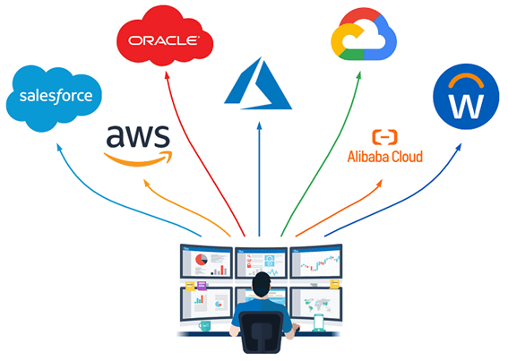
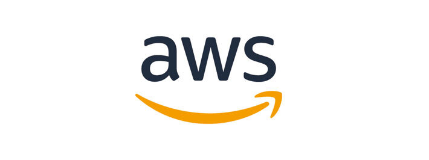
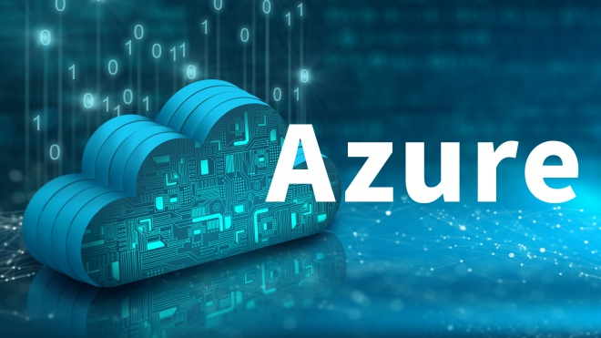
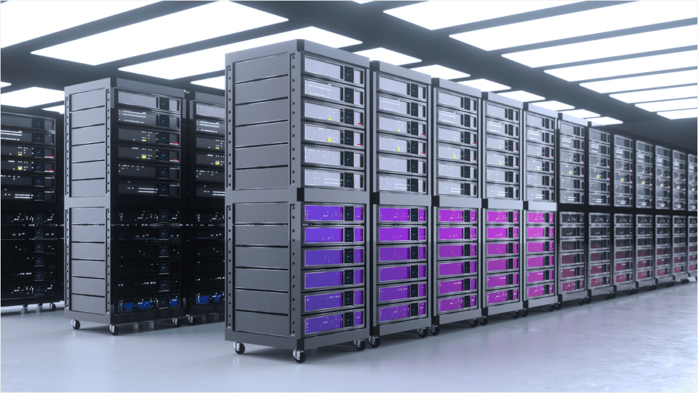

# クラウドとは？
　

みなさんは「クラウド」という言葉を耳にしたことはありますか？  
「クラウドコンピューティング」や「クラウドサービス」とも呼ばれます。  

クラウドとは、インターネットを通じて、サーバー・ソフトウェア・データベースなどを「必要な時に必要なだけ」利用できる仕組みのことです。  
これまでは自社のオフィスに大きなサーバーを購入して設置し、IT担当者がその管理をしていました。しかしクラウドを使えば、自分たちでサーバーを持たなくても、インターネット経由で同じ機能を利用できるようになります。  

例えば、みなさんが普段使っている **Gmail** や **Googleドライブ**、**iCloud**、**Dropbox** といったサービスもクラウドの一種です。パソコンやスマートフォンがあれば、会社でも自宅でもカフェでも、同じアカウントでログインして同じデータにアクセスできます。これこそがクラウドの便利さです。

---

## クラウドが生まれた背景
　

　　　　　　　　　　　　　　　　　　　　　　　　　　　　　　　　　　　　　画像：エリック・シュミット氏

クラウドの考え方自体は1990年代後半から存在していました。  
1997年にアメリカ・南カリフォルニア大学の教授 **ラムナト・チュラッパ** 氏が最初に提唱しましたが、当時はまだ実現が難しく、あまり注目されませんでした。  

その後2006年、GoogleのCEOだった **エリック・シュミット** 氏が「クラウドコンピューティング」という言葉を使って改めて紹介したことで世界的に注目され始めました。  

このころ、インターネットの速度が速くなり、パソコンやスマートフォンの性能も向上したため、「サーバーを自前で持たずにインターネット上から借りる」という仕組みが現実的になったのです。

---

## クラウドが広まった理由

クラウドが一気に普及した理由はとてもシンプルです。  

- **お金の節約**：サーバーを買う必要がなくなり、初期費用が大幅に下がる  
- **すぐに使える**：契約すればすぐ利用でき、数か月の準備が不要  
- **どこからでも使える**：インターネットにつながっていれば場所を選ばない  
- **使った分だけ払う**：従量課金モデルでムダが少ない  

こうしたメリットが、スピード感を求める現代の企業活動と相性が良かったのです。  

---

## 代表的なクラウドサービス

クラウドにはたくさんのサービスがありますが、日本で特に利用されているものは以下の2つです。

### AWS（Amazon Web Services）
　

Amazonが提供している世界最大のクラウドサービスです。2006年にスタートし、現在ではクラウド市場でシェアNo.1を誇ります。  

AWSのすごいところは、「とにかくサービスの種類が多い」ことです。100種類以上のサービスがあり、サーバーやストレージ、データベース、AI、IoTなど、ITに必要なほぼすべてを提供しています。  

代表的なサービス：  
- **Amazon EC2**：インターネット上で使えるサーバー  
- **Amazon S3**：安全で大容量のストレージ  
- **RDS**：データベースを簡単に使えるサービス  
- **CloudFront**：高速でコンテンツを配信するサービス  

AWSは世界中で使われているため、教材や参考資料も豊富で、学習を始めやすいのもメリットです。  
これからクラウドを学ぶなら、まずAWSを知っておくことがとても有効です。

### Microsoft Azure
　

Microsoftが提供するクラウドサービスです。  
WindowsやOfficeといった既存のソフトとの連携に強く、すでにMicrosoft製品を使っている企業にとって導入しやすいのが特徴です。  

全世界に55か所以上のデータセンターを持ち、日本にも東京・大阪の2拠点があります。  

---

## オンプレミスとは？
　

クラウドとよく比較される言葉に「オンプレミス」があります。  
オンプレミスとは、自社内にサーバーやシステムを設置して、自分たちで管理・運用する方法です。  

昔はオンプレミスが当たり前でしたが、今ではクラウドを利用する企業が急増しています。とはいえ、金融業界や官公庁のようにセキュリティ要件が厳しい分野では、今もオンプレミスが利用されています。

---

## クラウドのメリット

1. **常に最新**  
   自動でアップデートされるので、古いソフトを使い続ける心配がありません。  

2. **コスト削減**  
   サーバー購入や電気代、保守費用が不要になり、経費が減ります。  

3. **IT担当者の負担軽減**  
   メンテナンスはクラウド事業者に任せられるので、担当者は別の仕事に集中できます。  

4. **場所をとらない**  
   サーバールームを作る必要がなくなり、オフィスを広く使えます。  

---

## クラウドのデメリット

- **カスタマイズの自由度が低い**  
  完全に自社向けに作り込みたい場合は制限がある。  

- **サービス停止のリスク**  
  提供元に障害があれば、一時的に利用できなくなる可能性がある。  

---

## まとめ

クラウドとオンプレミスにはそれぞれ利点と欠点があります。  
クラウドはコストが安く、すぐに始められるのが魅力。オンプレミスは自由度が高く、自社に合わせたシステムを構築できます。  

大切なのは、「自分たちの会社や学習目的に合った方法を選ぶこと」です。  
もしクラウドを学ぶなら、まずは世界で最も使われている **AWS** を入り口にするのがおすすめです。  

AWSを理解すれば、クラウド全体の仕組みも自然と見えてきます。
