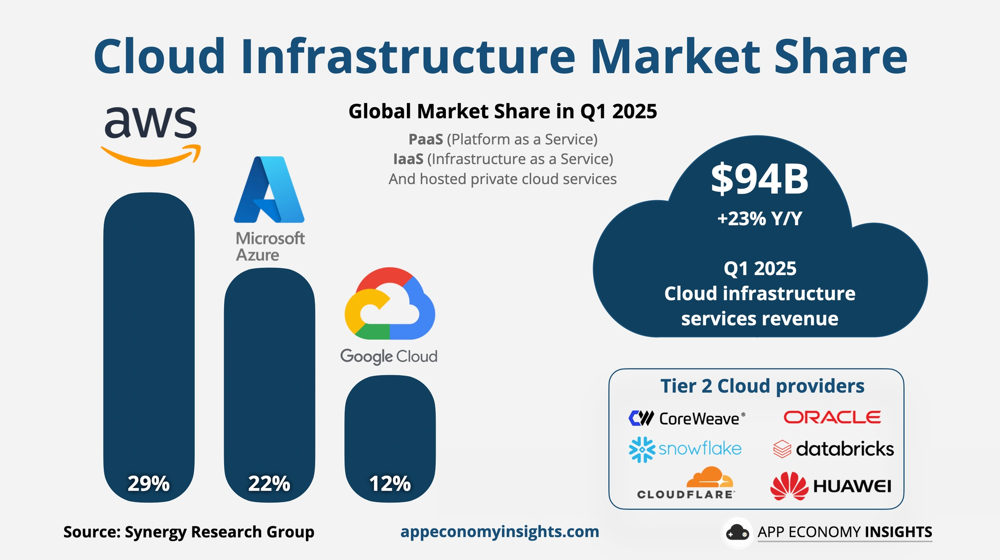
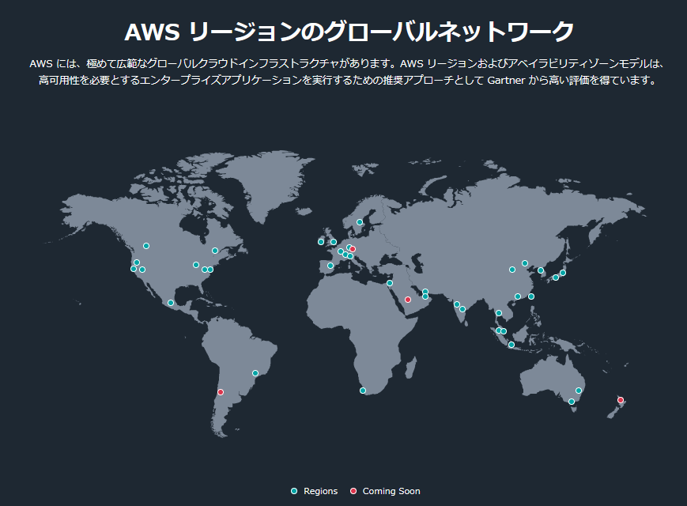
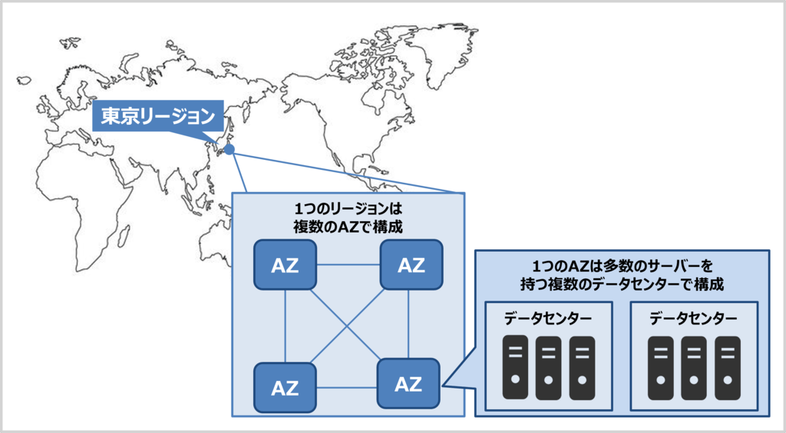
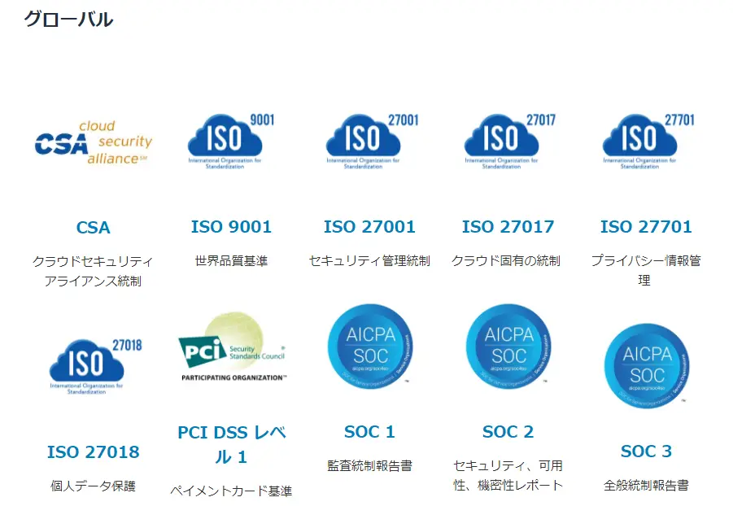
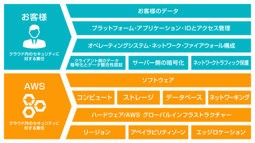

# AWSとは？

## アマゾン ウェブ サービス（AWS）について
　

アマゾン ウェブ サービス（AWS）は、世界で最も包括的で幅広く利用されているクラウドサービスです。
世界各地にあるデータセンターを基盤に、200種類以上のサービスを提供しており、コンピューティング、ストレージ、データベース、AI・機械学習、セキュリティなど多岐にわたります。
スタートアップから大企業、さらには政府機関に至るまで、数百万のお客様がAWSを利用してコスト削減、システム運用の柔軟性向上、新しいサービスやビジネスの創出を実現しています。

---

## グローバルインフラストラクチャー
　

AWSは世界中に **リージョン（地域単位の拠点）を展開しており、各リージョンには複数のアベイラビリティゾーン（AZ）** が設けられています。
AZは独立したデータセンター群で、低遅延の高速ネットワークで相互接続されています。これにより、単一のデータセンターに障害が発生しても、他のAZに切り替えることでシステムを継続可能です。
ユーザーは必要に応じて世界の任意のリージョンを選択してIT基盤を構築でき、国際展開や災害対策にも柔軟に対応できます。

| リージョンコード       | リージョン名                    | AZ数 | 地域・特徴                         |
| -------------- | ------------------------- | --- | ----------------------------- |
| us-east-1      | US East (N. Virginia)     | 6   | 米国東部の中心リージョン。最古参でサービス対応が最も多い。 |
| us-east-2      | US East (Ohio)            | 3   | 米国東部。N. Virginiaの補完。コスト効率がよい。 |
| us-west-1      | US West (N. California)   | 3   | 米国西海岸。古参だがAZ数が少なく利用範囲は限定的。    |
| us-west-2      | US West (Oregon)          | 4   | 米国西部の主要リージョン。安定稼働で人気。         |
| ca-central-1   | Canada (Central)          | 3   | カナダ東部（モントリオール）。国内データ主権に対応。    |
| ca-west-1      | Canada West (Calgary)     | 3   | カナダ西部。新設リージョン。金融・政府機関対応を想定。   |
| sa-east-1      | South America (São Paulo) | 3   | 南米初のリージョン。ブラジル中心に利用。          |
| eu-north-1     | Europe (Stockholm)        | 3   | 北欧リージョン。水力発電など再生可能エネルギー活用。    |
| eu-west-1      | Europe (Ireland)          | 3   | 欧州最古参。サービス対応範囲が広く、拠点として利用多い。  |
| eu-west-2      | Europe (London)           | 3   | 英国向け。金融業界での利用が多い。             |
| eu-west-3      | Europe (Paris)            | 3   | フランス国内データ主権に対応。               |
| eu-central-1   | Europe (Frankfurt)        | 3   | 欧州金融の中心。EU規制対応が強み。            |
| eu-central-2   | Europe (Zurich)           | 3   | スイス。金融・高機密データ向け。              |
| eu-south-1     | Europe (Milan)            | 3   | イタリア。南欧地域の主要リージョン。            |
| eu-south-2     | Europe (Spain)            | 3   | スペイン。欧州南部の冗長性確保に利用。           |
| il-central-1   | Israel (Tel Aviv)         | 3   | イスラエル。中東・スタートアップ拠点。           |
| me-south-1     | Middle East (Bahrain)     | 3   | 中東初のリージョン。湾岸諸国に近接。            |
| me-central-1   | Middle East (UAE)         | 3   | ドバイ・アブダビ経済圏を対象。               |
| af-south-1     | Africa (Cape Town)        | 3   | アフリカ初のリージョン。南ア市場向け。           |
| ap-east-1      | Asia Pacific (Hong Kong)  | 3   | 香港。金融サービス企業に利用多い。             |
| ap-south-1     | Asia Pacific (Mumbai)     | 3   | インド初のリージョン。大規模ユーザー基盤。         |
| ap-south-2     | Asia Pacific (Hyderabad)  | 3   | インド南部。金融・政府機関需要に対応。           |
| ap-northeast-1 | Asia Pacific (Tokyo)      | 4   | 日本最大リージョン。サービス対応数が豊富。         |
| ap-northeast-3 | Asia Pacific (Osaka)      | 3   | 日本西部。東京のバックアップ／冗長利用に最適。       |
| ap-northeast-2 | Asia Pacific (Seoul)      | 4   | 韓国市場向け。金融・ゲーム業界の利用が多い。        |
| ap-east-2      | Asia Pacific (Taipei)     | 3   | 台湾。2022年以降に追加された新リージョン。       |
| ap-southeast-1 | Asia Pacific (Singapore)  | 3   | 東南アジア拠点。国際企業の利用多数。            |
| ap-southeast-2 | Asia Pacific (Sydney)     | 3   | オーストラリア主要リージョン。公共機関や教育利用も多い。  |
| ap-southeast-4 | Asia Pacific (Melbourne)  | 3   | 豪州第2リージョン。災害対策に活用。            |
| ap-southeast-3 | Asia Pacific (Jakarta)    | 3   | インドネシア市場向け。人口規模が大きい。          |
| ap-southeast-5 | Asia Pacific (Malaysia)   | 3   | マレーシア。東南アジアのデータ主権に対応。         |
| ap-southeast-7 | Asia Pacific (Thailand)   | 3   | タイ。ASEAN域内向けリージョン。            |
| mx-central-1   | Mexico (Central)          | 3   | メキ                            |

:::tip 各リージョンは地理的に離れた場所に配置され、法規制やデータ主権（データを特定の国に保存する要件）にも準拠しやすい設計となっています。2025年時点では、30以上のリージョンと100以上のAZが提供されています。
:::

---

## 高可用性を実現するインフラストラクチャ(AZ:アベイラビリティゾーン)

　

アベイラビリティゾーンは、リージョン内にある複数の独立したデータセンターの集合体です。
1つのリージョンは必ず複数のAZで構成され、各AZは多数のサーバーを備えた複数のデータセンターで成り立っています。

各AZは災害の影響を分散するために、**地理的に離れた場所（通常は数十km〜100km以内）**に配置されます。これにより、遅延は数ミリ秒以下に抑えられ、近接しつつも十分な冗長性を確保しています。

また、AZごとに電源・空調・ネットワークが完全に独立しているため、1つのAZで障害が発生しても他のAZへの影響は最小限に抑えられます。さらに、AZ間は複数の冗長化ネットワークで相互接続され、安定かつ高速な通信を実現しています。

:::tip 単一のデータセンターに依存するオンプレミス環境と異なり、AWSではリージョン内でのAZ冗長化によって「災害対策（DR対策）」を容易に実現できる点が大きな特徴です。
:::
---

## わずか数分でITリソースの用意が可能

従来のオンプレミス環境では、サーバーの購入や設置、ネットワーク構築、容量の見積もりなどに多くの時間と費用がかかっていました。
AWSを利用すれば、こうした準備を待つことなく、数分で仮想サーバーやストレージを利用開始できます。必要なときにすぐリソースを調達できるため、開発や検証をスムーズに始められます。

---

## 運用負荷の軽減・イノベーションの加速

運用負荷の軽減・イノベーションの加速

AWSは仮想サーバーなどのIaaS（Infrastructure as a Service）に加えて、データベース、ストレージ、分析、AIといった多彩なマネージドサービスを提供しています。
これらのサービスでは、バックアップ、パッチ適用、障害対応といった日常的な運用作業をAWSが担うため、利用者はシステムの保守管理に時間を取られません。

その結果、企業は限られたリソースを日常の運用作業ではなく、新しいシステム開発やサービスの企画といったイノベーションに直結する活動に集中できます。

:::note クラウドサービスの分類

***IaaS（Infrastructure as a Service）***  
サーバーやネットワークなどの基盤を提供。利用者はOSやアプリを自分で管理。 

***PaaS（Platform as a Service）***  
アプリ開発や運用に必要な環境を提供。インフラ管理は不要で、アプリケーション開発に集中できる。 

***SaaS（Software as a Service）***  
完成されたアプリケーションをサービスとして提供。ユーザーは利用に専念できる。 

***マネージドサービス***  
IaaSやPaaSの一部をAWSが管理・自動化して提供する形態。 
:::
---

## AWSクラウドセキュリティ

　

AWSはセキュリティを最優先に設計されており、データセンターの物理的な安全対策からネットワーク、暗号化、アクセス管理まで、多層的な防御仕組みを備えています。
この堅牢な基盤により、利用者はクラウド環境でも安心してアプリケーションやデータを運用できます。

さらに、AWSはさまざまな国際的なコンプライアンス認証や業界基準に準拠しており、規制が厳しい分野（金融、医療、公共機関など）でも利用可能です。

AWSコンプライアンスプログラム
HIPAA（医療情報保護）、ISO（国際規格）、SOC（監査基準）、PCI DSS（クレジットカード業界基準）など、幅広い規格に対応しています。
これにより、利用者は自社で一から基盤の認証を取得する必要がなく、短期間で安全性の高いシステムを構築できます。

---

## AWSにおける責任共有モデル

　

AWSでは、セキュリティに関する責任を「クラウドのセキュリティ（AWSの責任）」と「クラウド内のセキュリティ（利用者の責任）」に分ける責任共有モデルを採用しています。

AWSの責任範囲
データセンターの物理的な保護、ネットワークインフラ、ハードウェア、仮想化基盤の安全性を保証します。

利用者の責任範囲
OSやアプリケーションの設定、ユーザーアカウントの管理、データの暗号化やアクセス権限の制御などを行う必要があります。
このモデルによって、利用者は自分たちの責任範囲を明確に理解でき、AWSが提供する堅牢な基盤の上に安全なシステムを構築できます。

---

## AWS利用で得られる6つのメリット

| 特徴 | 説明 |
|------|------|
| 従量課金による無駄の削減 | サーバーやストレージを必要なときに必要な分だけ利用し、使った分だけ料金を支払う仕組み。余分な設備投資が不要で、コストの最適化が容易。 |
| スケールメリットによる低価格 | 世界中の膨大なユーザーによる大規模調達でコスト削減を実現。その効果が利用料金に反映され、オンプレ環境より低価格で高性能なサービスを享受可能。 |
| 高可用性と災害対策 | 複数のアベイラビリティゾーンやリージョンを活用し、障害や災害時も迅速に復旧可能。事業継続計画（BCP）や災害対策（DR）を強化できる。 |
| 柔軟なオンデマンド利用 | 利用開始から停止まで自由に選択可能。短期利用や新しい試みも容易で、実験的なサービス利用に適している。 |
| 豊富なマネージドサービス | データベース、分析基盤、AIなどのマネージドサービスを利用可能。バックアップやパッチ適用をAWSに任せることで運用負荷を軽減し、開発や新規事業に集中できる。 |
| グローバル展開の容易さ | 世界各地のリージョンで同じインフラを利用可能。海外拠点の立ち上げや新市場進出が迅速にでき、法規制やデータ主権にも対応可能。 |

---

## 従量課金体系による初期コストおよび余剰コストの削減
AWSではサーバーやストレージを導入する際に初期費用が不要で、利用した分だけを支払う従量課金モデルを採用しています。
これにより、オンプレミス環境のようにサーバーを購入・設置するための高額な投資や、将来の需要を見越した過剰な設備準備が不要となります。

その結果、実際の利用量に応じた柔軟なコスト管理が可能となり、余分な支出を大幅に抑えられます。

補足: 長期的に利用する場合は「リザーブドインスタンス」や「Savings Plans」を活用することで、さらにコスト削減を実現できます。これらを組み合わせることで、短期利用は従量課金、長期利用は割引プランといった最適なコスト戦略を立てられます。

---

## AWSの代表的なサービス

### Amazon EC2

AWSが提供する 仮想サーバー サービスです。自分で用意するサーバーの代わりに、クラウド上で必要なときにすぐ立ち上げて使えます。開発環境から本番システムまで幅広く利用されます。

:::tip

目的に応じて「小さなサーバー」「メモリが多いサーバー」「GPU付きサーバー」など自由に選べます。

利用者が増えたらサーバー台数を自動で増やし、減ったら減らす「オートスケーリング」が可能です。

EBS（ハードディスク代わり）や AMI（サーバーのひな型）を組み合わせて効率よく運用できます。
:::

### Amazon S3

インターネット上の大容量データ置き場。写真・動画・バックアップなどを、壊れにくく（耐久性“イレブンナイン”＝ほぼ消えない）、いつでもどこからでも取り出せます。

:::tip

保存するデータの種類や利用頻度に応じて、通常保存・低コスト保存・長期保管用（Glacier）を選べます。

古いデータを自動的に移動したり削除したりでき、長期利用でもコストを最適化可能。

アクセス権限を細かく設定でき、外部共有用の一時的なURLも発行できます。
:::

### Amazon RDS

データベースを自動で用意・管理してくれるサービスです。MySQLやPostgreSQLなどを数クリックで利用開始でき、バックアップやアップデートも自動で行ってくれます。

:::tip

障害に備えて複数の拠点（AZ）にまたがって配置でき、可用性を確保。

自動バックアップやスナップショットで、間違って消したデータを復旧しやすい。

サーバーやOSの管理はAWSが対応するため、開発者はアプリケーションに集中できます。
:::

### Amazon VPC

自分専用の 仮想ネットワーク空間 をAWS上に作れるサービスです。インターネットに公開する部分と、社内だけで使う部分を分けて安全に運用できます。

:::tip

公開用と内部用のサブネットを分けて、安全なシステム構成を作れる。

VPNやDirect Connectを使って、会社のネットワークとAWSを安全につなげられる。

ファイアウォールのように通信を細かく制御できる仕組み（セキュリティグループやACL）が用意されています。
:::

### AWS Direct Connect

会社やデータセンターとAWSを 専用線で直結 できるサービスです。インターネット経由よりも通信が安定して速く、セキュリティ面でも優れています。

:::tip

大容量のデータをやり取りする場合や、低遅延が求められる業務に有効。

VPNと組み合わせて冗長構成をとれば、障害にも強いネットワークを構築可能。

接続拠点（ロケーション）を経由して各リージョンのVPCへアクセスできます。
:::

### Amazon Route 53

AWSの DNSサービス です。インターネットの「住所録」の役割を果たし、example.com のような名前を、通信に必要なIPアドレスに変換してくれます。

:::tip

利用者の場所や状況に応じて、一番近くて速いサーバーに振り分けられます。

サーバーの状態を監視し、故障時には自動的に別のサーバーへ切り替え。

ドメインの購入・更新・管理も可能で、DNSとドメインをまとめて扱えます。
:::

### AWS Identity and Access Management (IAM)

AWSのリソースに 誰がどこまで操作できるかを管理する仕組み です。社員やシステムごとに「使えるサービス」や「できる操作」を細かく制御できます。

:::tip

たとえば「AさんはS3にアクセスできるがEC2は使えない」「このアプリはEC2を起動できる」など、ルール（ポリシー）を設定して安全に管理。

MFA（二段階認証）を設定すれば、パスワード＋スマホ認証コードでセキュリティを強化可能。

誰が何をしたか記録されるため、監査や不正防止にも役立ちます。
:::

### Amazon CloudWatch

AWS上で動くシステムやアプリを 監視するサービス です。サーバーやデータベースの動き、リソースの利用状況（CPU・メモリ・ネットワークなど）、アプリから送られるログをまとめて確認できます。

CloudWatch を使えば「問題を早く見つける」「異常が起きたら自動で通知・対応する」ことが可能になります。

:::tip

メトリクス監視
EC2のCPU使用率やS3のリクエスト数など、さまざまな数値をグラフで可視化できます。

アラーム
しきい値を超えたときにメールやSlackなどへ自動通知可能。必要に応じて自動でスケールアウトすることもできます。

ログ管理
アプリケーションやシステムのログを一元的に収集し、検索・分析ができます。

ダッシュボード
必要な情報をひと目で確認できる画面を作成可能。運用担当者がリアルタイムで状況を把握できます。
:::