# アカウント作成の流れ
AWSを学んでいく上で、まずはAWSアカウントを作成する必要があります。
これがないとサービスを実際に触ることも設定を試すこともできません。
ここから先は実際に手を動かしながら学んでいきますので、
まず最初にアカウントを作成する手順を確認しておきましょう。

---

## ステップ1:AWSアカウントの作成

最初に下記よりサインアップ画面へ移動します。

[今すぐ無料サインアップ »](https://portal.aws.amazon.com/billing/signup#/start)

はじめに AWS アカウントとなる情報を設定します。
ここからはすべて**半角英数字**で入力ください。

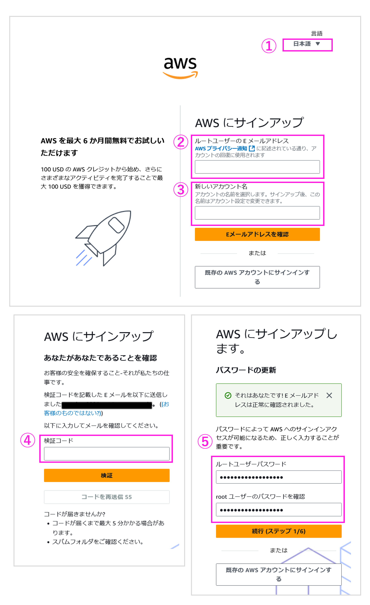

① 表示されたページが「日本語」でない場合、ページ右上の言語選択ボックスより「日本語」を選択後、サインアップ画面へお進みください。
② 「ルートユーザーの E メールアドレス」には、**AWSへのログイン時に使用するメールアドレス**を設定します。
③ 「AWS アカウント名」に、**お客様のお名前を半角アルファベットで入力**します。

入力が完了したら、「認証コードを E メールアドレスに送信」ボタンをクリックします。
④「ルートユーザーの E メールアドレス」で入力したメールアドレスに届いた確認コードを入力します。
入力が完了したら、「認証を完了して次へ」ボタンをクリックします。
⑤「ルートユーザーパスワード」で **AWS へのログイン時に使用するパスワード**を設定し、確認用にもう一度同じパスワードを入力します。
入力が完了したら、「次へ」ボタンをクリックします。

## ステップ1-2:アカウントプランの選択
アカウントプランを選択ください。

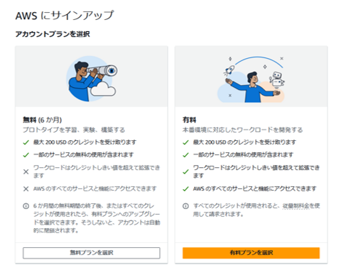

---

## ステップ2:連絡先情報の入力

次にご自身の連絡先情報を登録します。

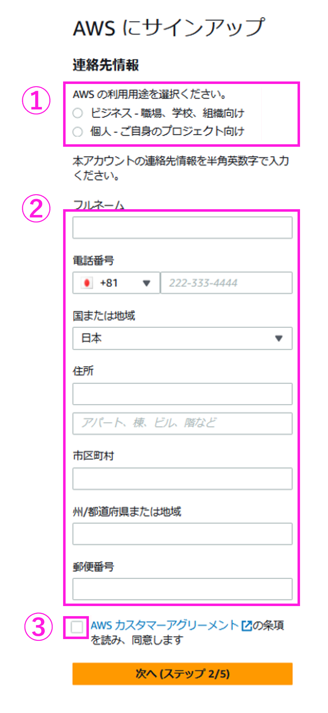

① 「個人 - ご自身のプロジェクト向け」を選択します。　　
② 連絡先情報を下記を参照の上、入力ください。
- フルネーム: ご自身のフルネームを入力します。
- 会社名: の会社名を入力します。
- 電話番号： プルダウンメニューからお住まいの国を選択します。続けてお客様のお電話番号の先頭のゼロを削除し、ハイフン・記号なしで入力します。(例：312345678)
- 国または地域：国を選択します。
- 住所： お客様のご住所の番地、建物名等を入力します。
(例 : 上大崎1-1-1 ABCビル)
- 市区町村： お客様のご住所の市区町村名を入力します。
(例 : 品川区)
- 州/都道府県または地域: お客様のご住所の都道府県名をローマ字（半角アルファベット）でご入力します。
(例 : Tokyo)
- 郵便番号: お客様のご住所の郵便番号をハイフン付きで入力します。
(例：141-0021)
AWS カスタマーアグリーメント (利用規約) に同意の上、③ のチェックボックスをクリックし、「次へ」ボタンをクリックします。

---

##  ステップ3:請求情報の入力
次に **請求情報(お支払い情報)** の登録を行います。
※ 無料プランを選択した場合でも、有料プランにシームレスに移行できるようにするため、クレジットカードまたはデビットカードが必要になります。また、お客様の支払い情報を使用してアカウントの信頼性を確認し、不正な行為を防止します。

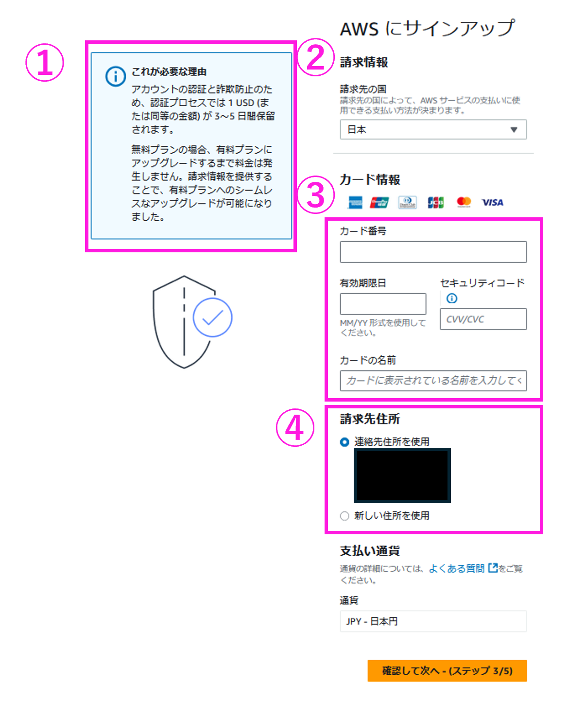

① **無料プランの場合、有料プランにアップグレードするまで料金は発生しません**。ご本人様確認のため、3～5 日間、1 USD/EUR が保留中の取引として明細に表示されます。
② 請求先となる国を選択します。
③ お客様の**有効なクレジットカードまたはデビットカード情報を入力**します。カード番号、有効期限などの情報に間違いのないようお気をつけください。
④ 請求先住所を選択します。前のステップでご入力いただいたご住所と同様の場合は、「連絡先住所を使用する」を選択します。アカウント作成時にご入力いただいたご住所と異なる請求先となる場合は、「新しい住所を使用する」を選択して、請求先住所をご入力ください。
入力が完了したら、「確認して次へ」ボタンをクリックします。

---

## ステップ4:SMSまたは音声電話による本人確認
作成していただいた AWS アカウントのご本人確認を行います。テキストメッセージ (SMS) または、電話（自動音声） をお選びいただけます。
※ ご入力いただいた電話番号に、日本語の自動音声による検証コードの入力を求める確認電話または SMS が直ちに届きます。

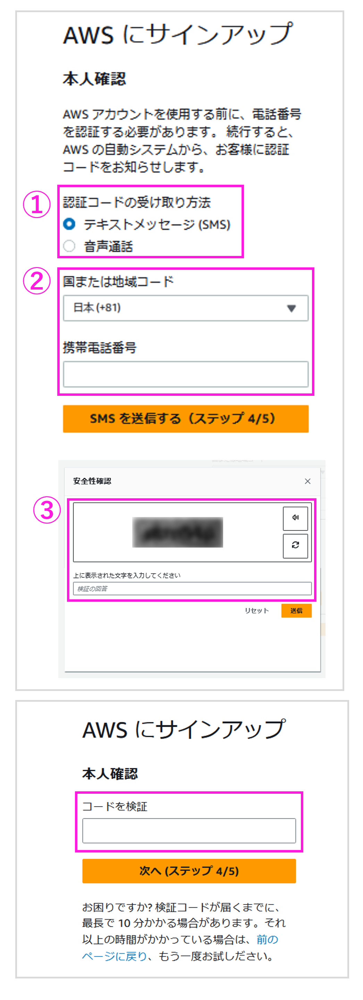

① でご希望の検証コードの受け取り方法を選択します。
**国または地域コードで、国を選択**し、電話番号を ②に**ハイフン・記号なしで入力**します。
（例：09012345678）
入力が完了したら、SMS の場合「SMS を送信する」、音声通話の場合「今すぐ呼び出し」ボタンをクリックします。
※以下の点にご注意ください。
携帯電話等で非通知の着信拒否設定を行っている場合は、**着信拒否設定の解除が必要**です。オレンジのボタンをクリックする前に、必ず電話がかかる状態にしておいてください。
③ポップアップで表示されたセキュリティチェックの英数字を入力し、「送信」をクリックします。
「送信」ボタンをクリックすると、即座に音声電話または SMS が届きます。②の電話番号入力欄には**すぐに着信を受け取れる電話番号をご入力ください**。
国番号選択を誤ると電話がかかってきませんので、必ず正しい国コードをご選択の上、ハイフンなしで電話番号をご入力ください。
SMS または電話（日本語自動音声）で 4 桁の 検証コードが届きます。
検証コードが届いたら入力欄に検証コードを入力し、「次へ」ボタンをクリックします。

---

## ステップ5:AWSサポートプランの選択

最後に AWS のサポートプランの選択を行います。
有償のサポートを現時点で必要としていない場合は、「ベーシックサポート」を選択します。

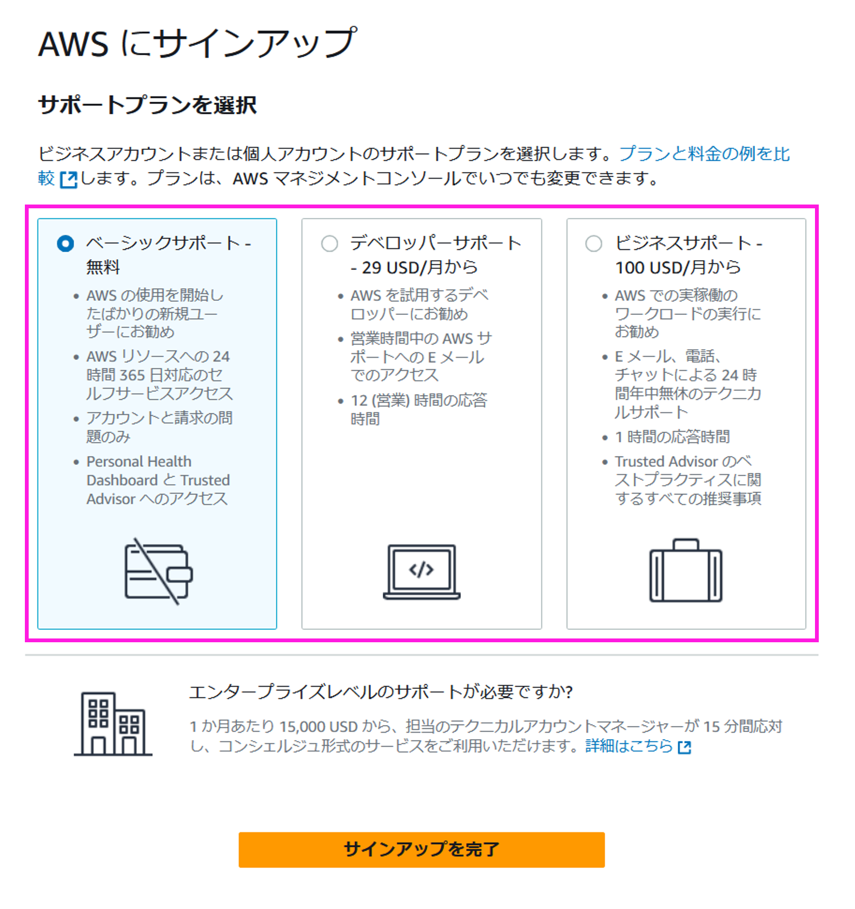

選択が完了したら、「サインアップを完了」ボタンをクリックします。
#請求情報の管理
クラウドを使ううえで気をつけたいのが「気づかないうちに料金が膨らんでいた」というケースです。　　
特に学習や検証でAWSを使っていると、思わぬ課金が発生することがあります。　　
そこで役立つのが AWS Budgets です。　　
あらかじめ予算を設定しておき、その金額を超えそうになったらメールで通知してくれる仕組みです。これを活用すれば、安心してAWSのサービスを利用できます。　　

:::note
「CloudWatch（監視サービス）の請求アラーム」でも同じような通知は可能ですが、Budgetsのほうが後発サービスであり、細かい条件設定や柔軟な運用ができます。そのため、基本的にはBudgetsを使うのがおすすめです。
:::

ここでは、予算を 100ドル に設定する例で、実際の設定方法を解説していきます。

## 設定手順

### 1. アカウントメニューから予算作成へ移動

- AWSマネジメントコンソール右上の「アカウントID」 → 「アカウント」をクリックします。
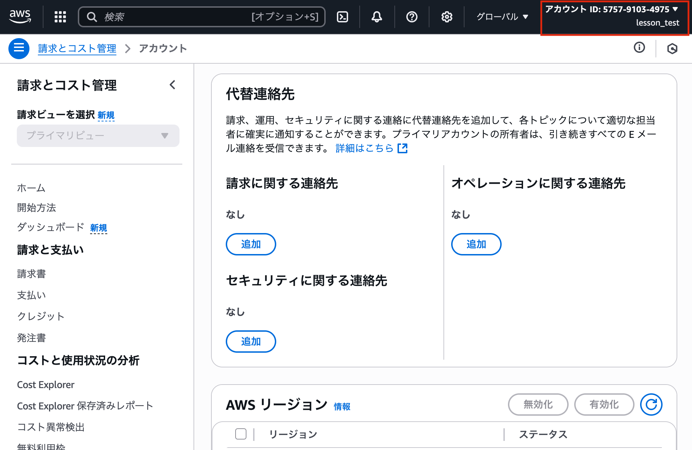
- 左側のメニューから「予算」 → 「予算の作成」をクリックします。
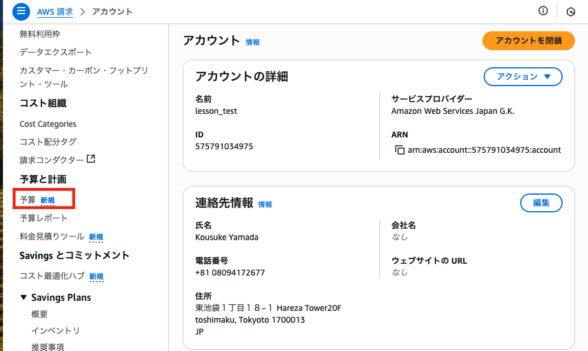
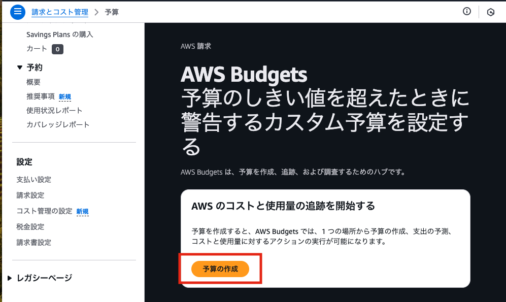

### 2. テンプレートを選択

- 「テンプレート - 新規」 → 「月次コスト予算」をクリックします。

### 3. 通知先メールアドレスを入力

- 「Eメールの受信者」に、予算を超えた際に通知を受け取りたいメールアドレスを入力します。

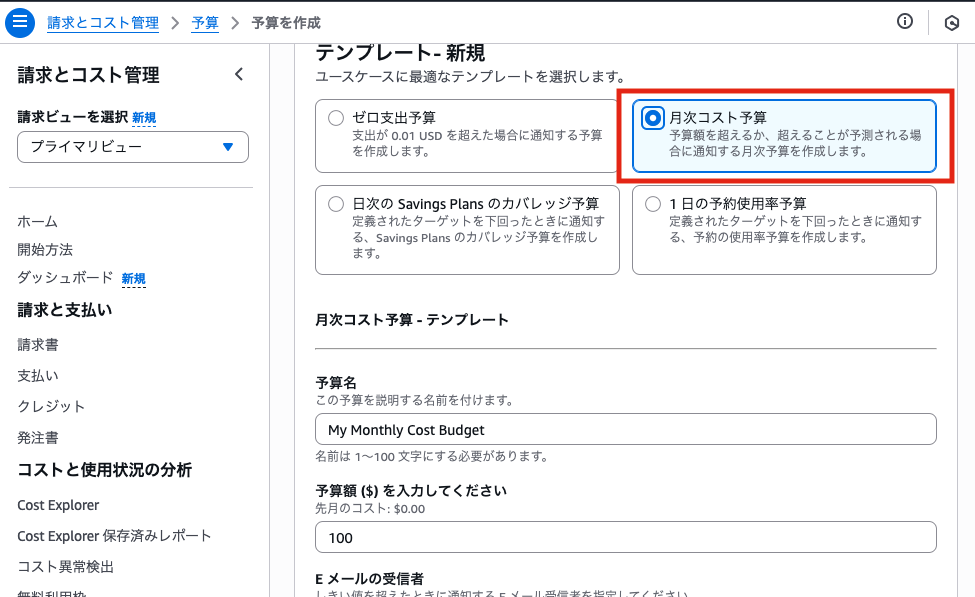

### 4. 予算を作成

- ページ右下の「予算を作成」をクリックしてください。
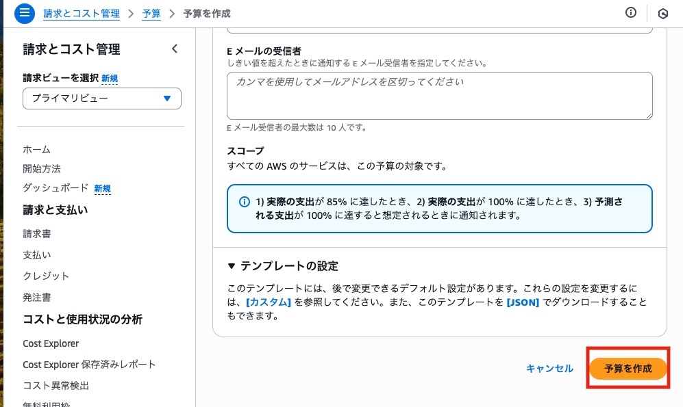

次のページが表示されたら設定完了です。

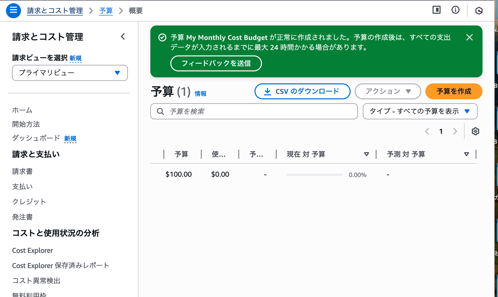