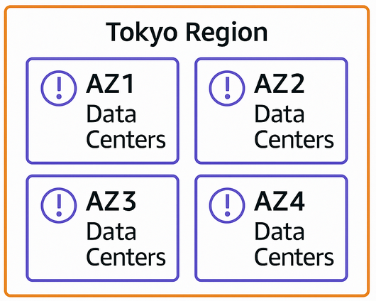
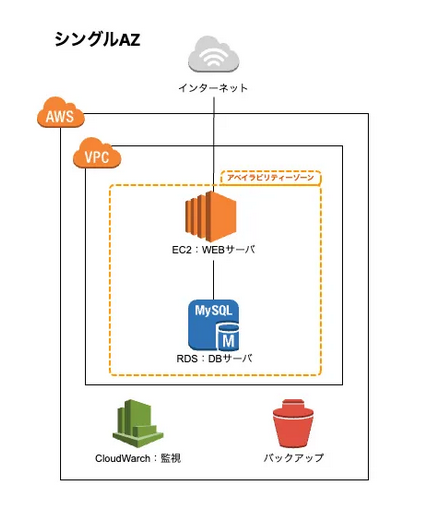
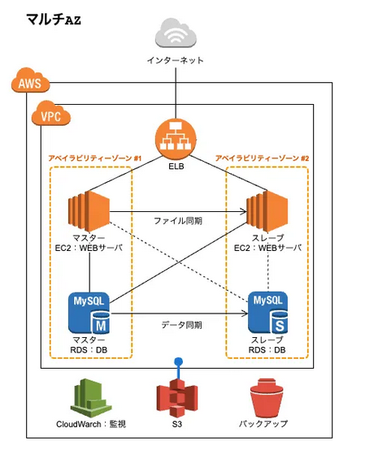
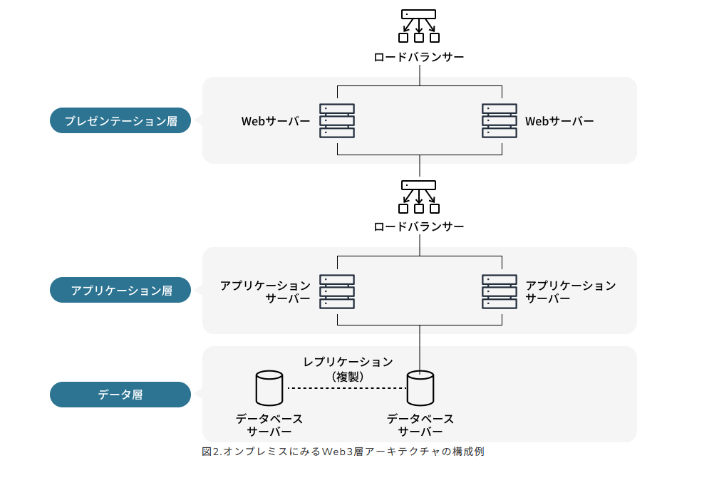
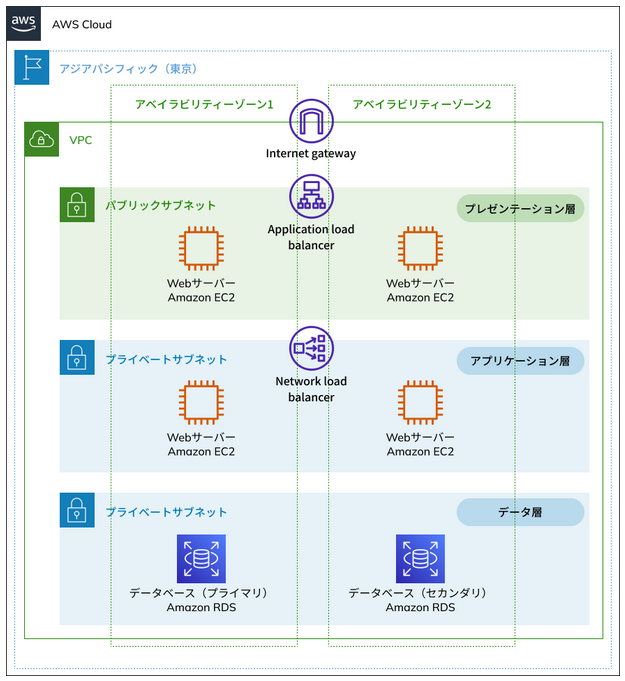

# AWS アベイラビリティーゾーン（AZ）とは？

**AWS アベイラビリティーゾーン（Availability Zone、略称 AZ）** の定義・特長・メリットをわかりやすく解説します。  

---

## アベイラビリティーゾーンの定義

- **AZ とは？**  
  アベイラビリティーゾーン（Availability Zone、AZ）は、**複数のデータセンター（DC）をまとめたインフラ設備の単位**です。  
  1つのAZは電源・空調・ネットワークなどの基盤設備を独立して備えた複数のデータセンターで構成されています。  
  これらは高速かつ冗長化された専用ネットワークで接続されており、利用者から見ると **1つの統合された大規模データセンター** として利用可能です。  
  そのため、もしAZ内の一部のデータセンターに障害が発生しても、残りの設備が稼働し続ける仕組みになっています。  

- **従来との違い**  
  オンプレミス環境で可用性を高めるには、東京と大阪といった地理的に離れた複数のデータセンターを契約し、それぞれに同じシステムを構築・運用する必要がありました。これは **コストや運用負荷が非常に大きい方法** でした。  
  一方、AWSではリージョンを選び、その中から複数のAZを指定するだけで、同様以上の冗長性・可用性を簡単に実現できます。  
  つまり、**利用者は物理的なデータセンターの契約や配置を意識することなく、高い信頼性を持つ環境を手軽に利用できる**のです。  

> 例：東京リージョンには4つのAZが存在し、それぞれが実質的に独立したデータセンター群です。ユーザーはこれらを組み合わせることで、障害に強いシステムを柔軟に構築できます。  

　

---

## アベイラビリティーゾーンの特長

| 特長 | 説明 |
|------|------|
| 自然災害・電力・ネットワーク面で独立 | 各AZは電力供給・冷却設備・ネットワークを他のAZから切り離して設計。1つのAZが障害で停止しても他のAZには影響が及びにくく、システムを継続できる。 |
| 物理的距離と低遅延の両立 | AZ同士は数十km〜最大100km以内に配置。災害リスク分散と低遅延通信を両立し、遅延は2ms以下に抑制。 |
| Transit Centerを介した外部接続 | 各AZは直接インターネットに接続せず、Transit Centerを経由。Transit Center自体も冗長化され、各AZは最低2つ以上のTransit Centerに接続して高信頼性を確保。 |
| 高可用性設計の前提 | AZは「独立した拠点」でありつつ「高速接続された近接拠点」でもあるため、複数AZを組み合わせるだけで高可用性システムを容易に構築できる。 |

---

## 日本のリージョンと AZ の特徴

### 東京リージョン（ap-northeast-1）
- **AZ数**：4  
- **特徴**  
  - 日本で最初に設置されたリージョンで、サービス提供範囲が最も広い。  
  - AWS公式イベントやサポート情報も東京リージョンを基準に公開されることが多い。  
  - 東京首都圏の需要をカバーしつつ、冗長化のため大阪リージョンと組み合わせて利用されるケースが多い。  

- **利用可能な AZ**  
  - `ap-northeast-1a`  
  - `ap-northeast-1b`（※一部のサービスで新規利用制限あり。利用者集中を防ぐため割り当て制御が行われることがある）  
  - `ap-northeast-1c`  
  - `ap-northeast-1d`  

### 大阪リージョン（ap-northeast-3）
- **AZ数**：3  
- **特徴**  
  - 元々は「ローカルリージョン（1 AZ 構成）」として提供されていたが、2021年以降に本格的な **マルチ AZ リージョン** に拡張。  
  - 東京リージョンの **ディザスタリカバリ（DR）用途** として利用されることが多い。  
  - 商用利用も広がり、東京と同様にフル機能のリージョンとしてサービス展開中。  

- **利用可能な AZ**  
  - `ap-northeast-3a`  
  - `ap-northeast-3b`  
  - `ap-northeast-3c`  

---

## シングル AZ 構成とは？

　

- **概要**  
  1つのアベイラビリティゾーン（AZ）のみを利用してシステムを構成する方式。  
  例：テスト用に VPC・サブネット・EC2 を 1 つの AZ 内にまとめて配置。  

- **メリット**  
  - 構成がシンプルで分かりやすい  
  - 利用するリソースが少ないため低コストで運用できる  

- **デメリット**  
  - 障害がその AZ に発生すると、システム全体が停止するリスクがある  
  - 本番環境には通常推奨されない（冗長化がないため）  

---

## マルチ AZ 構成とは？

　

- **概要**  
  2つ以上のアベイラビリティゾーン（AZ）にシステムを分散配置する方式。  
  1つのAZに障害が発生しても、別のAZで処理を継続できるため **高可用性** を実現できる。  

- **例：Web 3階層アーキテクチャ**  
  - プレゼンテーション層（Webサーバー）  
  - アプリケーション層（Appサーバー）  
  - データベース層（DBサーバー）  
  → 各層を2つ以上のAZに分散配置して冗長化  

**オンプレミスでの構成**
  　

**クラウドマルチAZでの構成**  
  　

- **メリット**  
  - AZ 障害が発生してもシステムの稼働を継続できる  
  - 高可用性・災害耐性を実現できる  
  - 本番環境での標準的な構成  

- **デメリット**  
  - 冗長化によるコスト増加  
  - 障害切替（フェイルオーバー）を確認するためのテスト工数が必要  

---

## エッジロケーションとの違い

## アベイラビリティーゾーン（AZ）とエッジロケーションの比較

| 項目 | アベイラビリティーゾーン（AZ） | エッジロケーション |
|------|---------------------------------|--------------------|
| 定義 | 複数のデータセンターをまとめた独立したインフラ設備の単位 | ユーザーに物理的に近い場所に設置された拠点 |
| 主な目的 | 高可用性・耐障害性を実現するための冗長構成 | コンテンツ配信の高速化やセキュリティ強化 |
| 配置 | リージョン内に複数存在（東京は4つ、大阪は3つ） | 世界中に数百、日本国内は東京20・大阪7（2025年4月時点） |
| 接続 | 高速かつ冗長化されたネットワークでAZ間を接続 | 利用者とAWSサービスの間を最短距離で接続 |
| 提供サービス例 | EC2、RDS、VPCなど主要なAWS基盤サービス | CloudFront、WAF、Shield、Route53、Firewall Manager |
| 利用イメージ | システムをマルチAZ構成にして高い可用性を確保 | Webサイトのレスポンス改善やDDoS対策に活用 |

---

## まとめ

- AZ は複数データセンターをまとめた単位で、独立設計により高い耐障害性を持つ  
- 国内は東京と大阪リージョンに AZ が存在  
- **シングルAZ**：低コスト・シンプルだが可用性は低い  
- **マルチAZ**：コスト増加するが高可用性が実現可能  
- 一般的には **マルチAZ構成が推奨**  

---
