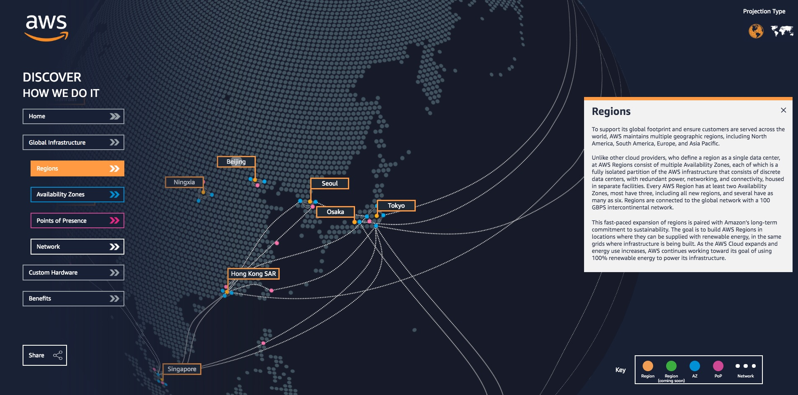
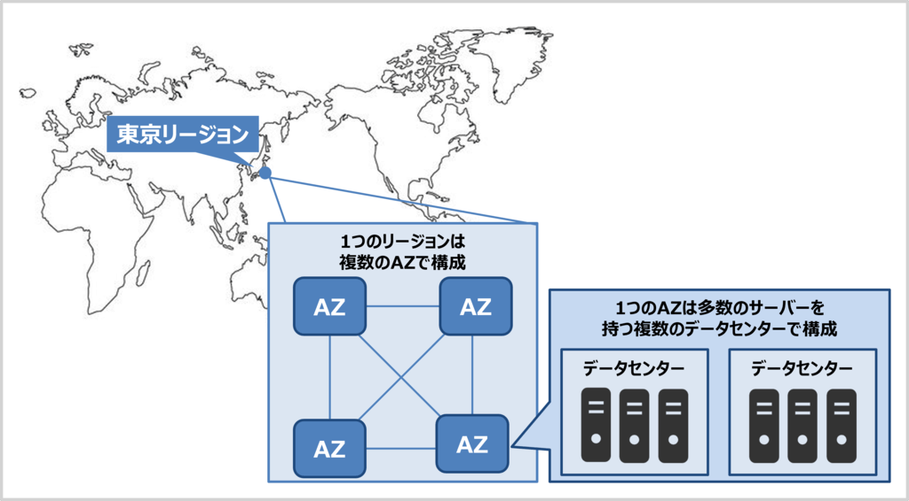

# AWS リージョン

AWS（Amazon Web Services）を利用する上で、避けて通れない概念のひとつが **リージョン（Region）** です。  
「クラウドだからどこでも同じ」と思われがちですが、実際にはリージョンごとに利用できるサービス、料金、通信速度（レイテンシ）、法規制対応の可否などが異なります。  
この記事では、リージョンの定義や特長、世界・日本のリージョン状況、さらに選定のポイントまで詳しく解説します。

　

  

---

## 1. AWS リージョンとは？

AWSは世界各地にデータセンターを配置しており、それらを地理的にまとめた単位を **「リージョン」** と呼びます。  
リージョンは単なる地名ではなく、**高可用性と耐障害性を実現するための基本的なインフラ単位**です。  

さらに、各リージョンは相互に独立して設計されているため、あるリージョンで障害が発生しても他のリージョンには影響しません。  
この「独立性」こそが、災害対策やグローバル展開を行ううえでAWSが持つ大きな強みとなっています。

---

## 2. リージョンの定義

リージョンとは、**地理的に区切られたAWSの拠点**を指します。  
各リージョンは特定の都市や地域に設置されたインフラの集合体であり、その中でAWSの各種サービスが提供されています。  

リージョンは、**複数のアベイラビリティーゾーン（AZ）から構成**されています。  
AZはさらに複数のデータセンターで成り立ち、電源・ネットワーク・空調といった基盤設備を独立して備えることで、高い冗長性と可用性を実現しています。  

また、ユーザーはリソースを配置する際に **どのリージョンを利用するかを明示的に選択**します。  
選んだリージョンによって、利用できるサービスや料金体系、そして通信の性能（レイテンシ）が変わるため、システム設計上きわめて重要な要素となります。

---

## 3. リージョンの特長

リージョンには次のような特長があります。

| 特長 | 説明 |
|------|------|
| 独立性 | 1つのリージョンが障害を受けても、他リージョンに影響は及ばない。 |
| サービスの差異 | 新サービスはまず米国リージョンで提供されることが多く、他地域への展開は遅れる傾向がある。 |
| 料金の違い | 電力・土地・税制などの違いにより、同じサービスでもリージョンごとに料金が異なる。 |
| 法規制対応 | データの保存場所を指定することで、国ごとの規制に対応可能。 |
| レイテンシの影響 | 利用者に近いリージョンを選ぶほど、通信遅延が少なくなる。 |

---

## 4. リージョンを利用するメリット

リージョンを意識することで得られるメリットは大きく、システム設計に直結します。

1. **パフォーマンスの最適化**  
   顧客に近いリージョンを選ぶことで、応答速度（レイテンシ）が改善します。  
   例：日本国内向けサービスなら東京リージョンを利用するのが自然です。

2. **災害対策（DR対策）**  
   別リージョンにバックアップやレプリカを構築すれば、片方が障害を受けてもサービスを継続可能です。  

3. **法規制・コンプライアンス対応**  
   個人情報保護法や金融関連の規制では「国内にデータを保存すること」が求められる場合があります。リージョン選択はこの要件を満たす手段となります。  

4. **柔軟な拡張性**  
   グローバル企業であれば、海外拠点の立ち上げ時に現地リージョンを使うことで、迅速にシステムを展開できます。  

---

## 5. 世界のリージョンと特徴・料金

2025年4月現在、AWSは **37リージョン・117以上のアベイラビリティーゾーン** を展開しています。  
リージョンごとに特徴や料金傾向があるため、用途に応じた選定が必要です。

### 主なリージョン一覧（抜粋）

| 地域 | リージョン名 | コード | AZ数 | 特徴 | 料金傾向 |
|------|--------------|--------|------|------|----------|
| 北米 | US East (N. Virginia) | us-east-1 | 6 | 最も早く新サービスが展開される代表的リージョン | 安価（基準） |
| 北米 | US West (Oregon) | us-west-2 | 4 | コストが低く人気 | 最安クラス |
| 北米 | US East (Ohio) | us-east-2 | 3 | バランスの良い構成 | 標準 |
| 南米 | South America (São Paulo) | sa-east-1 | 3 | 南米拠点用、レイテンシ有利 | 高め（オレゴン比1.3倍） |
| 欧州 | Europe (Ireland) | eu-west-1 | 3 | 欧州の中心的リージョン | 標準 |
| 欧州 | Europe (Frankfurt) | eu-central-1 | 3 | ドイツ規制に強い | やや高め |
| アジア | Asia Pacific (Tokyo) | ap-northeast-1 | 4 | 日本の主要リージョン、サービス豊富 | 標準〜やや高め |
| アジア | Asia Pacific (Osaka) | ap-northeast-3 | 3 | 西日本・災害対策に活用 | 標準 |
| アジア | Asia Pacific (Seoul) | ap-northeast-2 | 4 | 韓国市場向け | 標準 |

> ※料金傾向は代表的なEC2インスタンス（m5.large）比較による一般的な目安です。  
> 最安はオレゴン、最高はサンパウロといった差があります。

---

## 6. 日本国内のリージョン

日本には次の2つのリージョンがあります。

| リージョン名 | コード | AZ数 | 開設時期 | 特徴 |
|--------------|--------|------|----------|------|
| アジアパシフィック（東京） | ap-northeast-1 | 4 | 2011年 | 日本で最も利用される主要リージョン。新サービスも早期に展開されやすい。 |
| アジアパシフィック（大阪） | ap-northeast-3 | 3 | 2021年 | 西日本向け、または東京の災害対策として利用される。 |

東京は国内の標準リージョン、大阪はBCP（事業継続計画）の観点でバックアップ用途として採用されるケースが多いです。

---

## 7. リージョン選定時のポイント

リージョンを選ぶ際には以下の観点をバランスよく考慮する必要があります。

1. **利用者の所在地**  
   ユーザーに近いほどレイテンシが小さくなる。  
   例：日本国内向けなら東京リージョンを優先。  

2. **料金**  
   コスト重視ならオレゴンやバージニアが有利。南米などは割高。  

3. **法規制**  
   個人情報保護や金融規制がある場合は、国内リージョンを選定する必要あり。  

4. **冗長化・DR計画**  
   東京と大阪を組み合わせて災害対策を行うケースが一般的。  

---

## 8. まとめ

- リージョンは **AWSインフラを地理的に区切った単位** で、複数のAZで構成される。  
- 世界には37のリージョンがあり、**料金・利用可能サービス・レイテンシはリージョンごとに異なる**。  
- 日本には東京と大阪の2リージョンがあり、用途やDR要件に応じて使い分けることが重要。  
- 選定時には「ユーザーの所在地」「料金」「法規制」「DR要件」の4つを必ず意識すること。  

リージョンの仕組みを理解すれば、AWSをより戦略的に活用できるようになります。  
