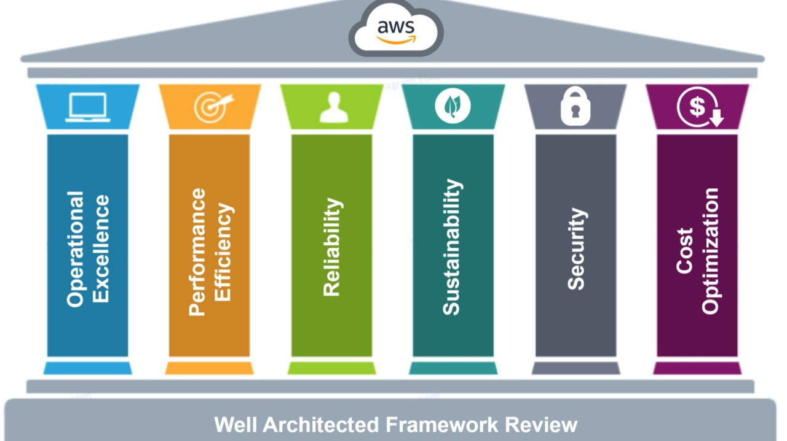
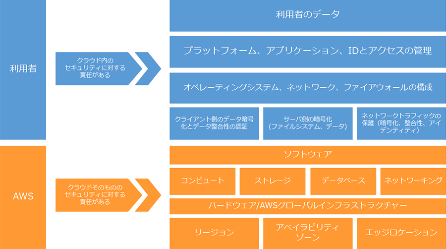
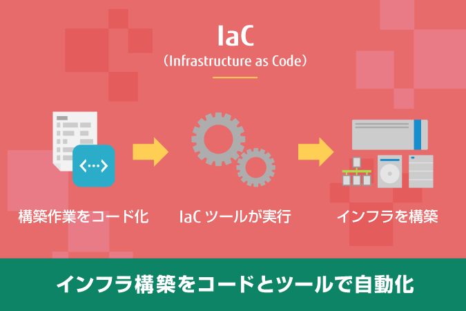

# AWSの設計思想

## 1. AWS設計思想とは何か
AWS（Amazon Web Services）は、2006年にスタートして以来、世界中の企業や組織が利用しているクラウドプラットフォームです。  
オンプレミスと大きく異なるのは、**クラウドだからこそ実現できる柔軟性と考え方**が設計に反映されている点です。  

従来のオンプレミスでは、「障害が起きないようにする」「余裕をもったサーバを最初から購入する」といった発想が一般的でした。  
しかし、この考え方では需要変動やコスト効率に対応できません。  

AWSの設計思想は、以下のような発想の転換に基づいています。  
- **障害は必ず発生するものとして設計する**  
- **利用に応じて伸縮できるリソースを前提とする**  
- **セキュリティは後付けではなく設計に組み込む**  
- **コストは固定費ではなく運用方法次第で変わる**  

こうした考え方を理解しないと、AWSを「単なるレンタルサーバ」としてしか使えず、その真価を引き出すことはできません。

---

## 2. クラウド設計の基本原則

### スケーラビリティ（Scalability）
システムにかかる負荷は一定ではなく、時間やイベントによって増減します。  
AWSでは、利用者数が増えれば自動でサーバを追加し、減れば縮小する「水平スケーリング」が可能です。  
例えばEC2とオートスケーリンググループを組み合わせると、アクセス増加時に自動でインスタンスが追加され、利用が落ち着けば自動削除されます。  

この仕組みによって、従来の「最大負荷を見越して過剰なサーバを購入する」必要がなくなり、**効率的で柔軟なシステム**を構築できます。

### 弾力性（Elasticity）
Elasticityはスケーラビリティを短期的・即時的に捉えた概念です。  
「一時的にアクセスが急増するセールイベント」や「深夜に利用者が減る」といった変化に即応できる点が特徴です。  
クラウドの真価は、この弾力性にあります。リソースが使われていないときには課金が発生しないため、**利用効率とコスト削減の両立**が可能です。

### 高可用性（High Availability）
オンプレミスでは高可用性を実現するには高額な機器が必要でした。  
AWSでは、地理的に分散された**アベイラビリティゾーン（AZ）**を活用して、片方に障害が発生してもサービスを止めない仕組みが取れます。  
「止まらないシステム」は、AWSの設計思想の中心的な考え方です。

### セキュリティ by Design
クラウドにおけるセキュリティは、利用開始前から組み込むべきものです。  
AWSのIAMやVPCを活用し、最小権限・通信制御・暗号化を最初から設計に含めます。  
「後で守ればよい」という発想では、クラウド時代のセキュリティは担保できません。

### コスト最適化
クラウドは従量課金制です。  
オンプレミスのように「買ったから使い続ける」ではなく、**常に適切なリソース選定を行うことが前提**です。  
利用していないリソースは停止し、長期利用が見込まれる場合はリザーブドインスタンスやSavings Plansを選ぶなど、設計段階での工夫が必要です。

---

## 3. AWS Well-Architected Framework

AWSの設計思想を体系化したものが **Well-Architected Framework** です。  
これは「自分の設計がAWSのベストプラクティスに沿っているかどうか」を確認するための指針です。  
AWSはこのフレームワークを使い、システムを設計する際に検討すべき観点を「柱（Pillar）」という形で整理しています。  
これを理解しているかどうかで、同じAWS環境でも「動くけれど脆弱なシステム」と「将来を見据えた堅牢なシステム」に大きな差が生まれます。  

### 6つの柱

#### 1. オペレーショナルエクセレンス（Operational Excellence）
システムは作って終わりではなく、その後の**運用**で安定して価値を提供し続けることが重要です。  
オペレーショナルエクセレンスでは、運用手順を標準化し、自動化を活用して人手に頼らない仕組みを作ることを重視します。  
例えば、CloudFormationでインフラをコード化すれば、構築の手順がブレることはなく、障害時の復旧も自動化できます。  
さらに、CloudWatchやX-Rayを用いたモニタリングによって問題を早期に検知し、継続的に改善する文化を育てることが求められます。

#### 2. セキュリティ（Security）
クラウドではセキュリティを「後付け」することはできません。  
セキュリティの柱では、データとシステムを保護するための仕組みを設計段階から組み込むことが求められます。  
具体的にはIAMで最小権限を設定し、VPCでネットワークを分離し、KMSでデータを暗号化することが基本です。  
また、CloudTrailによる操作履歴の記録や、GuardDutyによる不審な動作の検知も有効です。  
「誰が何をできるのか」を明確にし、不要な権限や無防備な公開を排除することが、クラウドセキュリティの第一歩です。

#### 3. 信頼性（Reliability）
「障害は必ず発生するもの」として設計するのがAWSの思想です。  
この柱では、障害に対してシステムがどれだけ素早く復旧できるかを重視します。  
マルチAZ構成にして1つのデータセンターが停止しても稼働を続けられるようにする、Route 53でDNSフェイルオーバーを設けるなどが具体策です。  
また、バックアップやDR（ディザスタリカバリ）の仕組みを設計しておけば、大規模障害が起きても復旧可能です。  
「壊れないように祈る」ではなく、「壊れても動き続ける」ことを前提にするのがポイントです。

#### 4. パフォーマンス効率（Performance Efficiency）
システムの性能を「過剰に作り込みすぎる」ことも「足りなさすぎる」ことも避ける必要があります。  
パフォーマンス効率の柱では、利用状況に応じて適切なリソースを選択し、最適化することを重視します。  
例えば、S3で静的コンテンツを配信すればEC2に無駄な負荷をかけずに済みますし、CloudFrontを使えば世界中の利用者に低遅延でコンテンツを届けられます。  
さらに、サーバレス（AWS Lambda）を採用すれば、処理が発生したときだけ自動的にスケールするため効率的です。  
クラウドでは「必要なときに必要な分だけ性能を発揮する」ことが理想です。

#### 5. コスト最適化（Cost Optimization）
クラウドは従量課金制であり、設計によってコストが大きく変わります。  
コスト最適化の柱では「必要以上のリソースを使わないこと」が前提となります。  
たとえば、開発環境を夜間や休日に自動停止させる、アクセス頻度が低いデータをS3 Glacierに移行する、といった工夫です。  
また、長期間利用するリソースはリザーブドインスタンスやSavings Plansを活用することでコストを大幅に削減できます。  
クラウドにおける「ムダな支出」は設計と運用の工夫で防げるのです。

#### 6. サステナビリティ（Sustainability）」
2021年に追加された新しい柱が「サステナビリティ」です。  
これは環境負荷の低減を重視する考え方で、AWS自体が再生可能エネルギーを積極的に利用しています。  

利用者もまた、以下のような工夫を設計に取り入れることが求められます。  
- 常に稼働させる必要のないリソースは自動停止する  
- 過剰なスペックのサーバを選ばず、最適なサイズを使う  
- データを効率的に管理し、不要な保存を減らす  

これらは単に「地球に優しい」というだけでなく、**コスト削減にも直結する**という利点があります。  
つまりサステナビリティは、環境とビジネスの両立を図るための新しい視点と言えるでしょう。

:::tip Well-Architected Frameworkの意義
このフレームワークを学ぶことは、AWSを利用するうえでの「設計の物差し」を手に入れることに相当します。  
ただ動くシステムを作るだけでなく、「運用しやすいか」「安全か」「効率的か」「無駄がないか」「環境負荷に配慮しているか」を体系的にチェックできるのです。  
AWS公式の **Well-Architected Tool** を使えば、自分の設計を診断し、改善点を見つけることも可能です。  
:::

---

## 4. 可用性と冗長化の設計思想
AWSでは「止まらないシステム」を標準としています。  

- **リージョン**: 世界各地にあるAWSの拠点（例: 東京リージョン、バージニアリージョン）。  
- **AZ（アベイラビリティゾーン）**: 1つのリージョンに複数存在する独立したデータセンター群。  

たとえば東京リージョンには3つ以上のAZがあり、同時に障害が発生する可能性は極めて低いです。  
そのため、システムを複数AZに分散配置することで高可用性を実現できます。  

ECサイトの例を考えると、片方のAZが障害で落ちても、別のAZでサービスを継続でき、ユーザーにはほとんど影響が出ません。  
これが**マルチAZ構成**であり、AWSの冗長化思想の基本です。

---

## 5. セキュリティ設計の考え方
AWSでは **Shared Responsibility Model（責任共有モデル）** が基本です。  
AWSはインフラのセキュリティを担保しますが、利用者はアプリやデータのセキュリティを守る責任を負います。  

### ポイント
- **最小権限の原則**: IAMユーザーやロールには必要最小限の権限だけ付与する。  
- **ネットワーク分離**: VPCを利用してパブリックサブネットとプライベートサブネットを使い分ける。  
- **監査と可視化**: CloudTrailで操作履歴を残し、セキュリティインシデントを追跡可能にする。  

「セキュリティは後付け」ではなく、**設計段階からセキュリティを前提に考える**ことが求められます。

---

## 6. スケーラビリティとパフォーマンス設計

AWSの大きな強みのひとつは、**利用状況に応じて柔軟にリソースを増減できるスケーラビリティ**です。  
従来のオンプレミス環境では「ピーク時を想定して余裕を持ったサーバー構成」を用意する必要があり、結果として平常時には無駄なリソースやコストが発生していました。  

クラウドではこれを「必要なときに必要な分だけ」という考え方に置き換えることが可能です。  

### 主な仕組み

- **オートスケーリング（Auto Scaling）**  
  アクセス数や負荷状況に応じて、EC2インスタンスを自動的に増減させる仕組みです。  
  例えば、セール期間など一時的にトラフィックが急増した場合には自動的にサーバー台数を増やし、夜間や休日でアクセスが減ったときには台数を減らすことで、コストを最適化しながら安定稼働を維持できます。

- **キャッシュの活用**  
  - **Amazon CloudFront**（CDNサービス）は、静的コンテンツを世界中のエッジロケーションにキャッシュし、利用者に近い場所から配信することでレスポンスを高速化します。  
  - **Amazon ElastiCache** は、頻繁に参照されるデータをインメモリで保持し、データベースへのアクセス回数を減らすことで大幅なパフォーマンス向上を実現します。  

- **サーバーレス設計**  
  **AWS Lambda** では、リクエストが発生したときに初めてコードが実行され、処理が終わるとすぐにリソースが解放されます。  
  常時稼働のサーバーが不要なため、利用がない時間帯にはコストが発生せず、効率的なシステム運用が可能です。  

---

## 7. コスト最適化の思想

AWSの料金体系は**従量課金制**です。  
つまり、使った分だけ料金が発生する仕組みですが、裏を返せば「設計や運用次第で大きな差が生まれる」ことを意味します。  
クラウドを本当に味方につけるには、**初期設計から運用ルールまで含めたコスト最適化の思想**が不可欠です。

### 代表的な仕組みとアプローチ

- **オンデマンド利用**  
  必要になったタイミングでリソースを立ち上げ、使った分だけ課金される方式です。  
  無駄がなく柔軟ですが、長期間利用する場合は割高になるケースがあります。  

- **リザーブドインスタンス／Savings Plans**  
  1年・3年といった長期利用を前提に事前契約することで、最大7割近いコスト削減が可能です。  
  安定運用が見込める基幹システムでは必須の選択肢です。  

- **利用停止の徹底**  
  開発環境や検証環境を「夜間・休日は自動停止」するだけで、想像以上にコスト削減につながります。  
  Lambdaなどのサーバーレスと組み合わせれば、利用していない時間帯の「ゼロ課金運用」も実現できます。  

### 設計段階から意識すべきこと

1. **リソースのライフサイクルを見積もる**  
   本番・検証・開発のどの環境なのかを明確にし、それぞれに適した課金モデルを選択する。  

2. **コスト見える化の仕組みを導入する**  
   AWS Cost Explorer や Trusted Advisor を使って、無駄なリソースや割引対象外の利用状況を定期的に確認する。  

3. **「スケールする＝コストも変動する」を前提に設計する**  
   トラフィック増加に合わせてオートスケーリングされると、性能は維持できますがコストも増加します。  
   あらかじめ「どの範囲まで許容するか」を設計しておくことが重要です。  

:::tip
オンプレミスでは「サーバーを買ってしまえば固定費」でしたが、クラウドでは**設計次第でコストが雪だるま式に増える**こともあれば、**合理的に抑えられる**こともあります。  
AWSを使いこなすうえで、単なる「技術設計」ではなく **コスト最適化を意識した設計思想** が成功のカギとなります。
:::

---

## 8. 運用性・自動化の思想

AWSが提供する最大の価値のひとつは、**「人が手作業で運用することを減らす」思想**です。  
オンプレミスでは、サーバーの設置・構成・監視・復旧まで、すべて人の手で行う必要がありました。  
しかしAWSでは、これらの運用を「仕組み化」して自動化することが可能です。  
結果として、ヒューマンエラーを減らし、運用コストを抑え、システムの信頼性を大きく高めることができます。  

### 代表的な実践例

- **IaC（Infrastructure as Code）**  
  CloudFormationやTerraformを使って、インフラ構成を「コード」として管理します。  
  - ボタン操作ではなくコードで定義するため、**環境の再現性が高い**。  
  - Gitなどでバージョン管理でき、**変更履歴が明確になる**。  
  - テスト環境や本番環境を「同じ定義ファイル」から素早く再構築できる。  

- **監視と通知の自動化**  
  Amazon CloudWatchを使えば、CPU利用率やメモリ使用率、レスポンスタイムといった指標を常に監視可能です。  
  - 閾値を超えたらSNS（Simple Notification Service）を通じてアラートを送信。  
  - Slackやメール、PagerDutyと連携させれば、**即座に担当者に通知**できる。  

- **自動復旧の仕組み**  
  CloudWatchのアラートをトリガーに、Lambdaを実行して自動復旧処理を走らせることができます。  
  例えば「EC2が落ちたら自動的に再起動」「異常なインスタンスを削除して新しいものを立ち上げる」といった対応が、**人が介入する前に自動で行える**のです。  

:::tip
AWSの運用設計では、「どう人が動くか」よりも **「どう自動で回すか」** を前提に考えることが重要です。  
IaC・監視・自動復旧といった仕組みを組み合わせることで、**人に依存しない強固な運用体制**を築くことができ、結果としてシステムの安定性とコスト効率を両立できます。
:::

---

## 9. マイクロサービスアーキテクチャの思想

従来のアプリケーション開発では、**モノリシックアーキテクチャ**と呼ばれる手法が一般的でした。  
これは「アプリ全体を1つの大きなプログラムとして作る」方式です。  
しかし、この方式では次のような課題がありました。  

- どこか1か所に障害が起きると、アプリ全体が停止してしまう  
- 機能を少し追加・修正したいだけでも、全体を再デプロイ（再配布）しなければならない  
- チームで分担開発しづらく、規模が大きくなるほど開発スピードが落ちる  

こうした問題を解決する考え方が **マイクロサービスアーキテクチャ** です。  

### マイクロサービスとは？

マイクロサービスとは、アプリを**小さな機能単位に分割して、それぞれを独立したサービスとして動かす仕組み**です。  
たとえばECサイトを例にすると、  

- 「商品カタログ表示」  
- 「カート機能」  
- 「決済処理」  
- 「ユーザー管理」  

といった機能を**別々のサービス**として作ります。  
それぞれのサービスは独立して動くため、カート機能に障害があっても、商品閲覧やユーザー管理は動き続けます。  

### サービス間のつなぎ方（疎結合）

ただし、分けただけでは「バラバラ」になってしまうので、サービス同士をつなぐ仕組みが必要です。  
マイクロサービスでは **疎結合（そけつごう）** と呼ばれる「ゆるやかなつながり方」をします。  

- **API Gateway**  
  各サービスの入り口を統一的に管理し、外部や他サービスから呼び出せるようにする。  
- **Amazon SQS（キューサービス）**  
  あるサービスからのリクエストを一旦キューにため、処理できるタイミングで他サービスに渡す。  
  → サービス同士が直接つながらないため、障害が広がりにくい。  

### コンテナとEKSの活用

マイクロサービスを効率的に動かす基盤として、**コンテナ**がよく使われます。  
コンテナはアプリとその実行環境をパッケージ化したもので、どこでも同じように動くのが特徴です。  

- **Amazon ECS**（AWSの独自コンテナサービス）  
- **Amazon EKS**（KubernetesをAWSでマネージド運用できるサービス）  

これらを使うことで、複数のマイクロサービスをまとめて運用管理することが容易になります。  

### メリットまとめ

| 観点 | モノリシック | マイクロサービス |
|------|--------------|------------------|
| 障害の影響範囲 | アプリ全体が停止する | 障害が起きたサービスだけに限定 |
| 開発・運用 | 全体を一括で更新 | サービス単位で独立して更新 |
| スケーリング | 全体を大きくする必要あり | 必要なサービスだけスケール可能 |
| チーム分担 | 同じコードベースを共有 | 機能ごとにチーム分担が容易 |

マイクロサービスは「大きな一枚岩アプリ」を「小さな部品の集合」に分ける発想です。  
AWSでは、API Gateway・SQS・ECS/EKS・Lambdaといったサービスを組み合わせることで、**柔軟で耐障害性が高く、開発スピードも速いシステム**を実現できます。  

初学者の方は、まず「**モノリシック＝家電のオールインワン機械、マイクロサービス＝機能ごとの独立した家電**」というイメージを持つと理解しやすいでしょう。

---

## 10. サステナビリティとクラウド設計

AWSは「持続可能なITインフラ」の実現を重要な目標に掲げています。  
その代表例が **2050年までにネットゼロカーボン（温室効果ガス排出ゼロ）を達成する** という宣言です。  
データセンターは膨大な電力を消費するため、クラウド事業者として環境負荷を軽減する責任を担っています。  

### AWSの取り組み

- **再生可能エネルギーの活用**  
  AWSは世界中のデータセンターに太陽光・風力発電を積極的に導入し、2030年までに **100%再生可能エネルギー稼働** を目指しています。  

- **効率的なデータセンター設計**  
  高度な冷却システムや電力効率化の工夫により、同じ処理能力でもオンプレ環境より少ない電力で稼働できるよう最適化されています。  

- **利用者への透明性提供**  
  AWS Customer Carbon Footprint Tool を使うことで、自社のクラウド利用によるカーボン排出量を可視化し、改善に活かすことができます。  

### 利用者ができる工夫

AWSのサステナビリティ戦略は、利用者の設計思想にも反映できます。  
つまり「コスト最適化」と「環境配慮」は両立可能です。  

- **過剰なリソースを削減する**  
  オンプレでは余裕を見込んだサーバー調達が一般的でしたが、クラウドでは必要な分だけに絞ることで無駄な電力消費を減らせます。  

- **アイドル状態のインスタンスを自動停止する**  
  開発環境や検証環境を夜間や休日に自動停止すれば、コストも環境負荷も同時に削減できます。  

- **効率的なアーキテクチャを採用する**  
  サーバレス（Lambda）やマネージドサービスを活用すれば、アイドル時間がなくなり、リソースの使いすぎを防げます。  

### コストと環境配慮の両立

| 項目 | 従来型（オンプレ等） | クラウド設計 |
|------|-------------------|--------------|
| リソース利用 | 常時フル稼働、余裕を持たせて調達 | 必要なときに必要な分だけ利用 |
| 電力効率 | 個別企業で効率化に限界 | AWSの大規模最適化を享受 |
| 環境配慮 | 企業ごとに独自対応 | AWSと利用者が協力して削減 |
| コスト | 固定費が重く無駄が多い | 従量課金で無駄な支出を削減 |

:::tip
クラウド設計におけるサステナビリティは、もはや「CSR的な付加価値」ではなく、**コスト削減と同時に追求できる実務的な目標**です。  
AWSが進める環境負荷低減の取り組みに、利用者も日々の設計や運用で協力することが、企業の社会的責任と経営効率の両面で重要になっています。  
言い換えれば、**環境にやさしい設計こそが、経済的にもやさしい設計**となるのです。
:::

