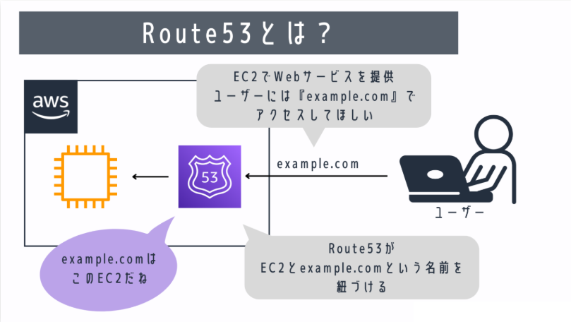

# Route53とは
Route53（ルートフィフティースリー）とは、AWSが提供するDNS（Domain Name System）サービスです。  

Route53を使用することで、AWSで開発したWebサービスを任意のURLで公開することができます。  
例えば、EC2でWebサービスを提供するときに、ユーザーには『example.com』という名前でアクセスしてほしいときなどに、Route53を利用します。

まずは、ドメイン名やDNSについての用語を見ていきましょう。  

### ドメイン名とDNS
Route53を理解する上で、重要なキーワードになるのが『ドメイン名』と『DNS』です。  
これらはAWS特有の用語ではなく、一般的なネットワークの知識です。

### ドメイン名とは？
ドメイン名とは、Webサイトでアクセスするときの名前です。  
例えば、『google.com』とか、『yahoo.jp』などがドメイン名にあたります。

なぜドメイン名が必要かというと、もしドメイン名がなければ、ユーザーはGoogleなどのWebサービスが提供されているサーバーのIPアドレス（ネットワーク上の住所）を知っておく必要があるからです。  
IPアドレスというのは、『142.251.222.46』のような数字の羅列なので、IPアドレスよりも『google.com』のようなドメイン名でアクセスした方がわかりやすいのは明白です。

試しにお使いのブラウザで『142.251.222.46』と『google.com』のどちらで検索しても、同じGoogleのトップページが表示されます。  
このように、実際のWebサービスのIPアドレスを、わかりやすい名前にしたものが『ドメイン名』です。

#### DNSとは？
DNSとはDomain Name Systemの略で、先ほどのドメイン名（Domain Name）とIPアドレスの対応関係を管理するシステムのことです。  
ドメイン名はIPアドレスをわかりやすい名前にしたものと説明しましたが、この対応関係をDNSが管理しています。  
先ほどのGoogleの例だと、『142.251.222.46』と『google.com』の対応を覚えているのがDNSということです。

#### DNSサーバーとは？
DNSの仕組みを提供するサーバーをDNSサーバーといいます。  
PCからWebサイトにアクセスするにはドメイン名ではなく、そのWebサイトを提供するサーバー（Webサーバー）のIPアドレスが必要です。

そのため、ブラウザのURL欄にドメイン名を入力したとき、ブラウザは一度DNSサーバーにそのドメイン名に対応するIPアドレスを問い合わせます。  
これを**名前解決**といいます。  
そして、DNSサーバーから返ってきたIPアドレスを用いて、そのドメイン名に紐づくWebサイトにアクセスします。  

:::note 
[1つのドメイン名に対して複数のIPアドレスを対応づけることも可能]です。  
例えば、同じWebサイトでも日本語版と英語版のサイトを作成しておいて、アクセスしてきた人の国情報に合わせてサイトを切り替えるようなことができます。  
:::

### Route53を利用する目的
「Route53とは」でも記載しましたが、Route53はDNSの機能を提供するサービスです。  
Route53を利用することで、サービスを提供するサーバーのIPアドレスを任意のドメイン名と対応づけることができます。

ちなみに、Route53以外にもDNSの機能を提供するサービスはあります。  
しかし、Route53を利用すると以下のようなメリットがあります。

* AWSの他のサービスと連携しやすい
* アクセス数に応じて自動でサーバーの性能を調整（スケーリング）してくれるので、アクセス数の急増にも耐えられる
* 世界各地にあるデータセンターに分散しているため、災害などの障害に強い

最後の「障害に強い」というのは、サービスの本番環境では必要不可欠な要素です。

## Route53の特徴と機能

では、具体的なRoute53の機能について詳しく見ていきましょう。
Route53の主な機能として、以下の5つの機能があります。

* ドメイン名の登録と管理
* ホストゾーン
* ヘルスチェック
* トラフィックフロー
* リゾルバー

以下では、これらの機能について詳しく説明します。

### ドメイン名の登録と管理
Route53では、コンソール画面からドメイン名を登録（購入）することができます。

:::note 
[ドメイン名]は有料です（例えば◯◯.comであれば、$13など）。  
:::

Route53でもドメイン名は購入できますが、「お名前.com」や「freenom」のような外部サービスで低価格で購入したドメイン名をRoute53で扱うことも可能です。

### ホストゾーン
Route53では、ドメイン名の問い合わせに対して宛先（IPアドレス）を教えるDNSサーバーの役割もあります。  
ドメイン名の問い合わせに対して、どういう回答をするのか、という設定をまとめたものを**ホストゾーン**といいます。  
例えば、eample.comというドメイン名の問い合わせがあった場合に、11.11.11.11と22.22.22.22という2つのIPアドレスをランダムに返すようにする、というように設定することが可能です。  
このような、「ドメイン名に対する回答の設定」を**ルーティングポリシー**といいます。  
ルーティングポリシーの詳細は後ほど**Route53のルーティングポリシー**の章で解説しています。

### ヘルスチェック
Route53では、ドメイン名に対応づけたサーバーの状態をチェックすることができます。  
例えば、example.comというドメイン名に、11.11.11.11と22.22.22.22を対応させているときに、  
11.11.11.11に障害が発生した場合、障害を自動で検知して22.22.22.22のみ対応づけるようにすることが可能です。これが**ヘルスチェック**です。

この機能のおかげで、ユーザーが障害の発生したサーバーへアクセスすることを防ぐことができます。  
このヘルスチェックの機能は、後ほど解説するフェイルオーバールーティングポリシーでも用いられます。

### トラフィックフロー
Route53では様々なルーティングポリシーがあることを紹介しました。  
しかし、これらの様々なルーティングポリシーを組み合わせてルールを作っていくと、訳がわからなくなってしまいます。  
そこで、Route53ではわかりやすくルーティングポリシーを設定できるように、ビジュアルエディタ上でルーティングポリシーを設定できる**トラフィックフロー**という機能があります。  
トラフィックフローを利用すれば、複雑なルーティングポリシーもわかりやすく作成・管理ができるようになります。

## Route53のルーティングポリシー
Route53には以下のような**ルーティングポリシー**が設定可能です。（A/BテストやBlue/Greenデプロイなどの用語が出てきますが、あくまで利用例なので説明は省略します）。

**シンプルルーティングポリシー** 
単純に1つのドメイン名に対して特定の1つのIPアドレスを返します。  
    例えば、example.comというドメイン名に対して、xx.xx.xx.xxという1つのIPアドレスを紐づけます
    これは一般的なDNSの標準的な機能です。

**フェイルオーバールーティングポリシー**  
Webサーバーをメインとサブで複数用意しておき、メインサーバーに障害が発生した際に、ドメイン名に紐づけるIPアドレスをサブサーバーのものに切り替えます。  
    これは、**Route53の特徴と機能**で解説したRoute53のヘルスチェック機能を用いることで、サーバーの以上を検知しています。　　
    例えば、メインサーバーに異常が発生した場合に、メンテナンス中と表示するページへ通信を振り分けることが可能です。　　
    それ以外にも、同じ機能を持ったサーバーを最初から2台用意しておき、メインに障害が発生したらサブで同じサービスを提供し続けることも可能です。　　
    このように、平常時用と非常時用にサーバーを用意しておく構成を**アクティブ/パッシブ構成**といいます。

**位置情報ルーティングポリシー**  
ユーザーの位置に基づいて対応するサーバーを切り替えることができます。　　
ユーザーの位置に応じてサイトの言語を切り替えるときなどに使用します。　　

**地理的近接性ルーティングポリシー**  
ユーザーの位置に基づいて対応するサーバーを切り替えることができます。  
ユーザーの位置に応じてサイトの言語を切り替えるときなどに使用します。

**レイテンシールーティングポリシー**  
サーバーとの応答速度（レイテンシー）が最も小さいサーバーに対応させます。

**IP ベースのルーティングポリシー**  　
特定の送信元の IP アドレスに対して細かい設定を行いたい場合に使用します。

**複数値回答ルーティングポリシー**  
複数の登録された値をランダムに回答します。A/Bテストなどに使用することができます。

**加重ルーティングポリシー**  
複数の値に対して、特定の割合（8:2など）で回答します。Blue/Greenデプロイなどに使用できます。

## Route53の料金  
2023年6月現在、Route53では以下の機能について料金が発生します（最新の情報や詳細は[公式サイト](https://aws.amazon.com/jp/route53/pricing/?did=ap_card&trk=ap_card)で確認できます。）

* ホストゾーン
* DNSクエリ
* ドメイン登録・管理

ホストゾーンに対する料金は、1つのホストゾーンに対して月0.50USDが発生します（26ホストゾーン以降は0.10USD/月）。　　
こちらは時間単位ではなく月単位ですので、少しの間だけホストゾーンを作成していても課金されるのでお気をつけください。

DNSクエリ（Route53に対する問い合わせ）に対しては、100 万クエリごとに0.40USDが発生します。　　　
Route53でドメインを購入した場合は、ドメインごとに年間料金が必要です（料金はドメイン名によります）。

## まとめ
以上が、Route53の基本機能に関しての説明です。
簡潔にまとめると、Route53はAWSで公開したWebサービスにドメイン名を紐づけるためのサービスです。

Route53にはまだ細かい機能がありますが、入門として本記事の内容を理解しておきましょう。