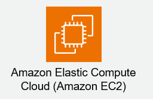
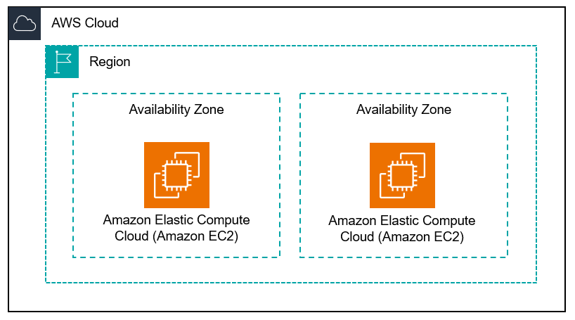

# EC2概要
---

## Amazon EC2とは

### クラウド上の仮想サーバー

Amazon Elastic Compute Cloud（Amazon EC2）は、AWSが提供する主要なサービスの一つであり、「Elastic（伸縮自在な）」な「Compute（計算能力）」を「Cloud（クラウド）」上で利用できるサービスです。  
簡単に言えば、クラウド上に仮想サーバーを構築し、利用したい時に利用したい分だけコンピューティングリソースを確保できるサービスです。  
オンプレミスで物理サーバーを調達・構築・運用する際に必要だった、多大な時間、コスト、労力を大幅に削減できます。  

### EC2のコア機能

EC2は、以下の主要な機能を提供することで、多様なワークロードに対応します。  

*   **仮想サーバー（インスタンス）:** クラウド上に構築される仮想マシンそのものを「インスタンス」と呼びます。  
目的に応じて様々なスペックのインスタンスを選択できます。  
*   **オペレーティングシステム（OS）:** Windows Serverや複数のLinuxディストリビューション（Amazon Linux、Ubuntu、Red Hat Enterprise Linuxなど）を選択してインスタンスにインストールできます。  
*   **ストレージ（EBS、インスタンスストア）:** インスタンスに接続する永続的なブロックストレージ（EBS）や、一時的なストレージ（インスタンスストア）を提供します。  
*   **ネットワーク設定:** 仮想ネットワーク環境（VPC）内でインスタンスを起動し、プライベートIPアドレス、パブリックIPアドレス、セキュリティグループなどを設定できます。  
*   **スケーラビリティ:** 需要に応じてインスタンスの数を自動的に増減させたり（オートスケーリング）、インスタンスのスペックを変更したりすることが容易にできます。  
*   **可用性:** 複数のアベイラビリティゾーン（AZ）にインスタンスを分散配置することで、システムの可用性を高めることが可能です。  

:::tip
### EC2の柔軟性

EC2は、その名の通り「Elastic（伸縮自在な）」な性質を持っており、ビジネス要件の変化に迅速に対応できる柔軟性を提供します。  
例えば、Webサイトのトラフィックが急増した際には、数分で新しいインスタンスを追加して処理能力を向上させることができます。  
また、利用が少ない時間帯にはインスタンス数を減らすことで、コストを最適化することも可能です。  
この柔軟性こそが、多くの企業がEC2をインフラ基盤として採用する大きな理由の一つです。  
:::

### ユースケース

EC2は、以下のような幅広いユースケースで活用されています。  

*   **Webサーバー/アプリケーションサーバー:** WordPressサイト、ECサイト、基幹システムなどのバックエンドとして利用されます。  
*   **バッチ処理/データ分析:** 大量のデータを高速に処理するための計算リソースとして活用されます。  
*   **開発/テスト環境:** 開発者が必要な時に迅速にテスト環境を構築し、利用後に容易に破棄できます。  
*   **データベースサーバー:** リレーショナルデータベースやNoSQLデータベースのホスティング基盤として利用されます（ただし、マネージドサービスであるRDSやDynamoDBの方が適している場合も多いです）。  
*   **コンテナホスティング:** Dockerなどのコンテナワークロードを実行するための基盤として利用されます（ECSやEKSなどのマネージドサービスも存在します）。  

---

## EC2のメリット

Amazon EC2は、従来のオンプレミス環境と比較して、多岐にわたるメリットを提供します。  
これらのメリットは、ビジネスの俊敏性、コスト効率、信頼性を大きく向上させる要因となります。  

### 1. 俊敏性と迅速なプロビジョニング

#### 数分でサーバーを構築・展開

EC2を利用することで、物理サーバーの調達、設置、OSインストールといった、従来数週間から数ヶ月かかっていた作業が、わずか数分で完了します。  
これにより、新しいサービスやアプリケーションのアイデアを迅速に具現化し、市場投入までの時間を短縮できます。  

#### リソースの柔軟な変更

ビジネス要件の変化に応じて、インスタンスのCPU、メモリ、ストレージなどのリソースを簡単にスケールアップ（増強）またはスケールダウン（縮小）できます。  
これにより、常に最適なリソースで運用し、過剰な投資を防ぐことが可能です。  

### 2. スケーラビリティと柔軟性

#### 需要に応じた自動的な拡張・縮小

EC2は、Webサイトのトラフィックやアプリケーションの負荷に応じて、インスタンスの数を自動的に増減させる「オートスケーリング」機能と連携できます。  
これにより、需要の急増時にはパフォーマンスを維持し、需要が低い時間帯にはリソースを削減してコストを最適化できます。  

#### グローバル展開の容易さ

AWSのグローバルインフラストラクチャを活用し、世界中の複数のリージョンやアベイラビリティゾーンにインスタンスを配置できます。  
これにより、ユーザーに近い場所でサービスを提供し、レイテンシを削減するとともに、災害対策や高可用性を実現します。  

### 3. コスト効率

#### 従量課金制によるコスト最適化

EC2は、利用した分だけ料金を支払う従量課金制を採用しています。  
これにより、初期投資が不要となり、使わないリソースに無駄な費用をかけることがありません。  
また、需要に応じてリソースを増減させることで、常に最適なコストで運用できます。  

#### 運用コストの削減

物理サーバーの保守、電源、冷却、データセンターの賃料といった、オンプレミス環境で発生する様々な運用コストが不要になります。  
インフラの管理負担が軽減されることで、IT部門はより戦略的な業務に集中できます。  

### 4. 高い可用性と信頼性

#### アベイラビリティゾーンによる耐障害性

AWSは、複数のアベイラビリティゾーン（AZ）を提供しており、これらは物理的に離れた独立したデータセンター群です。  
異なるAZにEC2インスタンスを分散配置することで、単一のAZで障害が発生してもサービスが継続できるような高可用性なシステムを構築できます。  

#### AWSの堅牢なインフラストラクチャ

AWSは、世界中で何百万もの顧客にサービスを提供しており、そのインフラストラクチャは非常に堅牢で信頼性が高いです。  
EC2は、この信頼性の高い基盤の上で動作します。  

### 5. セキュリティ

#### 多層防御のセキュリティモデル

AWSは、物理的なセキュリティからネットワーク、OS、アプリケーションレベルまで、多層にわたるセキュリティ機能を提供しています。  
EC2では、仮想ファイアウォール（セキュリティグループ）、アクセス制御（IAM）、ネットワーク分離（VPC）などを活用し、セキュアな環境を構築できます。  

#### 豊富な認証と監査機能

AWS Identity and Access Management (IAM) を使用して、誰がどのEC2リソースにアクセスできるかを細かく制御できます。  
また、AWS CloudTrailなどのサービスを利用して、EC2インスタンスへの操作履歴を監査し、セキュリティインシデントの早期発見に役立てることができます。  

---

## EC2の仕組み

Amazon EC2は、一見するとシンプルな仮想サーバーサービスに見えますが、その背後にはAWSの堅牢なインフラストラクチャと複雑な技術が組み合わされています。  
ここでは、EC2インスタンスがどのように動作し、ユーザーにサービスを提供しているのか、その基本的な仕組みを解説します。  

### 仮想化技術

#### ハイパーバイザーによるリソース分離

EC2インスタンスは、物理サーバー上に構築された仮想マシンです。  
AWSは、この仮想化を実現するために「ハイパーバイザー」と呼ばれるソフトウェアを使用しています。  
ハイパーバイザーは、1台の物理サーバーのCPU、メモリ、ストレージ、ネットワークなどのリソースを複数の仮想マシン（EC2インスタンス）に分割し、それぞれが独立して動作できるようにします。  

#### ベアメタルサーバーと仮想化

AWSでは、XenやKVMといったハイパーバイザーをベースとした仮想化技術が使われています。  
ユーザーは、物理ハードウェアを直接利用する「ベアメタルインスタンス」を選択することもできますが、ほとんどのEC2インスタンスは仮想化された環境で動作します。  
これにより、効率的なリソース利用と柔軟なインスタンス管理が可能になります。  

### インスタンスの起動プロセス

EC2インスタンスが起動する際には、いくつかの重要なコンポーネントが連携して動作します。  

1.  **AMI (Amazon Machine Image) の選択:**  
    インスタンスのテンプレートとなるAMIを選択します。  
    AMIには、OS、プリインストールされたソフトウェア、設定などが含まれています。  
    これにより、毎回OSをインストールする手間が省けます。  
2.  **インスタンスタイプの選択:**  
    CPU、メモリ、ネットワーク性能など、インスタンスのハードウェア仕様を定義する「インスタンスタイプ」を選択します。  
    ワークロードに応じて最適なタイプを選びます。  
3.  **VPC (Virtual Private Cloud) の設定:**  
    インスタンスを起動する仮想ネットワーク環境（VPC）と、その中のサブネットを指定します。  
    これにより、インスタンスがネットワーク上でどのように通信できるかが決まります。  
4.  **ストレージの割り当て:**  
    インスタンスのルートボリュームとして、Amazon Elastic Block Store (EBS) を割り当てます。  
    必要に応じて、追加のEBSボリュームやインスタンスストアをアタッチすることもできます。  
5.  **セキュリティグループの設定:**  
    インスタンスへのインバウンド（受信）およびアウトバウンド（送信）トラフィックを制御する仮想ファイアウォール「セキュリティグループ」を設定します。  
    これにより、インスタンスへのアクセスを制限し、セキュリティを確保します。  
6.  **キーペアの設定:**  
    SSHによるインスタンスへの安全な接続のために、公開鍵と秘密鍵のペア（キーペア）を指定します。  
    秘密鍵はユーザーが保持し、インスタンス起動時に公開鍵がインスタンスに登録されます。  

これらの設定が完了すると、AWSは指定されたAMIとインスタンスタイプに基づき、物理サーバー上に新しい仮想マシン（EC2インスタンス）をプロビジョニングし、起動します。  

### 物理リソースと仮想リソースのマッピング

AWSのデータセンターには、数多くの物理サーバーが稼働しています。  
ユーザーがEC2インスタンスを起動すると、AWSはこれらの物理サーバーの中から、指定されたインスタンスタイプに合致するリソース（CPU、メモリなど）が利用可能な物理サーバーを特定し、その上に仮想マシンを割り当てます。  
この割り当ては、高い可用性と効率性を保ちつつ、動的に行われます。  

#### 共有責任モデル

EC2の仕組みを理解する上で重要なのが「共有責任モデル」です。  

| 責任範囲     | AWSの責任                                | お客様の責任                                     |
| :----------- | :--------------------------------------- | :----------------------------------------------- |
| **セキュリティ** | クラウドのセキュリティ（物理インフラ、ネットワーク、ハイパーバイザーなど） | クラウド内のセキュリティ（OS、アプリケーション、データ、ネットワーク設定など） |
| **可用性**   | 基盤インフラの可用性                     | アプリケーションの冗長化、バックアップなど             |

AWSはEC2インスタンスが稼働するための基盤を提供しますが、インスタンス上で動作するOSやアプリケーション、そしてそのデータに対する責任はお客様にあります。  
このモデルを理解し、適切な設定と運用を行うことが、EC2を安全かつ効果的に利用するための鍵となります。  

---

## EC2の構造

Amazon EC2は、単一の仮想サーバーだけでなく、その周囲を取り囲む様々なコンポーネントと連携して動作します。  
ここでは、EC2インスタンスを構成する主要な要素と、それらがどのようにAWSインフラストラクチャに配置されているかについて解説します。  

### AWSの物理的インフラストラクチャ

EC2インスタンスは、AWSの堅牢なグローバルインフラストラクチャ上に展開されます。  

#### リージョンとアベイラビリティゾーン (AZ)

*   **リージョン:** AWSのサービスが提供されている地理的な領域です。  
    例えば、「東京リージョン (ap-northeast-1)」のように、物理的に独立したデータセンター群の集合体です。  
    リージョン間でデータが直接共有されることはなく、高い分離性と可用性を提供します。  
*   **アベイラビリティゾーン (AZ):** 各リージョンは、複数の物理的に独立した「アベイラビリティゾーン」で構成されています。  
    AZは、互いに十分な距離がありながらも、低遅延のネットワークで接続されています。  
    これにより、1つのAZで障害が発生しても、別のAZでサービスを継続できるような耐障害性の高いシステムを構築できます。  
    EC2インスタンスは、必ず特定のAZ内に配置されます。  

### 仮想ネットワーク環境 (VPC)

*   **Amazon Virtual Private Cloud (VPC):** お客様専用に論理的に分離された仮想ネットワークです。  
    EC2インスタンスは、必ずVPC内で起動されます。  
    VPC内でIPアドレス範囲、サブネット、ルートテーブル、ネットワークゲートウェイなどを自由に定義し、オンプレミスネットワークと接続することも可能です。  
*   **サブネット:** VPCをさらに分割したIPアドレス範囲です。  
    パブリックサブネットとプライベートサブネットを分けて配置し、インターネットからのアクセスを制御します。  
    各サブネットは、必ず1つのアベイラビリティゾーンに属します。  

### EC2インスタンスの主要コンポーネント

EC2インスタンスそのものは、以下の要素が組み合わさって構成されます。  

#### 1. インスタンス（仮想サーバー）

EC2インスタンスは、AWSクラウド上に作成される仮想サーバーの実体です。  
CPU、メモリ、ストレージ、ネットワークインターフェースといった仮想的なハードウェアリソースを持ち、その上でオペレーティングシステムが動作します。  

#### 2. AMI (Amazon Machine Image)

AMIは、EC2インスタンスを起動するためのテンプレートです。  
これには、以下の要素が含まれています。  

*   **OS (オペレーティングシステム):** Linux (Amazon Linux, Ubuntu, RHELなど) または Windows Server。  
*   **ソフトウェア構成:** アプリケーションサーバー、データベース、ウェブサーバーなど、事前にインストールされたソフトウェア。  
*   **設定:** 起動時に適用される設定（ユーザーアカウント、ネットワーク設定など）。  

AMIを使用することで、毎回OSのインストールや基本設定を行う手間なく、迅速にインスタンスを起動できます。  

#### 3. インスタンスタイプ

インスタンスタイプは、EC2インスタンスのハードウェア仕様を定義します。  
CPU、メモリ、ストレージ、ネットワーク性能などが組み合わされており、ワークロードの要件に合わせて選択します。  

主要なインスタンスタイプとその特徴を以下の表に示します。  

| ファミリー | 用途の例                               | 特徴                                                 |
| :--------- | :------------------------------------- | :--------------------------------------------------- |
| **T**      | 汎用、開発/テスト、トラフィックが少ないWebサーバー | バースト可能な性能。ベースライン性能を超えて一時的にCPU利用率を上げられる。 |
| **M**      | 汎用、中小規模のデータベース、アプリケーションサーバー | CPUとメモリのバランスが良い。様々なワークロードに適応。 |
| **C**      | 計算集約型、高性能コンピューティング (HPC) | 高いCPU性能を持つ。                                  |
| **R**      | メモリ集約型、インメモリデータベース、データ分析 | 非常に高いメモリ容量を持つ。                         |
| **G/P**    | グラフィック/汎用GPU、機械学習、ストリーミング | GPUを搭載し、並列処理能力が高い。                   |

#### 4. ストレージ (EBS / インスタンスストア)

EC2インスタンスは、データの保存に以下のストレージを使用します。  

*   **Amazon Elastic Block Store (EBS):** 永続的なブロックストレージです。  
    インスタンスとは独立して存在するため、インスタンスが停止または終了してもデータは保持されます。  
    OSのルートボリュームとして使用されるほか、追加のデータボリュームとしても利用されます。  
*   **インスタンスストア:** インスタンスが動作している物理ホストマシンに直接接続された一時的なストレージです。  
    非常に高速ですが、インスタンスが停止または終了するとデータは失われます。  
    一時的なキャッシュやスクラッチデータに適しています。  

#### 5. ネットワークインターフェースとIPアドレス

各EC2インスタンスは、仮想的なネットワークインターフェースを持ちます。  

*   **プライベートIPアドレス:** VPC内でインスタンスが互いに通信するためのIPアドレス。  
*   **パブリックIPアドレス:** インターネットからインスタンスに直接アクセスするためのIPアドレス（インスタンス停止・起動で変更される可能性がある）。  
*   **Elastic IP (EIP):** AWSアカウントに紐付けられる固定のパブリックIPアドレス。  
    インスタンスの停止・起動に関わらず同じIPアドレスを維持したい場合に利用します。  

#### 6. セキュリティグループ

セキュリティグループは、インスタンスへのトラフィックを制御する仮想ファイアウォールです。  
特定のポートやIPアドレスからの通信のみを許可するルールを設定し、インスタンスのセキュリティを確保します。  

#### 7. キーペア

キーペアは、SSH（Linuxインスタンス）やRDP（Windowsインスタンス）を用いてインスタンスに安全に接続するための認証情報です。  
公開鍵がインスタンスに登録され、秘密鍵はユーザーが保持します。  

これらの要素が密接に連携し、AWSクラウド上でEC2インスタンスとして機能する環境を構築しています。  
