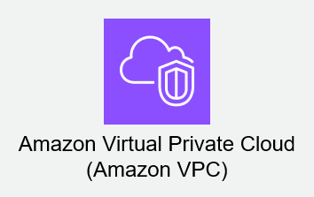
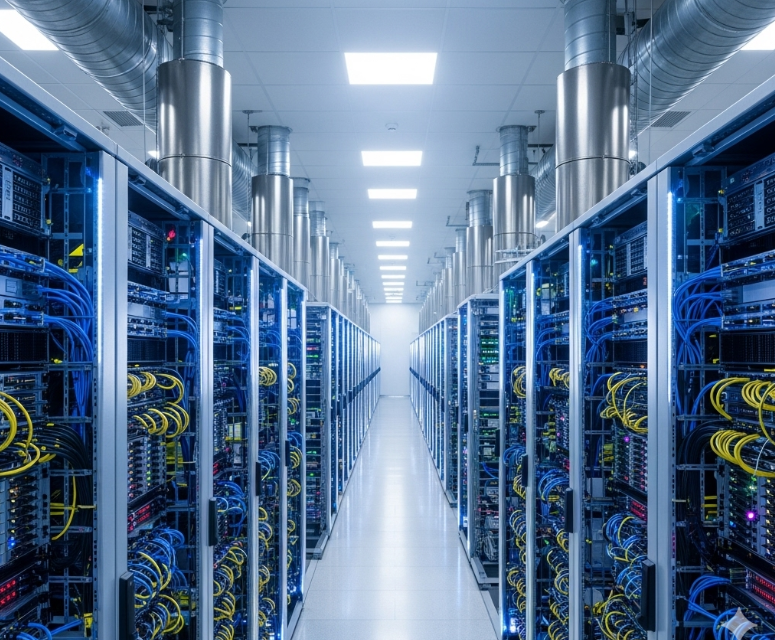
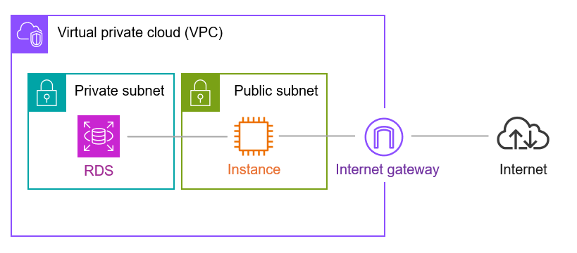

# VPC概要

---

## VPCとは

### 概要

Amazon Virtual Private Cloud（VPC）とは、AWSクラウド内に論理的に分離された、専用の仮想ネットワークを構築できるサービスです。  
この仮想ネットワーク内で、EC2インスタンスやRDSなどのAWSリソースを起動し、あたかもご自身のデータセンター内でリソースを運用しているかのように、ネットワーク環境を完全に制御できます。  
VPCは、指定するIPアドレス範囲（CIDRブロック）を用いて構築され、他のAWSユーザーのネットワークとは完全に隔離されています。  

### なぜVPCが必要なのか？

VPCは、AWS環境に以下の重要な利点をもたらします。  

*   **セキュリティと隔離**: AWSリソースは、他のAWSユーザーから論理的に隔離された専用のネットワーク内に配置されます。  
    これにより、データの機密性を保ち、外部からの不正アクセスリスクを軽減します。  
*   **ネットワークの自由な設計**: IPアドレス範囲、サブネット、ルートテーブル、ネットワークゲートウェイなど、従来のオンプレミス環境で利用していたネットワーク構成要素をAWS上に再現し、要件に合わせて自由に設計・構築できます。  
*   **オンプレミスとの連携**: VPNやAWS Direct Connectを通じて、オンプレミス環境とVPCをセキュアに接続し、ハイブリッドクラウド環境を容易に構築できます。  

### VPCの主な特徴

VPCは、以下の主要な特性と構成要素によって成り立っています。  

| 特徴的な要素             | 説明                                                                                                     |
| :----------------------- | :------------------------------------------------------------------------------------------------------- |
| **IPアドレス範囲（CIDR）** | VPC全体のプライベートIPアドレス範囲をCIDR形式で指定します。例えば、`10.0.0.0/16`などです。                 |
| **サブネット**           | VPC内のIPアドレス範囲をさらに分割し、リソースの配置場所やアクセス制御の単位とします。パブリックとプライベートがあります。 |
| **インターネットゲートウェイ** | VPCとインターネット間の通信を可能にするためにアタッチします。                                            |
| **ルートテーブル**       | ネットワークトラフィックのルーティングルールを定義し、どこへトラフィックを転送するかを決定します。               |
| **セキュリティグループ** | インスタンスレベルでインバウンドおよびアウトバウンドトラフィックを制御するステートフルなファイアウォールです。   |
| **ネットワークACL**      | サブネットレベルでインバウンドおよびアウトバウンドトラフィックを制御するステートレスなファイアウォールです。   |

### VPCが提供するコントロールレベル

VPCを使用することで、AWSクラウドにおけるネットワーク環境をきめ細かく制御できます。  

*   **IPアドレス範囲の選択**: プライベートIPアドレス空間を自由に定義できます。  
*   **サブネットの作成**: ネットワークを論理的に分割し、リソースの配置を最適化できます。  
*   **ルーティングの定義**: トラフィックがVPC内外のどこへ向かうかを明示的に制御できます。  
*   **セキュリティの適用**: 複数の層（サブネットレベル、インスタンスレベル）でネットワークセキュリティを設定できます。  
*   **ゲートウェイの接続**: インターネットやオンプレミスネットワークへの接続方法を管理できます。  

### まとめ

VPCは、AWSクラウド上に専用の安全でカスタマイズ可能なネットワーク空間を提供し、リソースのデプロイと運用に不可欠な基盤となります。  
従来のネットワーク概念をAWSクラウドに持ち込み、高度なセキュリティと柔軟性を実現するための中心的なサービスと言えます。  
今後の項目では、これらのVPCの構成要素について、さらに詳しく学んでいきます。

## VPCの基本イメージ

### 概要

VPCの基本イメージは、AWSという広大なクラウド環境の中に、専用の「仮想データセンター」や「論理的な社内ネットワーク」を構築するようなものです。  
物理的なインフラを意識することなく、ネットワークの設計、構成、およびセキュリティを、要件に合わせて完全にコントロールできます。  

### 広大なAWSクラウドの中の「あなたの区画」

AWSのリージョンは、世界各地に分散する大規模な物理インフラの集合体です。  
VPCは、このリージョン内に作成される「専用の隔離された区画」だと考えてください。  
他のAWSユーザーのVPCとは完全に分離されており、プライベートなIPアドレス空間（CIDRブロック）を用いて、指定した範囲でネットワークを構築します。  

### ネットワークの「設計図」を描く

VPCは、あたかも物理的なネットワーク機器を配置するかのごとく、仮想的な要素を配置していくイメージです。  
以下の表に、主要な要素とその役割を、物理的なものに例えながら示します。  

| VPC要素                 | 物理的なアナロジー              | 役割                                                                                                   |
| :---------------------- | :------------------------------ | :----------------------------------------------------------------------------------------------------- |
| **VPC本体**             | 会社の建物全体、あるいはフロア全体 | 専用のネットワーク空間の枠組み。IPアドレスの範囲（例: `10.0.0.0/16`）を定義します。                 |
| **サブネット**          | フロア内の各部屋、部署ごとの区画  | VPC内のIPアドレス範囲をさらに分割し、用途やセキュリティレベルに応じてリソースを配置する場所です。パブリックとプライベートがあります。 |
| **インターネットゲートウェイ** | 建物の玄関、メインエントランス    | VPCとインターネット間の通信を可能にするための出入り口です。                                            |
| **ルートテーブル**      | 建物内の案内板、道路標識          | ネットワークトラフィックがどこへ向かうべきかを指示するルールセットです。                                   |
| **セキュリティグループ** | 部屋のドアの鍵、個別の警備員      | EC2インスタンスなど、個々のリソースに対するアクセス制御（ファイアウォール）を行います。                 |
| **ネットワークACL**     | フロアの入口ゲート、フロア全体の警備員 | サブネット全体に対するアクセス制御（ファイアウォール）を行います。                                       |

### イメージ図（概念）

頭の中では以下のような構造をイメージしてください。  

このイメージ図では、VPCという大きな枠の中に、目的別に分割されたサブネットがあり、それぞれに役割の異なるリソースが配置されています。  
インターネットゲートウェイはVPCの外部、つまりインターネットとの接点となり、ルートテーブルがトラフィックの進路を決定します。  
そして、各サブネットやリソースには、セキュリティグループやネットワークACLといったセキュリティ層が適用されることで、安全なネットワークが構築されます。  

### まとめ

VPCの基本イメージは、「AWS上に構築された、専用の安全で柔軟な仮想ネットワーク空間」です。  
この空間内で、IPアドレスの割り当てからルーティング、セキュリティ設定に至るまで、ネットワークのあらゆる側面を自由に設計・制御できます。  
次の項目からは、これらのVPCを構成する各要素について、さらに詳しく掘り下げていきます。

## VPCの基本要素

### 概要

VPCは、複数の仮想的なネットワークコンポーネントを組み合わせて構成されます。  
これらの要素を理解し、適切に設定することが、セキュアで効率的なネットワーク環境を構築する上で不可欠です。  
ここでは、VPCを形成する主要な基本要素について詳しく解説します。  

### 1. VPC本体とIPアドレス範囲 (CIDRブロック)

VPCの最も基本的な要素は、VPC自体と、それに割り当てるプライベートIPアドレス範囲です。  

#### IPアドレス範囲 (CIDRブロック)

*   **定義**: VPC全体で使用するプライベートIPアドレスの範囲をCIDR（Classless Inter-Domain Routing）形式で指定します。  
    この範囲は、VPC内のすべてのサブネットやリソースに割り当てられるIPアドレスの基盤となります。  
*   **例**: `10.0.0.0/16`、`172.16.0.0/16`、`192.168.0.0/16`などが一般的に使用されます。  
*   **重要性**: 一度設定したVPCのプライマリCIDRブロックは、後から変更することが難しいため、将来の拡張性や他のネットワークとの重複を考慮して慎重に決定する必要があります。  
    ただし、セカンダリCIDRブロックを追加することは可能です。  

### 2. サブネット

VPCは、そのままでは広すぎるネットワーク空間です。  
サブネットは、VPCのIPアドレス範囲をさらに小さな区画に分割したものです。  

*   **定義**: サブネットは、VPC内の特定のIPアドレス範囲であり、通常は単一の**アベイラビリティーゾーン (AZ)** に配置されます。  
    AWSリソース（EC2インスタンスなど）は、このサブネット内にデプロイされます。  
*   **アベイラビリティーゾーン (AZ) との関連**: 各サブネットは、必ず1つのAZに紐付けられます。  
    これにより、アプリケーションの耐障害性を高めるために、複数のAZにまたがるサブネットにリソースを分散配置することが可能です。  
*   **パブリックサブネットとプライベートサブネット**:  

    | サブネットタイプ | 特徴                                                                                                   | 用途例                                              |
    | :--------------- | :----------------------------------------------------------------------------------------------------- | :-------------------------------------------------- |
    | **パブリック**   | インターネットゲートウェイ (IGW) へのルートがあり、インターネットから直接アクセス可能なリソースを配置します。 | Webサーバー、ロードバランサーなど                 |
    | **プライベート** | インターネットゲートウェイへの直接ルートがなく、インターネットから直接アクセスできないリソースを配置します。 | データベースサーバー、アプリケーションサーバーなど |

### 3. インターネットゲートウェイ (IGW)

VPC内のリソースがインターネットと通信するために不可欠なコンポーネントです。  

*   **定義**: VPCにアタッチする、スケーラブルで高可用性のVPCコンポーネントです。  
    VPCとインターネット間のトラフィックの出入り口として機能します。  
*   **役割**: パブリックIPアドレスを持つEC2インスタンスなどがインターネットと通信できるようになります。  
    インターネットゲートウェイ自体にコストはかかりませんが、データ転送量に応じて料金が発生します。  
*   **重要性**: パブリックサブネットがインターネットと通信するには、インターネットゲートウェイへのルートがルートテーブルに設定されている必要があります。  

### 4. ルートテーブル

ネットワークトラフィックがどこへ向かうべきかを決定するためのルールセットです。  

*   **定義**: サブネットからのトラフィックをどこにルーティングするかを制御するルール（ルート）の集合です。  
    各サブネットは、必ず1つのルートテーブルに関連付けられています。  
*   **ルート**:  

    | ルートの種類             | 説明                                                                                                 |
    | :----------------------- | :--------------------------------------------------------------------------------------------------- |
    | **ローカルルート**       | VPC内のIPアドレス範囲を示すルートで、自動的に追加されます。VPC内のリソース間の通信を可能にします。 |
    | **カスタムルート**       | 手動で追加するルートです。例として、インターネットゲートウェイへのルートや、NATゲートウェイへのルートなどがあります。 |
    | **デフォルトルート** (`0.0.0.0/0`) | 特定の宛先IPアドレスに一致しないすべてのトラフィックを転送するルールです。通常、インターネットへの通信に利用されます。 |
*   **関連付け**: ルートテーブルは、明示的にサブネットに関連付けられます。  
    関連付けられていないサブネットは、自動的にメインルートテーブルに関連付けられます。  

### 5. セキュリティグループ

インスタンスレベルのファイアウォールとして機能し、個々のリソースへのアクセスを制御します。  

*   **定義**: EC2インスタンスなど、個別のリソースにアタッチされる仮想ファイアウォールです。  
*   **特徴**:  
    *   **ステートフル**: 送信されたトラフィックに対する応答トラフィックは、明示的なルールがなくても自動的に許可されます。  
    *   **許可のみ**: 許可するトラフィックのルールのみを定義します。  
    *   **適用範囲**: 特定のインスタンスやENI（Elastic Network Interface）に対して適用されます。  
*   **詳細**: セキュリティグループについては、「セキュリティグループとネットワークACL」の項目でさらに詳しく解説します。  

### 6. ネットワークACL (NACL)

サブネットレベルのファイアウォールとして機能し、サブネット全体のトラフィックを制御します。  

*   **定義**: サブネットに出入りするトラフィックを制御する、オプションのセキュリティレイヤーです。  
*   **特徴**:  
    *   **ステートレス**: 送信されたトラフィックの応答トラフィックも、明示的なルールで許可する必要があります。  
    *   **許可と拒否**: 許可ルールと拒否ルールの両方を定義できます。  
    *   **ルール番号**: ルールには番号が付けられ、番号の小さい順に評価されます。  
    *   **適用範囲**: サブネット全体に対して適用されます。  
*   **詳細**: ネットワークACLについても、「セキュリティグループとネットワークACL」の項目でさらに詳しく解説します。  
