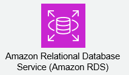
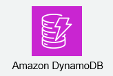
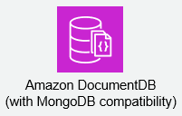
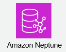
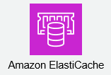
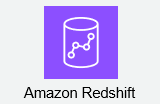

# RDS概要

---

## RDSとは？

Amazon RDS（Amazon Relational Database Service）は、AWSが提供するフルマネージド型のリレーショナルデータベースサービスです。  
ユーザーがデータベースのセットアップ、運用、スケーリングといった煩雑なタスクから解放され、アプリケーション開発に集中できるよう設計されています。  
これにより、企業はインフラストラクチャの管理に費やす時間と労力を削減し、ビジネス価値の創出に集中することができます。  

### Amazon RDSの主な特徴

Amazon RDSは、以下の主要な特徴によってデータベース運用を簡素化し、効率化します。  

#### フルマネージド型  
データベースのプロビジョニング、パッチ適用、バックアップ、リカバリ、障害検知といった、時間と手間のかかる運用タスクをAWSが自動的に行います。  
これにより、利用者はインフラ管理ではなく、アプリケーション開発やビジネスロジックの実装に専念できます。  

#### リレーショナルデータベースのサポート  
複数の人気のあるリレーショナルデータベースエンジンをサポートしており、既存のアプリケーションやスキルセットに合わせて選択できます。  
サポートされる主要なデータベースエンジンは以下の通りです。  

| データベースエンジン  | 概要                                         |
| :------------------ | :------------------------------------------- |
| MySQL               | オープンソースで広く普及しているDB           |
| PostgreSQL          | 高機能でエンタープライズ用途にも適したDB     |
| Oracle              | エンタープライズ向けの商用DB                 |
| SQL Server          | Microsoftが提供する商用DB                    |
| MariaDB             | MySQLから派生したオープンソースDB            |
| Amazon Aurora       | MySQL/PostgreSQL互換のAWS独自開発DB          |

#### 高可用性と拡張性  
リードレプリカやマルチAZ（アベイラビリティゾーン）配置といった機能により、高い可用性とスケーラビリティを実現します。  
これにより、システムの障害耐性を高め、トラフィックの急増にも柔軟に対応できます。  

---

## AWSが提供するデータベースサービス

AWSは、多様なアプリケーション要件やワークロードに対応するため、幅広い種類のデータベースサービスを提供しています。  
これにより、ユーザーは目的や特性に最適なデータベースを選択し、運用負荷を軽減しながら高いパフォーマンスとスケーラビリティを実現できます。  
主なデータベースサービスは、リレーショナルデータベース、NoSQLデータベース、データウェアハウスなどに分類されます。  

### リレーショナルデータベースサービス

リレーショナルデータベースは、行と列を持つテーブル形式でデータを格納し、SQL（Structured Query Language）を使用してデータを操作するデータベースです。  
AWSでは、以下の主要なリレーショナルデータベースサービスを提供しています。  

#### Amazon RDS (Relational Database Service)  
様々な商用およびオープンソースのリレーショナルデータベースエンジンをフルマネージドで提供するサービスです。  
データベースのプロビジョニング、パッチ適用、バックアップ、リカバリ、スケーリングなどの運用タスクをAWSが代行します。  
対応エンジンは以下の通りです。  

*   MySQL  
*   PostgreSQL  
*   MariaDB  
*   Oracle Database  
*   Microsoft SQL Server  
*   Amazon Aurora (後述)  

#### Amazon Aurora  

Amazon Auroraは、MySQLおよびPostgreSQLと互換性を持つ、AWS独自開発のリレーショナルデータベースです。  
商用データベースの性能と可用性に、オープンソースデータベースのシンプルさとコスト効率性を兼ね備えています。  
RDSの一部として提供されており、従来のRDSエンジンと比較して最大5倍（MySQL互換）または3倍（PostgreSQL互換）のパフォーマンスと、高い可用性・耐久性を実現します。  

### NoSQLデータベースサービス

NoSQL（Not only SQL）データベースは、非リレーショナルなデータモデルを採用しており、大量の非構造化データや半構造化データの処理、非常に高いスケーラビリティと柔軟性が求められるユースケースに適しています。  

#### Amazon DynamoDB  

キーと値のペア、またはドキュメント形式でデータを格納するフルマネージドなNoSQLデータベースサービスです。  
ミリ秒単位の応答時間で、あらゆる規模のワークロードに対応するように設計されており、極めて高いスケーラビリティと可用性を提供します。  

#### Amazon DocumentDB (with MongoDB compatibility)  

MongoDBと互換性のあるドキュメントデータベースサービスです。  
MongoDBのワークロードをクラウドで実行するために設計されており、MongoDB APIをサポートしつつ、スケーラビリティ、耐久性、可用性に優れています。  

#### Amazon Neptune  

グラフデータベースサービスです。  
ソーシャルネットワーク、レコメンデーションエンジン、不正検出などの、接続されたデータセットを扱うアプリケーションに適しています。  

#### Amazon ElastiCache  

インメモリデータストアサービスで、RedisとMemcachedをサポートします。  
データベースの読み込み処理を高速化するためのキャッシュとして利用され、アプリケーションのパフォーマンス向上に貢献します。  

### データウェアハウスサービス

データウェアハウスは、大量の履歴データを分析し、ビジネスインテリジェンス（BI）やレポート作成に使用するために最適化されたデータベースです。  

#### Amazon Redshift  

ペタバイト規模のデータを分析できる、高速でフルマネージドなクラウドデータウェアハウスサービスです。  
カラムナストレージと並列処理技術により、複雑なクエリでも高速なパフォーマンスを発揮します。  

### その他のデータベースサービス

AWSは、特定のユースケースに特化したデータベースサービスも提供しています。  

*   **Amazon Timestream:** 時系列データに特化したデータベースサービスです。  
*   **Amazon Quantum Ledger Database (QLDB):** 改ざん不可能な完全なトランザクション履歴を提供する台帳データベースサービスです。  
*   **Amazon MemoryDB for Redis:** Redis互換の、耐久性と高速性を兼ね備えたインメモリデータベースサービスです。  

---

## Amazon RDSの特徴

Amazon RDSは、リレーショナルデータベースの運用における多くの課題を解決し、利用者に多大なメリットをもたらすサービスです。  
その主な特徴を詳細に見ていきましょう。  

### フルマネージド型サービスによる運用負荷の軽減

RDSの最大の魅力は、そのフルマネージド性です。  
これにより、データベース管理者は以下の煩雑な運用タスクから解放されます。  

#### 自動化された運用タスク  
*   **プロビジョニング:** インスタンスの起動、DBエンジンのインストール、設定などが自動で行われます。  
*   **パッチ適用:** OSおよびデータベースエンジンのセキュリティパッチやバージョンアップが自動的に適用されます。  
*   **バックアップとリカバリ:** 自動バックアップ（最大35日間保持）およびポイントインタイムリカバリ（PITR）により、指定した時点へのデータ復旧が可能です。  
*   **障害検出と復旧:** インスタンスの障害を検出し、自動的に修復プロセスを開始します。  
*   **監視:** Amazon CloudWatchとの連携により、CPU使用率、I/O処理、ネットワーク接続などの主要なメトリクスを自動で収集・可視化します。  

#### インフラ管理からの解放  
データベースが稼働する基盤となるOSや物理サーバー、ストレージといったインフラストラクチャの管理は、すべてAWSが担当します。  
これにより、利用者はハードウェアの選定、OSのセットアップ、RAID構成の検討など、下位レイヤーの作業に時間を費やす必要がなくなります。  

### 多様なデータベースエンジンのサポート

Amazon RDSは、幅広いリレーショナルデータベースエンジンをサポートしており、既存のアプリケーションや特定の要件に合わせて最適な選択が可能です。  

| データベースエンジン  | 特徴                                                                   |
| :------------------ | :--------------------------------------------------------------------- |
| MySQL               | オープンソースで広く利用されており、Webアプリケーションに最適です。      |
| PostgreSQL          | 高度な機能と高いSQL標準準拠性を持ち、エンタープライズ用途に適しています。 |
| MariaDB             | MySQLから派生したオープンソースDBで、MySQLとの高い互換性があります。     |
| Oracle Database     | 商用データベースのデファクトスタンダードであり、多くの既存システムで利用されます。 |
| Microsoft SQL Server | Windows環境での開発に適しており、ビジネスインテリジェンス機能も充実しています。 |
| Amazon Aurora       | MySQL/PostgreSQL互換で、高いパフォーマンスと可用性を提供するAWS独自開発DBです。 |

### 高い可用性と耐久性

ビジネス継続性にとって不可欠な可用性とデータの耐久性も、RDSの強力な特徴です。  

#### マルチAZ配置 (Multi-AZ Deployment)  
異なるアベイラビリティゾーン（AZ）にスタンバイインスタンスを自動的にプロビジョニングし、プライマリインスタンスとデータを同期します。  
プライマリインスタンスに障害が発生した場合、自動的にスタンバイインスタンスへフェイルオーバーするため、ダウンタイムを最小限に抑えられます。  

#### 自動バックアップとポイントインタイムリカバリ  
定期的なスナップショットとトランザクションログの継続的なバックアップにより、最大35日間の任意の時点へデータベースを復旧できます。  
これにより、人的ミスやデータ破損が発生した場合でも、データの損失を最小限に抑えることができます。  

### 優れたスケーラビリティ

トラフィックの変動やデータ量の増加に合わせて、柔軟にデータベースのリソースを調整できます。  

#### スケールアップ/スケールダウン  
CPU、メモリ、ストレージ容量といったリソースを、データベースインスタンスのタイプを変更することで簡単にスケールアップ（増強）またはスケールダウン（削減）できます。  
これにより、ピーク時とアイドル時のリソースを最適化し、コスト効率を高めることが可能です。  

#### リードレプリカ (Read Replicas)  
読み込み集中型ワークロードに対応するため、既存のデータベースインスタンスから読み込み専用のレプリカを作成できます。  
これにより、プライマリインスタンスの負荷を軽減し、アプリケーションの読み込みパフォーマンスを向上させるとともに、可用性向上の手段としても利用できます。  

### 強固なセキュリティ

RDSは、データの保護とアクセス制御に関して、多層的なセキュリティ機能を提供します。  

*   **VPC (Virtual Private Cloud) 内でのデプロイ:** データベースインスタンスを仮想プライベートネットワーク内に配置し、ネットワークレベルでの隔離と制御を可能にします。  
*   **ネットワークアクセス制御:** セキュリティグループやネットワークACLを利用して、データベースへのアクセス元IPアドレスやポートを厳密に制限できます。  
*   **SSL/TLSによる暗号化:** アプリケーションとデータベース間の通信を暗号化し、データの盗聴を防ぎます。  
*   **保管時のデータの暗号化:** AWS Key Management Service (KMS) を利用して、データベースインスタンスに保存されているデータ（ストレージ、スナップショット、リードレプリカ）を暗号化できます。  
*   **IAM (Identity and Access Management) 連携:** AWSのIAMサービスと連携し、ユーザーやロールに対するデータベース操作権限を細かく制御できます。  

### コスト効率

RDSは、利用した分だけ料金を支払う従量課金モデルを採用しており、コスト効率に優れています。  

*   **従量課金制:** データベースインスタンスの稼働時間、ストレージ容量、I/O回数などに基づいて料金が発生します。  
*   **リザーブドインスタンス:** 長期間（1年または3年）の利用を確約することで、オンデマンド料金と比較して大幅な割引を受けることができます。  
*   **リソースの最適化:** 必要な時に必要なリソースをプロビジョニングできるため、過剰な設備投資が不要です。  

これらの特徴により、Amazon RDSは、あらゆる規模の企業に対して、信頼性、スケーラビリティ、セキュリティ、コスト効率に優れたデータベースソリューションを提供します。  

---

## データベース運用の作業と課題

データベースはアプリケーションの中核であり、その安定稼働とデータ保全はビジネスにおいて極めて重要です。  
しかし、データベースの運用には多岐にわたる専門的な作業が必要であり、それに伴う多くの課題が常に存在します。  
ここでは、従来のオンプレミス環境やIaaS（Infrastructure as a Service）上でデータベースを運用する際に直面する主要な作業と、それに付随する課題について解説します。  

### データベース運用の主要な作業

データベース管理者は、システムのライフサイクル全体にわたって、以下のような幅広い作業を担当します。  

#### 1. 設計・構築フェーズ  
*   **ハードウェア選定とプロビジョニング:** サーバー、ストレージ、ネットワーク機器の選定、調達、設置を行います。  
*   **OSおよびDBソフトウェアのインストールと設定:** 適切なOSのインストールとチューニング、データベースソフトウェア（例：MySQL, PostgreSQL）のインストール、初期設定、パラメータ調整などを行います。  
*   **ネットワークおよびセキュリティ設定:** ファイアウォール、VPN、VLANなどのネットワーク設定を行い、セキュリティグループ、アクセス制御リスト（ACL）などでデータベースへのアクセスを制限します。  
*   **高可用性（HA）と災害復旧（DR）の設計と実装:** 冗長化構成（クラスタリング、レプリケーション）、データセンター間のDR対策などを検討し、実装します。  
*   **バックアップ戦略の策定:** バックアップの種類（フル、差分、増分）、頻度、保存期間、保存場所、リストア手順などを詳細に計画します。  

#### 2. 日常運用・保守フェーズ  
*   **監視とパフォーマンス管理:** CPU、メモリ、ディスクI/O、ネットワーク、データベースのセッション数やクエリ実行時間などを継続的に監視し、パフォーマンスのボトルネックを特定して改善策を講じます。  
*   **バックアップとリカバリの実行・検証:** 定期的なバックアップを実行し、そのデータが正しくリストアできるか、定期的に検証を行います。  
*   **パッチ適用とバージョンアップ:** OSやデータベースソフトウェアのセキュリティパッチ適用、マイナー/メジャーバージョンのアップグレードを計画し、実行します。  
*   **ストレージ管理と容量計画:** ディスク使用量の監視、必要に応じたストレージの拡張、データアーカイブなどを行い、容量枯渇を防ぎます。  
*   **セキュリティ管理:** ユーザーアカウントの管理、権限設定の見直し、脆弱性診断、監査ログの確認などを実施し、セキュリティ脅威からデータベースを保護します。  
*   **パフォーマンスチューニング:** SQLクエリの最適化、インデックスの追加・見直し、データベーススキーマの最適化などを行い、アプリケーションの応答速度向上を図ります。  

#### 3. 障害対応フェーズ  
*   **障害検知と原因特定:** 監視アラートやシステムログに基づいて障害を迅速に検知し、根本原因を特定します。  
*   **復旧作業:** 事前に策定した手順に基づき、データベースの復旧作業（例：フェイルオーバー、バックアップからのリストア）を実施します。  
*   **恒久対策の検討と実施:** 再発防止のため、障害の原因を分析し、システム構成や運用手順の改善策を検討・実施します。  

### データベース運用がもたらす主要な課題

これらの多岐にわたる運用作業は、以下のような深刻な課題を企業にもたらします。  

#### 1. 高いコスト  
*   **設備投資コスト:** サーバー、ストレージ、ネットワーク機器、DBソフトウェアライセンスなど、初期投資が非常に高額になります。  
*   **運用コスト:** データセンターの電気代、空調代、メンテナンス費用、そしてデータベース管理者の人件費など、継続的な運用コストが発生します。  
*   **リソースの無駄:** ピーク時の負荷に合わせた設備投資を行うため、アイドル時のリソースが遊休状態となり、無駄が生じやすいです。  

#### 2. 複雑性と専門知識の必要性  
*   **多様な技術要素:** OS、ネットワーク、ストレージ、データベースソフトウェア、アプリケーションなど、幅広い分野の専門知識が求められます。  
*   **データベース管理者の不足:** 高度な専門知識を持つデータベース管理者の採用や育成は困難であり、人手不足が深刻な課題となっています。  
*   **ノウハウの属人化:** 特定の管理者のみが運用ノウハウを持つ状況に陥りやすく、退職や異動によるリスクが大きいです。  

#### 3. 時間と労力の消費  
*   **手作業による負荷:** パッチ適用、バックアップ、バージョンアップなど、多くの作業が手動または半自動で行われ、管理者に大きな負担がかかります。  
*   **ダウンタイムのリスク:** パッチ適用やバージョンアップ、スケーリング作業では、計画的なダウンタイムが必要になることが多く、ビジネスへの影響が大きいです。  
*   **災害対策の複雑さ:** 複数のデータセンターを使ったDR構成の構築や同期、テストは非常に複雑で、時間とコストがかかります。  

#### 4. 可用性・信頼性の確保  
*   **単一障害点のリスク:** 冗長化が不十分な場合、ハードウェア故障やソフトウェア障害が直接的なサービス停止につながる可能性があります。  
*   **災害発生時の復旧:** 大規模災害発生時、オンプレミス環境でのデータ復旧やサービス再開は極めて困難を伴います。  
*   **SLA（サービスレベル合意）達成の難しさ:** 自社で高い可用性SLAを保証することは、多大な投資と運用努力が必要です。  

#### 5. スケーラビリティへの対応  
*   **リソース拡張の遅延:** 急激なトラフィック増加やデータ量増大に対応するためには、新たなハードウェア調達や設定変更が必要となり、迅速な対応が困難です。  
*   **計画外のダウンタイム:** リソース増強のためのスケールアップ作業が、アプリケーションのダウンタイムを伴う場合があります。  

#### 6. セキュリティリスク  
*   **脆弱性への対応:** OSやDBソフトウェアの脆弱性パッチ適用を怠ると、外部からの攻撃リスクが高まります。  
*   **アクセス制御の複雑さ:** 適切なアクセス制御の設計と維持は複雑であり、設定ミスが情報漏洩につながる可能性があります。  
*   **データ暗号化の課題:** 保存されているデータや通信経路の暗号化を自社で実装・管理することは、技術的にも運用的にも負荷が高いです。  

これらの課題は、企業がITリソースを本来のビジネス価値創造ではなく、インフラ維持管理に費やしてしまう大きな要因となります。  
このような背景から、データベース運用を効率化し、課題を解決するためのマネージドサービスが強く求められるようになりました。  

