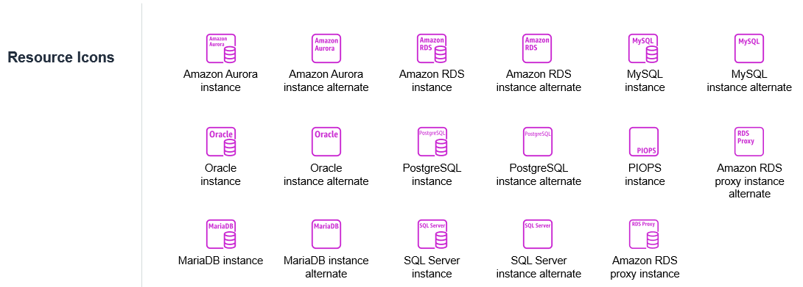
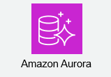

# 機能と基本用語

---

## RDSの機能と基本用語

Amazon RDSは、多岐にわたる機能を持ち、それらを理解することでサービスの恩恵を最大限に受けることができます。  
ここでは、RDSを利用する上で不可欠な主要な機能と、それに付随する基本用語について解説します。  

### 1. データベースインスタンス (DB Instance)

Amazon RDSにおける最も基本的な構成要素です。  
これは、クラウド上で稼働する独立したデータベース環境であり、ユーザーが実際に利用するデータベース本体を指します。  
特定のデータベースエンジン（MySQL、PostgreSQLなど）が稼働し、独自のコンピューティングリソース（CPU、メモリ）、ストレージ、ネットワークが割り当てられます。  
EC2インスタンス上にデータベースソフトウェアをインストールしたものと似ていますが、OSやDBソフトウェアの管理はAWSが担当します。  

### 2. データベースエンジン (DB Engine)

RDSは、複数のリレーショナルデータベースエンジンをサポートしています。  
アプリケーションの要件や既存のシステムに合わせて、適切なエンジンを選択します。  

| データベースエンジン  | 概要                                         |
| :------------------ | :------------------------------------------- |
| MySQL               | Webアプリケーションで広く利用されるオープンソースDB。  |
| PostgreSQL          | 高機能で拡張性が高く、エンタープライズ用途にも適したオープンソースDB。  |
| MariaDB             | MySQLから派生したオープンソースDBで、MySQLとの高い互換性を持つ。  |
| Oracle Database     | 商用データベースのデファクトスタンダード。  |
| Microsoft SQL Server | Microsoftエコシステムとの親和性が高い商用DB。  |
| Amazon Aurora       | AWSが開発したMySQL/PostgreSQL互換の高性能・高可用性DB。  |

### 3. DBインスタンスクラス (DB Instance Class)

DBインスタンスクラスは、データベースインスタンスに割り当てるCPU、メモリ、ネットワーク性能などのコンピューティングリソースのサイズを定義します。  
AWS EC2のインスタンスタイプと同様の概念で、`db.t3.medium` や `db.m5.large` のように命名されます。  
ワークロードの要件に合わせて、スケールアップ（より高性能なクラスへ変更）やスケールダウン（より低性能なクラスへ変更）が可能です。  

### 4. ストレージ (Storage)

データベースがデータを格納するディスク領域です。  
RDSでは、以下の主要なストレージタイプを選択できます。  

*   **汎用 SSD (gp2/gp3):**  
    一般的なワークロードに適した、バランスの取れた性能とコスト効率を提供します。  
    ほとんどのビジネスアプリケーションで使用されます。  
*   **プロビジョンド IOPS SSD (io1/io2):**  
    高いI/O性能と一貫したパフォーマンスが必要な、トランザクション処理が集中するワークロード（例: OLTP）に適しています。  
    必要なIOPS（Input/Output Operations Per Second）を事前に指定できます。  

また、ストレージの自動拡張機能もあり、ディスク容量が不足しそうな場合に、設定した閾値に基づいて自動的にストレージを拡張できます。  

### 5. パラメータグループ (DB Parameter Group)

データベースエンジンのランタイム設定（例: メモリ割り当て、接続数、ログ設定など）を制御するものです。  
RDSインスタンス作成時にデフォルトのパラメータグループが割り当てられますが、ユーザーはカスタムのパラメータグループを作成し、データベースの挙動を詳細にチューニングすることができます。  
これにより、特定のアプリケーション要件に合わせてデータベースの性能を最適化することが可能です。  

### 6. オプショングループ (DB Option Group)

特定のデータベースエンジンに追加機能やツールを組み込むために使用されます。  
例えば、OracleデータベースのAPEX（アプリケーション開発環境）やSQL Serverの透明なデータ暗号化（TDE）などを有効にする際に利用します。  
利用したい追加機能がDBエンジンによって異なるため、必要なオプションを含むオプショングループをインスタンスに関連付けます。  

### 7. マルチAZ配置 (Multi-AZ Deployment)

高い可用性を実現するためのRDSの重要な機能です。  
異なるアベイラビリティゾーン（AZ）に、プライマリデータベースインスタンスの同期スタンバイレプリカを自動的にプロビジョニングします。  
プライマリインスタンスに障害が発生した場合（インスタンス障害、AZ障害など）、RDSは自動的にスタンバイインスタンスにフェイルオーバーし、ダウンタイムを最小限に抑えます。  
これにより、手動での障害復旧作業が不要となり、ビジネス継続性が向上します。  

### 8. リードレプリカ (Read Replica)

読み込み集中型ワークロードのパフォーマンスを向上させ、データベースの拡張性を高めるための機能です。  
既存のプライマリデータベースインスタンスから、データのコピーである読み込み専用のレプリカを作成します。  
アプリケーションからの読み込みクエリをリードレプリカにオフロードすることで、プライマリインスタンスの負荷を軽減し、全体的な応答性能を向上させます。  
異なるリージョンに作成して、災害対策としても利用できます。  

### 9. スナップショット (Snapshot)

データベースの特定の時点における完全なデータコピーです。  
RDSでは、以下の2種類のスナップショットが提供されます。  

*   **自動バックアップ (Automated Backups):**  
    毎日自動的に実行され、設定された保持期間（1〜35日）に基づいて管理されます。  
    これを利用して、指定した任意の時点へのポイントインタイムリカバリ（後述）が可能です。  
*   **手動スナップショット (Manual Snapshots):**  
    ユーザーが必要なときにいつでも手動で作成できるスナップショットです。  
    自動バックアップの保持期間を超えてデータを保持したい場合や、メジャーバージョンアップ前にバックアップを取得したい場合などに利用されます。  

スナップショットはS3に保存され、高い耐久性を持ちます。  

### 10. ポイントインタイムリカバリ (Point-in-Time Recovery, PITR)

データベースを過去の任意の時点（秒単位まで）に復旧させる機能です。  
これは、自動バックアップ機能によって取得される日次スナップショットと、そのスナップショットから次のスナップショットまでの間に発生したすべてのトランザクションログ（バイナリログなど）を組み合わせることで実現されます。  
誤ってデータを削除してしまったり、データが破損してしまったりした場合に非常に有効なリカバリ手段です。  

### 11. セキュリティグループ (Security Group)

データベースインスタンスへのネットワークアクセスを制御するための仮想ファイアウォールです。  
どのIPアドレス、どのポートからの通信を許可するかを設定することで、データベースを不正なアクセスから保護します。  
VPC（Virtual Private Cloud）内でRDSインスタンスを稼働させる際に、必須のネットワーク設定要素となります。  

### 12. 暗号化 (Encryption)

RDSでは、保管されているデータ（ストレージ、スナップショット、リードレプリカ）および通信中のデータを暗号化できます。  

*   **保管中の暗号化:** AWS Key Management Service (KMS) を利用して、データベースインスタンスに保存されているデータを暗号化します。  
    これにより、ディスクが盗難されたり、不正にアクセスされたりした場合でもデータが保護されます。  
*   **通信中の暗号化:** SSL/TLSを利用して、クライアントアプリケーションとデータベースインスタンス間の通信経路を暗号化します。  
    これにより、データがネットワーク上で盗聴されるリスクを防ぎます。  

これらの機能と用語は、Amazon RDSの基本的な理解と効果的な利用のために不可欠です。  
次の項目からは、これらの機能のいくつかをさらに深掘りして解説していきます。  

---

## Aurora

Amazon Auroraは、AWSが独自に開発した、クラウドネイティブなリレーショナルデータベースエンジンです。  
既存のAmazon RDSが提供するデータベースエンジンの一つとして利用でき、MySQLおよびPostgreSQLと高い互換性を持ちます。  
商用データベースの性能と可用性に、オープンソースデータベースのシンプルさとコスト効率性を兼ね備えることを目指して設計されました。  

### Auroraの特徴と革新的なアーキテクチャ

Auroraは、従来のデータベースアーキテクチャを根本から見直すことで、卓越したパフォーマンス、可用性、耐久性を実現しています。  

#### 1. 高いパフォーマンス  
*   **MySQL互換の場合:** 標準的なMySQLと比較して、最大5倍のスループット（トランザクション処理能力）を実現します。  
*   **PostgreSQL互換の場合:** 標準的なPostgreSQLと比較して、最大3倍のスループットを実現します。  
この高速性は、特にI/O処理の最適化と、分散型ストレージシステムによるものです。  

#### 2. 高い可用性と耐久性  
Auroraは、データベースの高可用性とデータの耐久性において業界最高水準を提供します。  
*   **分散型、自己修復型ストレージ:** データを3つのアベイラビリティゾーン（AZ）にわたって6つの方法で自動的にレプリケート（複製）します。  
    これにより、ディスク障害が発生してもデータ損失のリスクが極めて低く、自己修復機能により自動的に修復されます。  
*   **高速フェイルオーバー:** プライマリインスタンスに障害が発生した場合、数秒から数十秒という非常に短い時間で自動的にリードレプリカが新しいプライマリとして昇格します。  
    これにより、ダウンタイムを最小限に抑え、ビジネス継続性を確保します。  
*   **マルチAZ構成が標準:** Auroraは、設計上、データが複数のAZに分散して保存されるため、AZ障害からの保護が組み込まれています。  
    計算ノード（DBインスタンス）も複数のAZに配置することで、さらに高可用性を高めることができます。  

#### 3. 自動スケーリングストレージ  
*   データベースのストレージは、最大128TBまで自動的に拡張されます。  
    ユーザーは事前にストレージ容量をプロビジョニングする必要がなく、データ増加に伴うストレージ管理の負荷が不要になります。  
    また、使用した分だけ課金されるため、コスト効率も優れています。  

#### 4. リードレプリカの強化  
*   Auroraでは、最大15個のリードレプリカを作成できます。  
    これらのレプリカは、物理的に同じ共有ストレージを利用するため、従来のRDSリードレプリカよりもはるかに高速なレプリケーション遅延（通常10ms未満）を実現します。  
    これにより、読み込み集中型ワークロードを効率的に分散し、アプリケーションのパフォーマンスを大幅に向上させることができます。  

#### 5. コスト効率  
*   商用データベースのハイエンドな性能と信頼性を、オープンソースデータベースと同等の、あるいはそれ以下のコストで提供します。  
    従量課金モデルであり、必要なリソースに対してのみ支払うため、TCO（総所有コスト）を最適化できます。  

### Auroraの主要な機能

Auroraは、上記の基本的な特徴に加え、特定のユースケースやニーズに対応するための様々な機能を提供します。  

#### 1. Aurora Serverless  
*   オンデマンドで利用できる、フルマネージド型のAuroraの構成オプションです。  
    データベースの容量を自動的にスケーリングし、アイドル時には容量をゼロにまで縮小できるため、利用した分に対してのみ課金されます。  
    開発/テスト環境、散発的なワークロード、利用量が予測不能なアプリケーションなどに最適です。  

#### 2. Aurora Global Database  
*   複数のAWSリージョンにまたがってデータベースを配置し、リージョン間での災害対策やグローバルな読み込みパフォーマンスを実現する機能です。  
    プライマリリージョンで発生した書き込みが、数秒で他のセカンダリリージョンにレプリケートされます。  
    これにより、リージョン全体にわたる障害からの復旧を可能にし、低レイテンシーでのグローバルな読み込みアクセスを提供します。  

#### 3. Backtrack (巻き戻し)  
*   データベースを特定の過去の時点に「巻き戻す」ことができる機能です。  
    大規模なリカバリを必要とせず、数分でデータベースを以前の状態に戻すことができます。  
    誤ったデータ変更やアプリケーションエラーからの回復に特に有効です。  

#### 4. Fast Database Clone (高速データベース複製)  
*   既存のAuroraデータベースから、数分で新しいデータベースインスタンスを複製できる機能です。  
    物理ストレージをコピーするのではなく、コピーオンライト技術を使用するため、非常に高速かつコスト効率が良いです。  
    開発、テスト、分析用途に簡単にデータセットを提供できます。  

### Auroraのユースケース

Auroraは、その高い性能、可用性、スケーラビリティから、以下のような幅広いユースケースで利用されています。  

*   **大規模なWebアプリケーション:** 高いトランザクション処理能力と同時接続数が必要なWebサービスやECサイト。  
*   **エンタープライズアプリケーション:** 基幹システムや重要なビジネスアプリケーションで、高い信頼性とパフォーマンスが求められる場合。  
*   **SaaSアプリケーション:** マルチテナント環境で、顧客ごとにデータベースを分離しつつ、コスト効率とスケーラビリティを確保したい場合。  
*   **データ集約型ワークロード:** 大量のデータに対する複雑なクエリや分析を高速に実行したい場合。  
*   **グローバル展開するサービス:** Aurora Global Databaseを利用して、世界中のユーザーに低レイテンシーでサービスを提供したい場合。  

Amazon Auroraは、クラウドの利点を最大限に活かし、データベースの性能、信頼性、管理の容易さを次のレベルに引き上げた革新的なサービスと言えます。  

---

## リードレプリカ

Amazon RDSの重要な機能の一つである「リードレプリカ」は、特にWebアプリケーションやデータ分析など、読み込み処理が頻繁に発生するワークロードにおいて、データベースのパフォーマンスとスケーラビリティを大幅に向上させるために利用されます。  
プライマリデータベースインスタンスの読み込み負荷を分散し、システムの応答性を高める目的で設計されています。  

### リードレプリカの目的

リードレプリカを導入する主な目的は以下の通りです。  

#### 1. 読み込みパフォーマンスの向上  
アプリケーションからの大量の読み込みリクエストをリードレプリカに分散させることで、プライマリデータベースインスタンスへの負荷を軽減します。  
これにより、プライマリインスタンスは書き込み処理に専念でき、全体的なデータベースの応答速度とスループットが向上します。  

#### 2. プライマリデータベースの負荷軽減  
読み込み処理がプライマリから分離されることで、プライマリインスタンスのCPU、メモリ、I/Oリソースが解放されます。  
これにより、プライマリはより安定して書き込み操作を処理でき、パフォーマンスのボトルネックを解消します。  

#### 3. 可用性の向上（災害復旧戦略の一部として）  
リードレプリカは、プライマリインスタンスに障害が発生した場合のフェイルオーバーターゲットとして利用できる場合があります。  
特に、異なるアベイラビリティゾーン（AZ）や異なるAWSリージョンにリードレプリカを配置することで、プライマリインスタンスが完全に停止しても、リードレプリカを新しいプライマリとして昇格させ、サービス復旧時間を短縮することが可能です。  

#### 4. 分析ワークロードの分離  
本番環境のプライマリデータベースに影響を与えることなく、分析クエリやレポート生成などの重い読み込み処理をリードレプリカで実行できます。  
これにより、本番アプリケーションのパフォーマンス低下を防ぎます。  

### リードレプリカの仕組み

リードレプリカは、プライマリデータベースインスタンスのデータを複製することで機能します。  

#### プライマリとレプリカの関係  
*   **プライマリデータベース (DB Instance):** データの書き込み（INSERT, UPDATE, DELETE）と読み込みの両方を処理します。  
*   **リードレプリカ (Read Replica):** プライマリデータベースからデータを非同期で複製し、読み込み専用でサービスを提供します。  

#### データレプリケーションのプロセス  
1.  プライマリデータベースで行われた変更（書き込みトランザクション）は、バイナリログ（MySQL, MariaDB）やWAL（Write-Ahead Log, PostgreSQL）などの形式で記録されます。  
2.  リードレプリカは、これらのログをプライマリから継続的に取得し、自身のデータベースに適用することで、プライマリとのデータ同期を保ちます。  
3.  このレプリケーションは基本的に非同期で行われるため、プライマリとリードレプリカの間にはわずかなデータ遅延（**レプリケーションラグ**）が発生する可能性があります。  

#### Amazon Auroraのリードレプリカの特殊性  
一般的なRDSエンジンのリードレプリカが独立したDBインスタンスとしてプライマリから非同期でデータをコピーするのに対し、Amazon Auroraのリードレプリカは、そのアーキテクチャの特性上、異なる仕組みで動作します。  
*   **共有ストレージ:** Auroraのプライマリインスタンスとリードレプリカは、物理的に同じ分散型共有ストレージボリュームを利用します。  
*   **非常に低いレプリケーション遅延:** プライマリへの書き込みは、ストレージに書き込まれた時点でリードレプリカからも参照可能になるため、レプリケーションの遅延が非常に短く（通常10ms未満）、ほぼリアルタイムなデータ同期が実現されます。  
*   **高速フェイルオーバー:** Auroraのリードレプリカは、プライマリインスタンスに障害が発生した場合、数秒で新しいプライマリとして昇格できるため、高可用性ソリューションとしても非常に優れています。  

### リードレプリカのメリット

*   **スケーラビリティの向上:** 読み込み集中型のアプリケーションにおいて、アプリケーションのインスタンス数を増やすように、データベースの読み込み処理能力を水平に拡張できます。  
*   **パフォーマンスの安定化:** プライマリDBの負荷が軽減されることで、書き込み操作の応答速度が安定し、アプリケーション全体のパフォーマンスが向上します。  
*   **災害復旧の強化:** 異なるAZやリージョンにリードレプリカを配置することで、リージョン規模の障害にも対応できる災害復旧戦略を構築できます。  
*   **分離されたワークロード:** 分析やレポート生成などのリソースを消費するクエリをリードレプリカにオフロードし、本番アプリケーションへの影響を避けることができます。  
*   **簡単な管理:** RDSの機能として提供されるため、リードレプリカの作成、削除、管理がAWSマネジメントコンソールやCLIから簡単に行えます。  

### リードレプリカの考慮事項

*   **レプリケーションラグ:** 非同期レプリケーションの性質上、プライマリとリードレプリカの間には常にデータの一貫性のずれ（ラグ）が発生する可能性があります。  
    アプリケーションは、このラグを許容できるか、あるいはラグを意識した設計（例: 重要なデータは常にプライマリから読み込む、ラグを監視して許容範囲外の場合は警告するなど）が必要です。  
*   **書き込み不可:** リードレプリカは読み込み専用であり、書き込み操作はできません。  
    すべての書き込みはプライマリインスタンスに対して行われる必要があります。  
*   **コスト:** リードレプリカも通常のDBインスタンスであるため、それぞれにコンピューティングリソースとストレージの費用が発生します。  
    必要なレプリカ数とスペックを適切に見積もる必要があります。  
*   **インスタンスクラスの選択:** リードレプリカのインスタンスクラスは、プライマリインスタンスと同じである必要はありません。  
    読み込み負荷に応じて、適切なインスタンスクラスを選択することでコストを最適化できます。  
*   **ネットワークの考慮:** リードレプリカへのアクセスは、プライマリとは異なるエンドポイントを介して行われます。  
    アプリケーションは、読み込みクエリをリードレプリカのエンドポイントに、書き込みクエリをプライマリのエンドポイントにルーティングする必要があります。  

リードレプリカは、現代の高性能でスケーラブルなアプリケーションを構築する上で不可欠な機能であり、Amazon RDSを利用することで、その導入と管理が非常に容易になります。  

---

## スナップショット

データベースのスナップショットは、特定の時点におけるデータの完全なコピーを指します。  
Amazon RDSにおけるスナップショット機能は、データベースの信頼性、耐久性、そして復旧能力を確保するための最も重要な基盤の一つであり、災害復旧（DR）やデータ復元戦略の中心となります。  
これにより、不慮のデータ損失やシステム障害からデータベースを保護し、必要に応じて迅速に元の状態に復旧することが可能になります。  

### スナップショットとは？

RDSのスナップショットは、データベースインスタンスのディスクボリューム全体のバックアップイメージです。  
これはAmazon S3に保存され、非常に高い耐久性（99.999999999%）と可用性（99.99%）を誇ります。  
RDSでは、このスナップショット機能が**自動バックアップ**と**手動スナップショット**の2つの形で提供されます。  

### RDSにおけるスナップショットの種類

#### 1. 自動バックアップ (Automated Backups)  
*   **仕組み:**  
    *   RDSインスタンス作成時にデフォルトで有効化され、毎日自動的にデータベースのフルスナップショットが取得されます。  
    *   このフルスナップショットに加えて、直近のフルスナップショット以降に発生したすべてのトランザクション（データベースへの変更履歴）が、継続的にログ（バイナリログなど）として記録・保存されます。  
*   **目的:**  
    *   主に**ポイントインタイムリカバリ (Point-in-Time Recovery, PITR)** を実現するために使用されます。  
    *   これにより、ユーザーは過去の任意の時点（秒単位まで）にデータベースを復元することができます。  
*   **保持期間:**  
    *   デフォルトは7日間ですが、1日から35日の間で設定可能です。  
    *   保持期間を過ぎたバックアップデータは自動的に削除されます。  
*   **特徴:**  
    *   自動的に管理されるため、ユーザーはバックアップスケジュールや保存場所を意識する必要がありません。  
    *   バックアップウィンドウと呼ばれる時間帯に実行され、バックアップ取得中は一時的にI/Oパフォーマンスが低下する可能性がありますが、通常は大きな影響はありません。  

#### 2. 手動スナップショット (Manual Snapshots)  
*   **仕組み:**  
    *   ユーザーがAWSマネジメントコンソール、CLI、またはAPIを通じて任意のタイミングで明示的に取得するスナップショットです。  
*   **目的:**  
    *   **長期的なデータアーカイブ:** 自動バックアップの保持期間を超えてデータを保持したい場合に利用します。  
    *   **メジャーバージョンアップ前:** データベースのメジャーバージョンアップや大規模なシステム変更前に、安全な復旧ポイントとして取得します。  
    *   **開発/テスト環境のベース:** 本番環境に近いデータを持つ開発・テスト環境を迅速に構築する際のベースとして利用します。  
    *   **監査/コンプライアンス:** 特定の時点のデータを保持する必要があるコンプライアンス要件に対応します。  
*   **保持期間:**  
    *   ユーザーが手動で削除するまで無期限に保持されます。  
*   **特徴:**  
    *   自動バックアップとは独立して管理されます。  
    *   取得後もストレージ料金が発生するため、不要になったら適切に削除する必要があります。  

### スナップショットの動作原理とデータ耐久性

*   **ブロックレベルの増分バックアップ:**  
    スナップショットは、初回はデータベースインスタンスの全データブロックのコピーを作成しますが、以降のスナップショットは、前回のスナップショットからの変更点のみを記録する「増分バックアップ」として機能します。  
    これにより、バックアップ処理が高速化され、ストレージコストも最適化されます。  
*   **S3への高耐久性保存:**  
    すべてのスナップショットは、AWS S3に格納されます。  
    S3は、複数のアベイラビリティゾーン（AZ）にわたってデータを自動的に複製するため、非常に高いデータ耐久性が保証されます。  
    これにより、単一のデータセンターやディスク障害によるデータ損失リスクが大幅に低減されます。  
*   **データ整合性:**  
    スナップショット取得時には、データベースの一貫性を保つために、一時的にI/O処理が停止されるか、特定の技術（Copy-on-Writeなど）を用いて整合性が確保されます。  
    これにより、スナップショットから復元されたデータベースが、論理的に矛盾のない状態であることを保証します。  

### スナップショットからの復元 (Restore)

スナップショットは、直接元のデータベースインスタンスを上書きするのではなく、**新しいデータベースインスタンス**を作成する形で復元されます。  

*   **自動バックアップからの復元:**  
    PITR機能を利用して、指定した任意の時点（秒単位）に新しいデータベースインスタンスとして復元します。  
*   **手動スナップショットからの復元:**  
    選択した手動スナップショットの内容を持つ新しいデータベースインスタンスを作成します。  

復元時には、DBエンジンバージョン、インスタンスクラス、ストレージタイプ、ネットワーク設定などを自由に選択・変更できるため、柔軟なリカバリや環境移行が可能です。  

### スナップショットの応用とメリット

*   **堅牢な災害復旧戦略:**  
    スナップショットを異なるAWSリージョンにコピーすることで、リージョン規模の災害が発生した場合でも、別のリージョンでデータベースを復元し、事業継続性を確保できます。  
*   **迅速な開発/テスト環境の構築:**  
    本番環境の最新のスナップショットから数分で新しいDBインスタンスを複製し、開発者やテスターに提供できます。  
    これにより、開発ライフサイクルが加速し、本番データに近い環境でのテストが可能になります。  
*   **安全性なバージョンアップ/メンテナンス:**  
    大規模な変更やバージョンアップ前に手動スナップショットを取得しておけば、万が一問題が発生した場合でも、そのスナップショットから元の状態に復元できるため、リスクを低減できます。  
*   **データ保護とコンプライアンス:**  
    自動および手動スナップショットにより、重要なビジネスデータを確実に保護し、企業や業界のコンプライアンス要件（例：データ保持期間、復元能力の証明など）を満たすのに役立ちます。  

### 考慮事項

*   **コスト:**  
    自動バックアップも手動スナップショットも、保存されているストレージ量に応じて課金されます。  
    特に手動スナップショットは無期限に保存されるため、不要なものは定期的に削除し、コストを最適化する必要があります。  
*   **復元時間:**  
    スナップショットからの復元は、新しいDBインスタンスのプロビジョニングとデータロードにかかる時間があるため、データベースのサイズによってはそれなりの時間がかかることを考慮する必要があります。  
*   **暗号化:**  
    セキュリティ要件に合わせて、スナップショットも暗号化することを強く推奨します。  
    暗号化されたDBインスタンスから取得したスナップショットは自動的に暗号化されますが、非暗号化インスタンスのスナップショットを手動で暗号化してコピーすることも可能です。  

Amazon RDSのスナップショット機能は、データベースのライフサイクル全体において、データの安全性と復旧能力を保証する上で不可欠な存在です。  
これを理解し適切に活用することが、安定したアプリケーション運用に繋がります。  

---

## RDSのデメリット

これまでAmazon RDSの多くのメリットや強力な機能について解説してきましたが、どのようなサービスにもメリットとデメリットが存在します。  
RDSも例外ではなく、その特性を十分に理解することで、プロジェクトの要件に合致するかどうかを適切に判断できます。  
ここでは、RDSを利用する際に考慮すべき主要なデメリットについて解説します。  

### 1. 自由度の制限

RDSがフルマネージド型であることの裏返しとして、ユーザーがデータベース環境に対して直接的なコントロールを持つ範囲には制限があります。  

#### OSレベルへのアクセス不可  
RDSは基盤となるOSをAWSが管理するため、SSHなどを用いてDBインスタンスのOSに直接ログインすることはできません。  
これにより、特定のOSツールやユーティリティのインストール、OS設定の直接的な変更、カスタムスクリプトの実行などが制限されます。  

#### データベースソフトウェアのカスタマイズ制限  
データベースソフトウェア（MySQL, PostgreSQLなど）のバージョンアップはAWSのスケジュールに沿って行われることが多く、細かなパッチレベルの選択や、特定のDBソフトウェアの拡張機能（プラグイン）でRDSがサポートしていないものは利用できません。  
また、データベースのログファイル（例: MySQLのバイナリログ、エラーログ）に直接アクセスする際にも、AWSが提供するツール（例: CloudWatch Logsへのエクスポート）を介する必要があります。  

#### 特定のアーキテクチャや設定の制限  
RDSは標準的なリレーショナルデータベースの運用を効率化するためのサービスであり、非常に特殊なデータベースアーキテクチャ（例: 複雑なシャード構成を伴う分散DB、独自のクラスタリング技術）や、高度にカスタマイズされたパフォーマンスチューニングを要求するケースには不向きな場合があります。  

### 2. コスト構造に関する考慮

マネージドサービスであるRDSは、従来のオンプレミスやIaaS上に自前でデータベースを構築・運用する場合と比較して、特定の状況下でコスト面での考慮が必要になる場合があります。  

#### IaaSと比較した単位コスト  
RDSは、AWSが運用・管理の多くの部分を代行してくれるため、EC2インスタンスに自前でDBを構築する場合と比較して、同等のリソースに対する時間あたりの費用が割高に設定されています。  
特に、非常に小規模なワークロードや、開発・テスト環境で常時稼働させる必要がある場合には、この単位コストの差が顕著になることがあります。  

#### 予測困難なI/Oコスト  
ストレージI/Oは料金体系の一部であり、I/O性能が保証されるプロビジョンドIOPSストレージ（io1/io2）はコストが高く、汎用SSD（gp2/gp3）では急なI/Oのバーストが発生した場合に、課金対象となるI/Oリクエスト数が増加する可能性があります。  
I/Oパターンが予測しにくいアプリケーションでは、コストが予想以上にかかるリスクがあります。  

#### 長期的な利用におけるTCOの評価  
マネージドサービスによる運用負荷の軽減、高可用性の容易な実現、スケーラビリティの確保といったメリットを考慮した総所有コスト（TCO）で評価すれば、RDSの方が安価になることがほとんどです。  
しかし、単純なリソース費用だけで比較すると、初期投資が不要な分、長期間利用する場合にはIaaSの方が安価になるケースもゼロではありません。  

### 3. ベンダーロックインのリスク

AWSのマネージドサービスに深く依存することで、将来的に他のクラウドプロバイダーやオンプレミス環境へ移行する際の障壁となる可能性があります。  

#### 移行の複雑さ  
RDS独自の機能やAPIを利用している場合、他の環境への移行にはアプリケーションコードやデータベースのデータ移行戦略の見直しが必要になることがあります。  
特にAuroraのようなAWS独自エンジンを利用している場合は、互換性のある他のデータベースへの移行作業が複雑になる可能性があります。  

### 4. レプリケーションラグの発生

リードレプリカは非同期レプリケーションを使用するため、プライマリデータベースとリードレプリカの間には常にわずかなデータ遅延（レプリケーションラグ）が発生する可能性があります。  

#### データの一貫性に関する考慮  
アプリケーションがリードレプリカから読み取ったデータが、プライマリデータベースの最新の状態ではない可能性があります。  
これは、リアルタイム性が極めて重要な情報（例: 銀行の残高表示、在庫数など）をリードレプリカから読み取る場合に、問題となることがあります。  
アプリケーション設計者は、このレプリケーションラグを許容できるか、あるいはそれを考慮した設計（例: 重要な読み込みはプライマリから、許容できる読み込みはリードレプリカから）を行う必要があります。  

### 5. インスタンスサイズとスケーリングの制約

RDSはスケーラビリティに優れているものの、いくつかの制約があります。  

#### 最大インスタンスサイズの制限  
RDSインスタンスには、DBエンジンやインスタンスクラスに応じて最大CPU、メモリ、ストレージ容量の制限があります。  
非常に大規模なエンタープライズシステムや、テラバイト規模を超える超巨大データベースを扱う場合、RDSの単一インスタンスでは限界に達する可能性があります。  
その場合は、シャード化や他のNoSQLデータベースの検討が必要になることがあります。  

#### スケールアップ時のダウンタイム  
DBインスタンスクラスの変更（スケールアップ/ダウン）は、一般的に数分から数十分のダウンタイムを伴います（Multi-AZ構成の場合でも、フェイルオーバーが発生し接続が一時的に切断されます）。  
ストレージ容量の拡張はダウンタイムなしで可能ですが、性能タイプ（gp2からio1など）の変更はダウンタイムを伴う場合があります。  
これにより、24時間365日の稼働が必須のシステムでは、メンテナンスウィンドウの計画が重要になります。  

### 6. ネットワークレイテンシーの可能性

アプリケーションサーバーがオンプレミスにあり、RDSデータベースがAWSクラウドにある場合、ネットワークを介したデータアクセスには、オンプレミスの同一ネットワーク内にある場合と比較してレイテンシーが発生する可能性があります。  

#### 配置戦略の重要性  
アプリケーションとデータベースを同じAWSリージョン、可能であれば同じVPC内、さらには同じアベイラビリティゾーン内に配置することで、このレイテンシーを最小限に抑えることができます。  
しかし、分散されたシステム構成では、通信経路の最適化が重要になります。  

### 7. 責任共有モデルの理解不足によるリスク

AWSはRDSの多くの運用を代行しますが、ユーザー側にもセキュリティやデータ管理に関する責任が残ります。  

#### ユーザーの責任範囲  
データベース内のデータ自体（論理的な整合性、不正なデータ入力など）、アプリケーションからのアクセス制御（DBユーザー管理、権限設定）、VPCセキュリティグループの設定ミス、アプリケーション層の脆弱性など、これらは依然としてユーザーの責任範囲です。  
この責任境界線を誤解すると、セキュリティインシデントやデータ破損のリスクにつながる可能性があります。  

これらのデメリットを理解し、プロジェクトの要件や制約と照らし合わせることで、Amazon RDSを適切に活用し、その恩恵を最大限に引き出すことができます。  
特に、自由度の制限とコスト構造は、採用を検討する上で重要な判断材料となります。  

---

## ここまでのまとめ

これまでのセッションでは、Amazon RDSの概要から、その核となる機能、そして利用にあたってのメリットとデメリットまで、多岐にわたる項目を学習してきました。  
ここでは、これまで学んだ内容を簡潔に振り返り、理解を深めていきましょう。  

### 1. RDSの基本概念

*   **RDSとは？**: AWSが提供する**フルマネージド型**の**リレーショナルデータベースサービス**です。  
    ユーザーはデータベースのプロビジョニング、パッチ適用、バックアップなどの煩雑な運用タスクから解放され、アプリケーション開発に集中できます。  
*   **マネージド型とは？**: クラウドプロバイダ（AWS）がインフラからミドルウェア層までの大部分の運用・管理責任を負うサービス提供形態です。  
    これにより、ユーザーはOSやDBソフトウェアの管理から解放され、**責任共有モデル**における責任範囲が明確になります。  
*   **リレーショナルデータベースとは？**: データを**テーブル（表）形式**で管理し、複数のテーブルを**主キー**と**外部キー**で関連付けて（リレーションさせて）データを表現するデータベースモデルです。  
    データの整合性が高く、**SQL**を用いて柔軟なデータ操作が可能です。  

### 2. RDSが解決する課題と提供するメリット

従来のデータベース運用が抱える「高コスト」「複雑性」「専門知識の必要性」「可用性・スケーラビリティの課題」「セキュリティリスク」といった多くの問題に対し、RDSは以下の主要なメリットを提供します。  

| カテゴリ       | RDSのメリット                                         | 従来の運用課題の解決                  |
| :------------- | :---------------------------------------------------- | :------------------------------------ |
| **運用負荷**   | プロビジョニング、パッチ適用、バックアップ、リカバリ、監視の自動化  | 人的リソース不足、時間と労力の消費  |
| **コスト効率** | 初期投資不要、従量課金、リソースの最適化               | 高額な設備投資、運用コスト増大       |
| **可用性**     | マルチAZ配置による高可用性、自動フェイルオーバー、堅牢なデータ耐久性 | 単一障害点、DR対策の複雑さ           |
| **スケーラビリティ** | インスタンスクラスの変更、リードレプリカによる読み込み分散 | リソース拡張の遅延、計画外ダウンタイム |
| **セキュリティ** | VPC統合、暗号化、IAM連携、セキュリティグループによるアクセス制御 | 脆弱性対応、アクセス制御の複雑さ     |
| **ビジネス価値** | 運用からの解放、ビジネスロジックへの集中、Time-to-Market短縮 | インフラ維持管理への資源集中         |

### 3. RDSの主要な機能と基本用語

RDSを構成し、そのメリットを実現する主要な機能と用語は以下の通りです。  

*   **DBインスタンス**: クラウド上のデータベース環境の基本単位。  
*   **DBエンジン**: MySQL、PostgreSQL、Oracle、SQL Server、MariaDB、そしてAWS独自の**Amazon Aurora**など、利用するデータベースの種類。  
*   **DBインスタンスクラス**: DBインスタンスに割り当てるCPU、メモリなどのコンピューティングリソースのサイズ。  
*   **ストレージ**: データの格納領域（汎用SSD、プロビジョンドIOPS SSD）。自動拡張機能も。  
*   **パラメータグループ**: データベースエンジンのランタイム設定を管理。  
*   **オプショングループ**: DBエンジンに特定の追加機能を組み込む。  
*   **マルチAZ配置**: 異なるAZにスタンバイインスタンスを配置し、高可用性を実現する機能。自動フェイルオーバー。  
*   **リードレプリカ**: プライマリDBからの読み込み負荷を分散させるための読み込み専用レプリカ。非同期レプリケーション。  
*   **スナップショット**: 特定時点のデータベースの完全なコピー。  
    *   **自動バックアップ**: PITR（Point-in-Time Recovery）の基盤となる日次スナップショットとトランザクションログ。  
    *   **手動スナップショット**: ユーザーが任意で取得し、長期保管や環境移行に利用。  
*   **ポイントインタイムリカバリ (PITR)**: 自動バックアップを利用して、過去の任意の時点にデータベースを復旧する機能。  
*   **セキュリティグループ**: データベースインスタンスへのネットワークアクセスを制御する仮想ファイアウォール。  
*   **暗号化**: 保管中および通信中のデータを保護するための機能。  
*   **Aurora**: MySQL/PostgreSQL互換のAWS独自開発DB。標準的なDBエンジンより高性能・高可用性を持ち、共有ストレージアーキテクチャや高速フェイルオーバー、自動スケーリングストレージが特徴。  

### 4. RDSのデメリットと考慮事項

メリットが多い一方で、RDSには以下の考慮すべき点があります。  

*   **自由度の制限**: OSレベルへのアクセスや、DBソフトウェアの高度なカスタマイズが制限される。  
*   **コスト構造**: IaaSと比べて単位コストが高い場合があり、I/Oコストの予測が難しい場合がある。TCOで評価が重要。  
*   **ベンダーロックイン**: AWS独自の機能に依存すると、他クラウドへの移行が複雑になるリスク。  
*   **レプリケーションラグ**: リードレプリカは非同期のため、プライマリとの間にデータの一貫性のずれが発生する可能性がある。  
*   **インスタンスサイズとスケーリングの制約**: 単一インスタンスの最大性能には限界があり、スケールアップ時に短時間のダウンタイムが発生する可能性。  
*   **責任共有モデルの理解**: AWSが管理する範囲と、ユーザーが管理する範囲（データ内容、DBユーザー管理など）を明確に理解する必要がある。  

---

## Amazon RDSの特長まとめ

これまで、Amazon RDSの基本的な概念から始まり、その豊富な機能、運用上のメリット、克服する課題、そして監視や拡張性といった具体的な側面について詳細に解説してきました。  
このまとめでは、Amazon RDSが提供する主要な特長と、それが企業や開発者にもたらす価値を簡潔に再確認します。  

### 1. フルマネージド型による運用負荷の劇的な軽減

Amazon RDSの最大の特長は、データベース運用における多くの定型作業をAWSが代行する**フルマネージド型サービス**であることです。  
これにより、利用者はインフラ管理やデータベースの維持管理に費やす時間と労力を大幅に削減できます。  

| 運用タスク              | RDSでの解決策                      | DBAのメリット                      |
| :-------------------- | :--------------------------------- | :--------------------------------- |
| **プロビジョニング**  | 数クリックでのインスタンス起動     | 迅速な環境構築、初期投資不要       |
| **パッチ適用/更新**   | 自動または簡易なバージョンアップ   | セキュリティリスク低減、手間削減   |
| **バックアップ/リカバリ** | 自動バックアップ、ポイントインタイムリカバリ | データ損失リスク最小化、復旧容易化 |
| **高可用性構成**      | マルチAZ配置による自動フェイルオーバー | ダウンタイム最小化、複雑な設定不要 |
| **監視**              | CloudWatch, Performance Insights連携 | 問題の早期発見、運用負担軽減       |
| **ストレージ管理**    | 自動拡張、シンプルな容量変更       | 容量枯渇の心配不要、計画負担軽減   |

### 2. 高い可用性と耐久性の容易な実現

ビジネス継続性にとって不可欠なデータベースの可用性とデータの耐久性は、RDSの設計思想の中核をなす特長です。  

*   **マルチAZ配置**: 異なるアベイラビリティゾーンに同期スタンバイインスタンスを自動的にプロビジョニングし、プライマリ障害時には**自動フェイルオーバー**によりダウンタイムを最小限に抑えます。  
*   **自動バックアップ**: 日次スナップショットとトランザクションログの継続的な保存により、過去の任意の時点への**ポイントインタイムリカバリ (PITR)** を可能にし、データ損失のリスクを極めて低く保ちます。  
*   **Amazon Auroraの分散型ストレージ**: 3つのAZに6重にデータを複製し、自己修復機能を持つことで、卓越したデータ耐久性と可用性を提供します。  

### 3. 柔軟なスケーラビリティ

アプリケーションの成長やトラフィックの変動に合わせて、データベースのリソースを柔軟かつ迅速に調整できる特長があります。  

*   **スケールアップ/スケールダウン**: DBインスタンスクラスやストレージ容量を、数クリックで簡単に変更できます。  
*   **リードレプリカ**: 読み込み集中型ワークロードを複数のレプリカに分散させ、プライマリデータベースの負荷を軽減し、読み込み性能を水平に拡張します。  
*   **Amazon Aurora Serverless**: アプリケーションの需要に応じてデータベースのキャパシティを自動的にスケーリングし、アイドル時には課金を停止することで、究極の柔軟性とコスト効率を実現します。  

### 4. 強固なセキュリティ

多層的なセキュリティ機能が標準で提供され、重要なビジネスデータを安全に保護します。  

*   **VPCとの統合**: データベースインスタンスを仮想プライベートネットワーク内に隔離し、ネットワークレベルの保護を強化します。  
*   **セキュリティグループ**: アクセス元IPアドレスやポートを厳密に制限する仮想ファイアウォール機能。  
*   **データ暗号化**: 保管中のデータ（ストレージ、スナップショット、リードレプリカ）および通信中のデータ（SSL/TLS）を簡単に暗号化できます。  
*   **AWS IAM連携**: AWSの認証認可サービスと連携し、きめ細やかな権限管理が可能です。  
*   **監査ログ**: CloudTrailやDBエンジン固有のログを通じて、データベースの操作履歴やアクセスを追跡・監査できます。  

### 5. コスト効率と多様なデータベースエンジン

RDSは、高い性能と信頼性を保ちながら、コスト効率の良い運用を可能にし、幅広いDBエンジンをサポートします。  

*   **従量課金モデル**: 利用したリソースに対してのみ料金が発生するため、無駄な投資を避け、コストを最適化できます。  
*   **初期投資不要**: ハードウェアの購入やデータセンターの維持費が不要になります。  
*   **多様なDBエンジン**: MySQL, PostgreSQL, Oracle, SQL Server, MariaDBに加え、AWS独自開発の高性能なAmazon Auroraをサポートし、既存の資産やスキルセットを活かせます。  

### まとめ：Amazon RDSがもたらす価値

Amazon RDSのこれらの特長は、企業や開発チームに以下の価値をもたらします。  

*   **ビジネス価値創造への集中**: インフラ管理やデータベース運用といった非差別化タスクから解放され、アプリケーション開発やビジネスロジックの改善、データ分析など、本来注力すべきコア業務にリソースを集中できます。  
*   **Time-to-Marketの短縮**: データベース環境の構築が迅速に行えるため、新しいサービスや機能の市場投入までの時間を大幅に短縮できます。  
*   **リスクの低減**: 高い可用性、堅牢なデータ耐久性、強固なセキュリティ機能により、システム障害、データ損失、セキュリティインシデントのリスクを大幅に低減し、ビジネスの安定性を確保します。  
*   **運用コストの最適化**: 従量課金と自動化により、総所有コスト（TCO）を削減し、予測可能なコストモデルでIT予算を管理できます。  

Amazon RDSは、現代のクラウドネイティブなアプリケーション開発において、信頼性、スケーラビリティ、セキュリティ、そして運用効率を求めるあらゆる組織にとって、不可欠なリレーショナルデータベースサービスであると言えるでしょう。  
クラウドの利点を最大限に活用し、データベースの潜在能力を解き放つための強力な基盤を提供します。