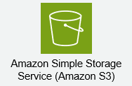

# S3概要

---

## Amazon S3とは

### Amazon S3の概要

Amazon S3 (Simple Storage Service) は、AWSが提供するオブジェクトストレージサービスです。
ウェブ上のどこからでも、容量に関わらず、任意のデータを保存および取得できるスケーラブルなストレージを提供します。
「シンプル」という名前が示す通り、その操作は直感的でありながら、高い信頼性とパフォーマンスを誇ります。

### Amazon S3の主な特徴

S3は、以下の主要な特徴によって、様々な用途で広く利用されています。

*   **オブジェクトストレージ**
    *   S3はデータをファイルシステムではなく「オブジェクト」として扱います。
    *   各オブジェクトはデータ本体と、そのデータを記述するメタデータ（作成日時、サイズ、タイプなど）および一意のキー（名前）で構成されます。

*   **高い耐久性**
    *   設計上、99.999999999% (イレブンナイン) という極めて高い耐久性を実現しています。
    *   これは、データを複数のアベイラビリティゾーン（AZ）にわたって自動的に複製・保存することで達成されます。

*   **高い可用性**
    *   データの可用性も非常に高く、通常99.99%の可用性をSLAで保証しています。
    *   障害発生時にもデータにアクセスできるような設計が施されています。

*   **無限のスケーラビリティ**
    *   保存できるデータ量に上限はありません。
    *   必要に応じて自動的にスケールするため、容量計画の手間を大幅に削減できます。

*   **コスト効率**
    *   実際に使用したストレージ量とデータ転送量に対してのみ料金が発生する従量課金制です。
    *   アクセス頻度や要件に応じて様々なストレージクラスが用意されており、コスト最適化が可能です。

*   **堅牢なセキュリティ機能**
    *   データ暗号化、アクセス制御（IAMポリシー、バケットポリシー、ACL）、VPCエンドポイントなど、多層的なセキュリティ機能を提供します。
    *   データのプライバシーと整合性を保護するための様々なオプションがあります。

### Amazon S3の主なユースケース

S3は非常に汎用性が高く、以下のような幅広い用途で利用されています。

*   **バックアップとリカバリ**
    *   サーバー、データベース、アプリケーションのデータを安全かつ耐久性の高いストレージにバックアップします。

*   **データレイク**
    *   構造化データ、半構造化データ、非構造化データを一元的に保存し、分析基盤として活用します。

*   **静的ウェブサイトホスティング**
    *   HTML、CSS、JavaScript、画像などの静的コンテンツをS3に保存し、低コストでウェブサイトを公開します。

*   **アーカイブ**
    *   長期保存が必要なデータを低コストのストレージクラスに移行し、アーカイブします。

*   **クラウドネイティブアプリケーションのデータストア**
    *   モバイルアプリやウェブアプリのユーザー生成コンテンツ、メディアファイルなどの保存先として利用します。

*   **ビッグデータ分析**
    *   Apache Spark、Presto、AWS Athenaなどの分析ツールと連携し、S3上のデータを直接分析します。
    
## EBSやEFSとの違い

AWSには様々なストレージサービスが存在し、それぞれ異なる特性と用途を持っています。
S3をより深く理解するためには、特にAmazon EBS (Elastic Block Store) やAmazon EFS (Elastic File System) との違いを明確に把握することが重要です。

### AWSの主要なストレージタイプ

AWSのストレージサービスは、大きく以下の3つのタイプに分類できます。

1.  **オブジェクトストレージ (Object Storage)**
    *   データとメタデータ、そして一意のキー（識別子）を組み合わせた「オブジェクト」としてデータを保存します。
    *   ファイルシステム階層を持たず、APIを通じてアクセスします。
    *   代表例: **Amazon S3**

2.  **ブロックストレージ (Block Storage)**
    *   OSから見ると、物理的なハードディスクドライブのように動作するストレージです。
    *   細かく分割されたブロック単位でデータを扱います。
    *   EC2インスタンスのOSやデータベースの保存先として利用されます。
    *   代表例: **Amazon EBS**

3.  **ファイルストレージ (File Storage)**
    *   ネットワーク経由で複数のコンピューターから共有可能なファイルシステムを提供します。
    *   標準的なファイルプロトコル（NFS、SMBなど）を使用してアクセスします。
    *   代表例: **Amazon EFS** (Linuxベース)、Amazon FSx (Windowsファイルサーバー、Lustreなど)

### 各ストレージサービスの詳細な比較

Amazon S3、EBS、EFSの主な違いを以下の表にまとめました。

| 特徴             | Amazon S3 (Simple Storage Service) | Amazon EBS (Elastic Block Store) | Amazon EFS (Elastic File System) |
| :--------------- | :--------------------------------- | :------------------------------- | :------------------------------- |
|アイコン||||
| **ストレージタイプ** | オブジェクトストレージ             | ブロックストレージ               | ファイルストレージ               |
| **用途**         | ウェブコンテンツ、バックアップ、データレイク、アーカイブ、静的ウェブサイト、ビッグデータ分析 | EC2インスタンスのOS、データベース、アプリケーションデータ | 複数のEC2からの共有ファイルシステム、コンテンツ管理システム、開発環境 |
| **アクセス方法**   | HTTP/HTTPS経由のRESTful API       | EC2インスタンスにアタッチ、ブロックデバイスとしてマウント | NFSプロトコル経由でマウント、ファイルシステムとしてアクセス |
| **接続対象**     | インターネット上のどこからでも、AWSサービスから | 単一のEC2インスタンスのみ (特定のAZ内) | 複数のEC2インスタンス (複数AZをまたぐことも可能) |
| **スケーラビリティ** | 無限                              | 制限あり (最大16TB/ボリューム)    | ペタバイト規模まで自動でスケール |
| **耐久性**       | 99.999999999% (11ナイン)            | 99.8% - 99.9% (スナップショットで高める) | 99.999999999% (11ナイン)            |
| **可用性**       | 99.99%以上                          | 99.99% - 99.999% (AZ内)           | 99.9%以上                          |
| **パフォーマンス** | 大容量データの並列アクセスに強い、低レイテンシではない | 高I/O性能、低レイテンシ          | 高スループット、分散処理に強い |
| **料金**         | 保存容量、リクエスト数、データ転送量で課金 | プロビジョニングされた容量、I/O性能で課金 | 保存容量、スループットで課金       |

### 各ストレージの使い分け

*   **Amazon S3**:
    *   非構造化データや半構造化データの大規模な保存に適しています。
    *   高い耐久性とスケーラビリティが求められるバックアップ、データレイク、アーカイブ、静的ウェブサイトホスティングに最適です。
    *   単一のアプリケーションだけでなく、複数のAWSサービスやインターネット上のアプリケーションからのデータ共有・アクセスに向いています。

*   **Amazon EBS**:
    *   単一のEC2インスタンスに、OSの起動ディスクやアプリケーションのデータストアとしてアタッチして利用します。
    *   データベースやアプリケーションサーバーなど、ブロックレベルでの高速な読み書きが必要な場合に選択されます。
    *   OSのファイルシステムとして直接利用できます。

*   **Amazon EFS**:
    *   複数のEC2インスタンス間で同じファイルシステムを共有したい場合に利用します。
    *   開発環境、コンテンツ管理システム、共有ホームディレクトリなど、分散アプリケーションでのファイル共有が主なユースケースです。
    *   POSIX準拠のファイルシステムインターフェースを提供します。

これらの違いを理解することで、アプリケーションやワークロードの要件に応じた最適なストレージサービスを選択できるようになります。
S3は特に、ウェブアプリケーションのバックエンドストレージ、ビッグデータ分析基盤、またはアーカイブ用途でその真価を発揮します。

## S3の仕組みと各種機能

Amazon S3は、シンプルながらも非常に強力な機能を多数備えています。
ここでは、S3がどのようにデータを保存し、どのような機能を提供しているのかを解説します。

### S3の基本的な仕組み

S3はオブジェクトストレージとして機能します。
データはファイルシステムのような階層構造ではなく、フラットな構造で「オブジェクト」として保存されます。

#### オブジェクトストレージの概念

*   **データとメタデータ:** S3では、保存するデータ本体に加え、そのデータに関する情報（メタデータ）も一緒に管理されます。
    *   メタデータには、コンテンツタイプ、最終更新日時、所有者、カスタムメタデータなどが含まれます。
*   **一意の識別子（キー）:** 各オブジェクトは、バケット内で一意な「キー」と呼ばれる識別子を持っています。
    *   このキーを使ってオブジェクトにアクセスします。

#### バケットとオブジェクト

S3のストレージ階層は、バケットとオブジェクトの2つの主要な要素で構成されます。

| 要素     | 説明                                                                                                     | 特徴                                                                    |
| :------- | :------------------------------------------------------------------------------------------------------- | :---------------------------------------------------------------------- |
| **バケット** | オブジェクトを格納するためのコンテナです。                                                               | - グローバルに一意の名前を持つ必要があります。  - リージョンと関連付けられます。  - アクセス制御、バージョニング、ライフサイクルなどの設定はバケットレベルで行います。 |
| **オブジェクト** | S3に保存されるデータ本体です。                                                                         | - データ本体とメタデータ、そして一意のキーで構成されます。  - ファイル、画像、動画、バックアップなど、あらゆる種類のデータを保存できます。  - 最大5TBのサイズをサポートします。 |

S3は、バケットをインターネット上のフォルダのように見立てることができますが、内部的にはファイルシステムとは異なるフラットな構造で管理されています。
オブジェクトへのアクセスは、一意のURLを通じて行われます。

#### キー

キーは、バケット内のオブジェクトを一意に識別するための名前です。
オブジェクトへのパスのように見えますが、実際にはフラットな文字列です。

*   例えば、`myfolder/mysubfolder/myfile.txt` というキーのオブジェクトは、S3内部では単一の文字列として扱われます。
*   S3コンソールやAPIでは、スラッシュ (`/`) を区切り文字として解釈し、フォルダのような階層構造を視覚的に表現しています。

### S3の主要な機能

S3は、データの保存だけでなく、管理、セキュリティ、最適化のための様々な機能を提供します。

#### データ管理機能

*   **ストレージクラス**
    *   アクセス頻度、復元要件、コスト効率に応じて、複数のストレージクラスが用意されています。
    *   「S3 標準」から「S3 Glacier Deep Archive」まで、最適なクラスを選択することで、ストレージコストを大幅に削減できます。
    *   (詳細は後続の「S3の種類 (ストレージクラス)」の項目で詳しく解説します。)

*   **バージョニング (Versioning)**
    *   誤ってオブジェクトを上書きしたり削除したりした場合に備え、オブジェクトの複数のバージョンを保持する機能です。
    *   有効にすると、同じキーでオブジェクトをアップロードするたびに新しいバージョンが作成されます。

*   **ライフサイクル管理 (Lifecycle Management)**
    *   オブジェクトのアクセスパターンや保持期間に基づいて、自動的にストレージクラスを移行したり、古いバージョンや期限切れのオブジェクトを削除したりする機能です。
    *   これにより、ストレージコストを最適化し、データのガバナンスを自動化できます。

*   **レプリケーション (Replication)**
    *   **クロスリージョンレプリケーション (CRR):** オブジェクトをあるAWSリージョンから別のリージョンにあるバケットに自動的に複製します。災害対策やデータローカリティの要件に利用されます。
    *   **同一リージョンレプリケーション (SRR):** 同じリージョン内のバケット（または同じバケット内の異なるプレフィックス）にオブジェクトを複製します。ログ集約や開発/テスト環境へのデータ配布に利用されます。

#### セキュリティとアクセス制御機能

*   **データ暗号化**
    *   S3に保存されるデータは、転送中および保存時に暗号化できます。
    *   **保存時の暗号化 (Encryption at Rest):**
        *   **SSE-S3:** Amazon S3が管理するキーを使用して暗号化します。設定が最も簡単です。
        *   **SSE-KMS:** AWS Key Management Service (KMS) で管理されるキーを使用して暗号化します。キーの管理に追加の制御が可能です。
        *   **SSE-C:** ユーザーが提供する暗号化キーを使用して暗号化します。S3はそのキーを保存しません。
    *   **転送中の暗号化 (Encryption in Transit):** HTTPSエンドポイントを使用することで、データはSSL/TLSによって暗号化されて転送されます。

*   **アクセス制御 (Access Control)**
    *   **IAM (Identity and Access Management):** ユーザー、グループ、ロールに対して、S3リソースへのアクセス権限を細かく定義できます。
    *   **バケットポリシー (Bucket Policies):** 特定のバケットとそのオブジェクトに対するアクセス権限をJSON形式で定義します。アカウント間アクセスや特定のIPアドレスからのアクセス制限などに利用されます。
    *   **ACL (Access Control Lists):** 特定のオブジェクトまたはバケットに対して、AWSアカウントまたは定義済みグループにアクセス権限を付与するレガシーなメカニズムです。バケットポリシーが推奨されます。

*   **オブジェクトロック (Object Lock)**
    *   WORM (Write Once Read Many) モデルをS3に適用し、指定された期間、または無期限にオブジェクトの変更や削除を防止します。
    *   規制要件への準拠や、重要なデータの不変性を確保するために利用されます。

#### 運用と最適化機能

*   **静的ウェブサイトホスティング (Static Website Hosting)**
    *   HTML、CSS、JavaScript、画像などの静的コンテンツをS3バケットに保存し、低コストでウェブサイトを公開できます。
    *   ドメイン名と紐付けることで、カスタムURLでアクセス可能です。

*   **イベント通知 (Event Notifications)**
    *   オブジェクトの作成、削除、復元などのバケットイベントが発生した際に、SQS (Simple Queue Service)、SNS (Simple Notification Service)、またはLambda関数に通知を送信できます。
    *   これを利用して、データのアップロードをトリガーとした自動処理を構築できます。

*   **アクセスログとモニタリング**
    *   **S3アクセスログ:** バケットに対するすべてのアクセスリクエスト（誰が、いつ、どこから、何をしたか）を記録し、別のS3バケットに保存できます。監査や分析に利用されます。
    *   **Amazon CloudWatch:** S3のパフォーマンスメトリクス（リクエスト数、データ転送量など）を監視し、アラームを設定できます。
    *   **AWS CloudTrail:** S3 APIへのすべての呼び出しをログに記録し、セキュリティ監査、変更追跡、トラブルシューティングに役立ちます。

*   **データ処理と高速化**
    *   **S3 Select / Glacier Select:** オブジェクト全体をダウンロードすることなく、SQLクエリを使用してオブジェクト内の特定のデータのみを取得できる機能です。
    *   **S3 Transfer Acceleration:** CloudFrontのエッジロケーションを利用して、遠隔地からS3バケットへのデータ転送を高速化します。
    
