# IAM 
## IAMとは？

**IAM** は、AWS リソースへのアクセス権限を管理するためのサービスです。  
IAMを用いて、AWS アカウントで誰(認証)が何を実行できるか(認可)を定義します。  
IAM による認証はユーザ、グループもしくはロールで行われ、IAMによる認可はポリシーで行われます。  

まず、認証と認可の違いを見ていきましょう。

### 認証（Authentication）
認証は、「サービスの利用者が本人であるか」を確認するための仕組みです。  
例えば、ユーザ名とパスワードを入力してサインインするというプロセス**認証**です。

### 認可（Authorization）
認可は、「サービスの利用者が適切な権限を持っているか」を確認するための仕組みです。  
例えば、AWS アカウントにサインインする権限を持っていますが、Amazon S3 へのアクセス権限を持っていないとします。  
この場合、AWS アカウントにサインインした後、S3 バケットの作成や削除などの操作を行うことができません。  
これを実現する仕組みが**認可**です。

IAMを使うことによって、IAMユーザ、グループ、ロール、およびポリシーを作成することができます。  
では、次にこれから IAM の重要な用語と概念を見ていきましょう。

---
## ルートユーザ
AWS には、**ルートユーザ**と **IAM ユーザ**という二種類のユーザがあります。  

ルートユーザは、AWS アカウントを作成する時にデフォルトで生成される最初のユーザです。  
アカウント作成時に指定したメールアドレスとパスワードを使って、AWS 管理コンソールにルートユーザでサインインすることができます。  
 
ルートユーザはアカウントの所有者であり、アカウントに対する全ての操作権限を持っていますが、セキュリティを考慮し、使用しないのが一般的です。  

:::caution
ルートユーザではログインしないようにしましょう。
:::

そのため、通常はルートユーザを使って管理者権限（`AdministratorAccess` ポリシー）付きの **IAM ユーザ**を作成します。  
以降は基本的に、この IAMユーザを使って日常作業を行います。

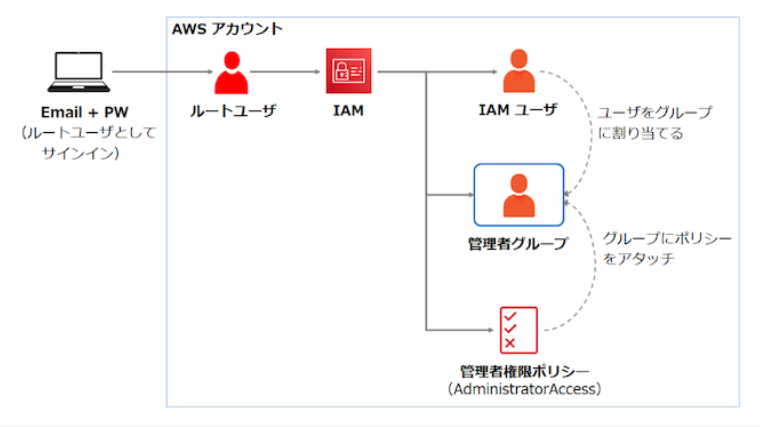

管理者権限が付与された IAM ユーザは、ルートユーザに限定されているいくつかの操作を除いて、ルートユーザが実行できるほぼ全ての操作を実行できます。
ルートユーザしかできない操作については、[ルートユーザ認証情報が必要なタスク](https://docs.aws.amazon.com/ja_jp/IAM/latest/UserGuide/security-creds.html)をご参照ください。

ルートユーザの使用を最小限に抑えること、ルートユーザの多要素認証を有効にすること、ルートユーザのアクセスキーを削除することはセキュリティのベストプラクティスとして推奨されています。

---
## IAM ユーザ  
**IAM ユーザ**は、ルートユーザまたはユーザの作成権限を持つ IAMユーザによって作成されます。IAM ユーザは、人だけではなくアプリケーションも含まれます。  
日常作業において、例えば、IAM ユーザやグループ、ポリシー、ロールなどの作成／削除は、適切な権限を持つ IAM ユーザを使って行います。

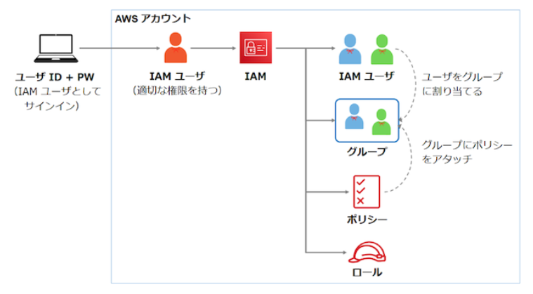

---

## グループ
**グループ**は、IAM ユーザの集まりです。グループを使う主な理由としては、IAM ユーザをグループに割り当てて、ポリシーをグループに適用することを通じて、グループ内のユーザに権限を付与することです。グループやロールをグループに所属させることはできません。

個別の IAM ユーザにポリシーを直接アタッチすることもできますが、ベストプラクティスとしては、IAM ユーザをグループにまとめて、グループに対してポリシーをアタッチすることです。同一ユーザは最大 10 個のグループのメンバーになることができます。

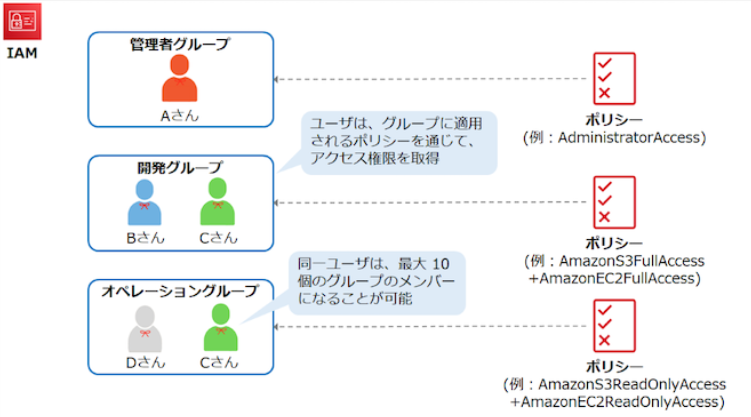

---
## ポリシー
**ポリシー**は、JSON 形式のドキュメントであり、アイデンティティ（IAM ユーザ、グループ、ロール、フェデレーションユーザ） または AWS リソース（S3、EC2 など）にアタッチして、アイデンティティまたは AWS リソースのアクセス権限を定義します。

ポリシーの構成は、バージョンとステートメント二つのセクションに大きく分けられます。

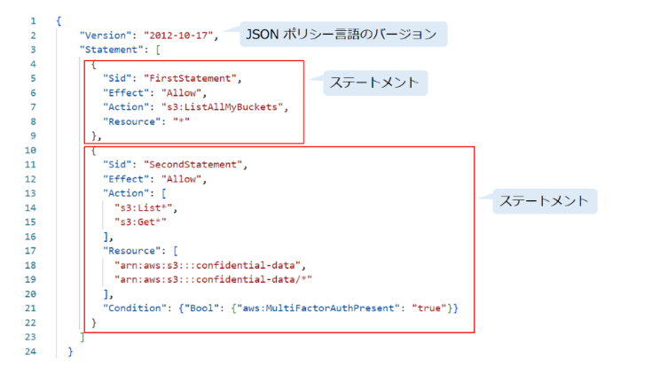

**Version**：JSON ポリシー言語のバージョンを指定します。現時点で `2008-10-17` と `2012-10-17` 二つのバージョンがあります。最新バージョン `2012-10-17` の使用が推奨されています。
:::caution 
バージョンは、ポリシー自体のバージョン管理をするものではありません。  
:::

**Statement**：  
コンテナみたいなもので、ステートメントの中に以下のポリシーの要素を記述します。  
ポリシーには一つまたは複数のステートメントを含めることができます。  

**Sid**：  
オプション要素で、複数のステートメントを区別するための任意の文字列です。  

**Effect**：  
`Allow` または `Deny` を使って、アクセスを許可するか拒否するかを示します。  

**Action**：  
ポリシーが許可または拒否するアクションのリストです。  

**Principal**：  
プリンシパルは、AWS リソースに対するアクションをリクエストできる IAM ユーザ、ロール、またはアプリケーションを指します。  
リソースベースのポリシーを作成する時、アクセスを許可または拒否するプリンシパルを指定する必要があります。  

**Resource**：  
アイデンティティベースのポリシーを作成する時、アクションが適用されるリソースを指定する必要があります。リソースは、そのリソースリストを示します。  

:::note  
リソースベースのポリシーを作成する時、リソースの指定はオプションとなります。リソースが指定されていない場合、アクションはポリシーがアタッチされているリソースに適用されます。*
:::  

**Condition**：  
オプション要素で、どの条件でアクセスを許可または拒否するのかを指定します。  

AWS には、アイデンティティベースのポリシー、リソースベースのポリシー、アクセス許可の境界、 SCP、ACL とセッションポリシーの計 6 種類のポリシーがあります。  
最も使用頻度の高いアイデンティティベースのポリシーとリソースベースのポリシーについて見ていきましょう。

### アイデンティティベースのポリシー
アイデンティティベースのポリシーは、IAM ユーザ、グループもしくはロールにアタッチされ、それらのアイデンティティがどのリソースに対してどの操作を実行できるかを定義します。  

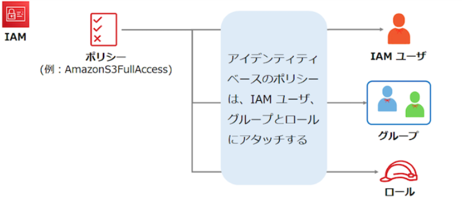

アイデンティティベースのポリシーは、さらに次のように分類できます。  

**AWS 管理ポリシー**：AWS が作成および管理するポリシーです。各 AWS サービスにフルアクセス権限や読み取り権限などのポリシーがあらかじめ用意されています。  
例えば、下記の `AmazonS3ReadOnlyAccess` ポリシーではアカウント内の全ての S3 バケットに対して、Get/Listの操作が許可されています。

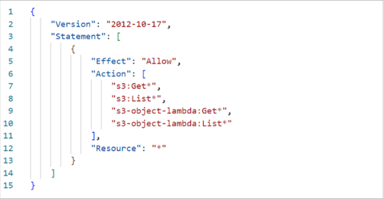

**カスタマー管理ポリシー**：  
利用者が作成及び管理するポリシーです。AWS 管理ポリシーに比べて、より細かめにアクセス権限を管理できます。  
例えば、利用者は特定の S3 バケットに対して特定の操作権限を付与するポリシーを作成することができます。

**インラインポリシー**：  
特定の IAM ユーザ、グループもしくはロールに専用に作成され、それらのアイデンティティに直接埋め込まれるポリシーです。  
インラインポリシーはアイデンティティの一部だと考えてもよくて、アイデンティティを削除すると、インラインポリシーも削除されます。

### リソースベースのポリシー  
リソースベースのポリシーは、AWS リソースにアタッチされ、そのリソースに対して誰がどの操作を実行できるかを定義します。「誰が」の部分はポリシーの中のプリンシパルで指定します。  

S3 バケットポリシーがよく使われるリソースベースのポリシーです。  
下記の S3 バケットポリシーの例では、AWS アカウント（`123456789012`）の IAM ユーザ（`Jack`）が S3 バケット（`examplebucket`）配下の全てのオブジェクトに対して、 `s3:PutObject` と `s3:PutObjectAcl` のアクセスを許可します。

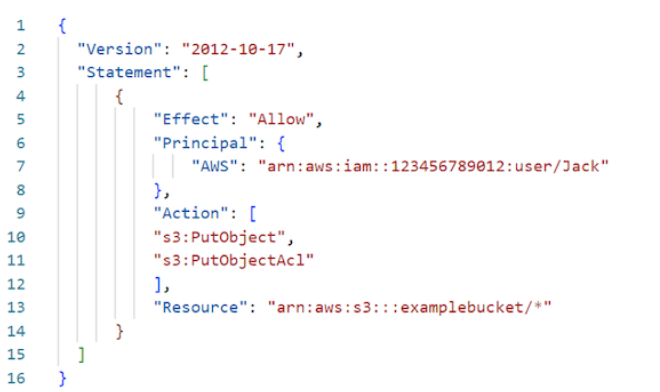

プリンシパル要素を削除すれば、このポリシーはアイデンティティにもアタッチできます。  
リソースベースのポリシーをサポートするサービスのリストについては、IAM と連携する AWS のサービスをご参照ください。

### ポリシーの評価ロジック
プリンシパルが AWS を利用しようとすると、そのプリンシパルは AWS にリクエストを送信します。  
AWS のサービスがリクエストを受け取ると、適用されるポリシーに基づいて、プリンシパルのリクエストを許可するか拒否するかを決めます。

次のフローチャートは、許可／拒否がどのように行われるかの詳細を示しています。

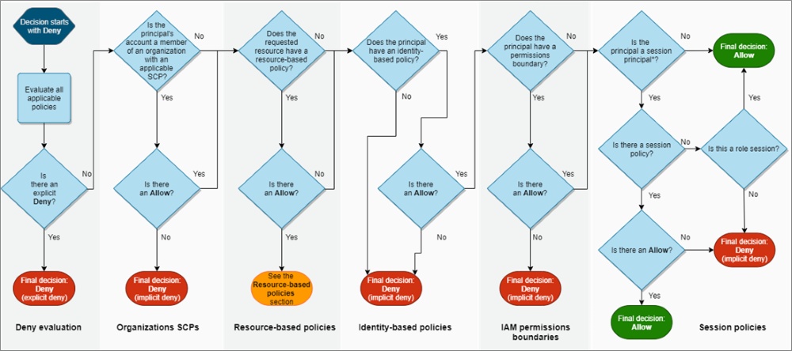

デフォルトでは、フルアクセス権限を持つルートユーザを除いて、全てのリクエストが暗黙的な拒否から評価されます。  
つまり、アクセス権限を明示的に許可するまで、全てのアクセスが拒否されます。

アクセスを許可するには、アイデンティティベースのポリシーまたはリソースベースのポリシーで明示的な許可を記載する必要があります。  
ただし、本記事で説明していないアクセス許可の境界、SCP、またはセッションポリシーが存在する場合、許可が暗黙の拒否でオーバーライドされる可能性があることにご注意ください。

許可／拒否の強さについては、**明示的な拒否 > 明示的な許可 > 暗黙的な拒否** のような関係があります。  
ポリシー内の明示的な拒否は全ての許可をオーバーライドできます。  

:::note 
AWSにはたくさんのポリシーがありますが、最初はこれだけ覚えておけばOKです。

| ポリシー名             | 説明                          |
| ----                  | ----                       |
| `AdministratorAccess`| 全ての操作が可能(管理者向け) |
| `AmazonS3ReadOnlyAccess` | S3の読み取りのみ可能       |
| `AmazonEC2FullAccess` | EC2の操作がすべて可能         |
:::

---
## ロール
**ロール**は複数のポリシーによって構成されます。  
ロールの役割はAWS サービス（`EC2`、`Lambda` など）にアクセス権限を付与して、  
その AWS サービスが IAM ユーザのように行動できるようにすることです。  

EC2 インスタンス上で稼働するアプリケーションがあって、そのアプリケーションは S3 バケットにアクセスする必要があるとします。  
AWS では、ポリシーを直接 IAM ユーザとグループにアタッチすることができますが、ポリシーを直接 AWS サービスにアタッチすることができません。この時は、まず S3 バケットポリシー（`AmazonS3FullAccess`など）をロールにアタッチします。  

次に、ロールを EC2 インスタンスにアタッチする必要があります。  

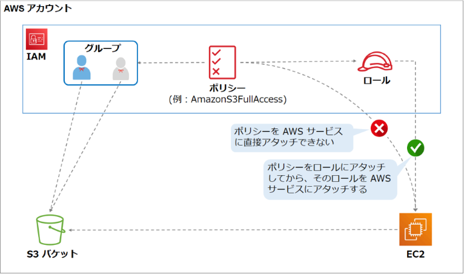

IAM ロールを作成する時、許可ポリシーと信頼されたアイデンティティを指定する必要があります。  
例えば、上記の例なら、許可ポリシーは `AmazonS3FullAccess` であり、S3 バケットにフルアクセス権限を持っています。  
許可ポリシーの中身はアイデンティティベースのポリシーです。  

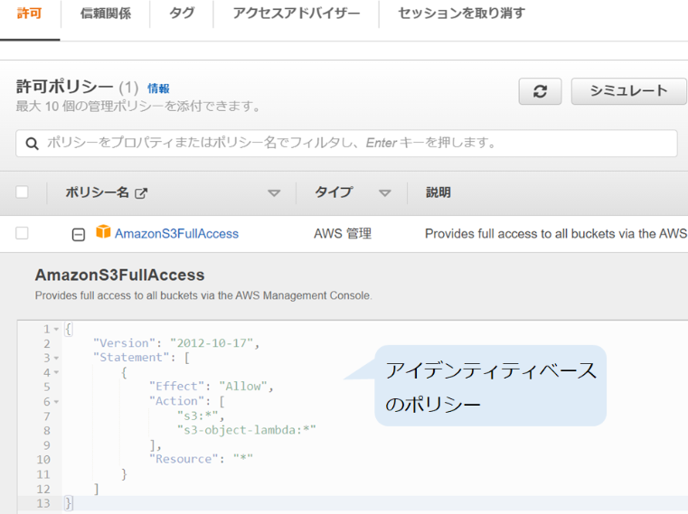

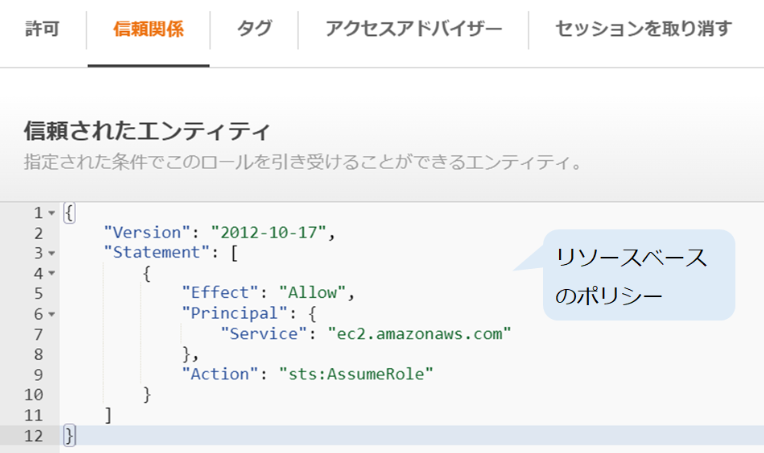

一方、信頼されたアイデンティティは EC2 であり、EC2 インスタンスはユーザに代わって AWSサービスを呼び出すことが許可されます。  
信頼されたアイデンティティの中身はリソースベースのポリシーです。

---

## まとめ
今回の記事では、IAM を理解するための必要最小限の用語や概念を解説しました。  
IAM は全ての AWS 利用者にとって非常に重要なサービスで、一歩間違ってしまえばセキュリティ事故にも繋がります。  
IAM の概念は少々複雑で、初心者にとって理解するのは難しいと思いますが、ざっくりと仕組みを理解しておきましょう。